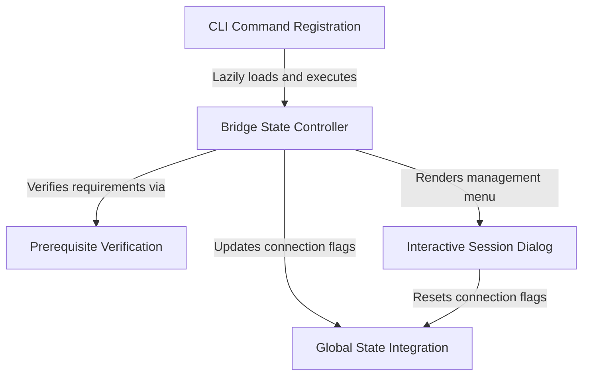

# Tutorial: bridge

This project implements a **remote control** feature that bridges a local terminal CLI with a web interface. It manages the connection lifecycle by verifying **prerequisites**, toggling global *application state* to trigger networking logic, and providing an interactive **dialog** for users to control or disconnect active sessions.

## Chapters

1. [CLI Command Registration](01_cli_command_registration.md)
2. [Bridge State Controller](02_bridge_state_controller.md)
3. [Prerequisite Verification](03_prerequisite_verification.md)
4. [Global State Integration](04_global_state_integration.md)
5. [Interactive Session Dialog](05_interactive_session_dialog.md)

---

Generated by [Code IQ](https://github.com/adityasoni99/Code-IQ)