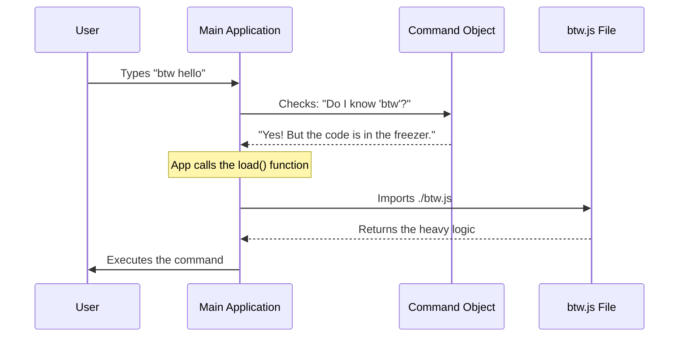

# Chapter 1: Command Registration

Welcome to the **btw** project tutorial!

In this series, we are building a feature called `btw` (By The Way). It allows users to ask a quick side question to an AI without losing the context of their main conversation.

Before we can build the user interface or handle logic, we have to start at the very beginning: **How does the application know our command exists?**

## The Motivation

Imagine you walk into a restaurant. You sit down and look at the menu.
*   **The Menu** is a list of available options (Commands).
*   **The Kitchen** is where the actual cooking happens (The Code).

If the kitchen cooked *every single dish* on the menu the moment the restaurant opened, the kitchen would be chaotic, the food would go cold, and the restaurant would run out of money.

Instead, the menu just contains a **description** of the dish. The kitchen only starts cooking (loading the code) when you actually order it.

We want our `btw` command to work the same way:
1.  The app knows `btw` exists (it's on the menu).
2.  The heavy code for `btw` is **not loaded** until the user types it (Lazy Loading).

## The Use Case

We want a user to be able to open their terminal and type:

```bash
btw "how do I reverse a list?"
```

For this to work, we need to create a "Registration Object"—a small definition file that tells the main application exactly what `btw` is.

## Defining the Command

Let's look at how we define this in `index.ts`. We will break this into small pieces.

### Step 1: Basic Metadata

First, we give the command a name and a description so the main application knows how to display it in help menus.

```typescript
// index.ts
const btw = {
  type: 'local-jsx', // Defines the type of UI we will use
  name: 'btw',       // The command the user types
  description:       // Helper text shown in the CLI
    'Ask a quick side question without interrupting conversation',
  // ... more properties coming
}
```

*   **name**: This is the keyword. When the user types `btw`, this triggers our code.
*   **description**: If the user asks for "help", this text explains what the tool does.

### Step 2: User Experience Hints

Next, we define how the command behaves immediately after being typed.

```typescript
// ... inside the object
  immediate: true,           // Run immediately, don't wait for Enter key
  argumentHint: '<question>', // Shows the user what to type next
// ...
```

*   **argumentHint**: When the user types `btw`, the UI will show a faint text like `btw <question>` to guide them.
*   **immediate**: This tells the app, "As soon as this command matches, take over!"

### Step 3: Lazy Loading (The Magic Part)

This is the most important concept in this chapter. We use a specific function to load the actual logic file (`btw.js`) only when needed.

```typescript
// ... inside the object
  load: () => import('./btw.js'),
} satisfies Command

export default btw
```

*   **`() => import('./btw.js')`**: This is an **Arrow Function** that performs a dynamic import.
    *   **Static Import** (`import x from y` at the top of a file): Loads code immediately when the app starts.
    *   **Dynamic Import** (`import(...)` inside a function): Loads code **only** when that function is executed.

By putting the import inside the `load` function, we ensure the heavy logic file (`btw.js`) stays on the disk and off the memory until the user actually runs the command.

## Internal Implementation: How it Works

What happens under the hood when the application starts?

1.  The Application scans for available commands.
2.  It reads our `index.ts` (the Registration Object).
3.  It adds `btw` to its internal list of "known commands" (the Menu).
4.  **Crucially**, it does *not* read `btw.js` yet.

Here is a sequence diagram of the flow when a user actually types the command:



### Understanding the Code Flow

The main application likely has code that looks something like this (simplified):

```typescript
// Hypothetical Main App Logic
async function onUserType(input) {
  // 1. Check if input matches our registered command name
  if (input.startsWith(btw.name)) {
    
    // 2. The user wants it! Now we call the load function.
    // This is where the file is physically read from disk.
    const module = await btw.load();

    // 3. Now we have the real code to run.
    module.run(input);
  }
}
```

By separating the **Registration** (`index.ts`) from the **Implementation** (`btw.js`), we keep the application fast and lightweight.

## Summary

In this chapter, we learned:
1.  **Command Registration**: How to tell the main app that `btw` exists using a simple object.
2.  **Metadata**: Defining names and descriptions for better UX.
3.  **Lazy Loading**: Using `load: () => import(...)` to improve performance by only loading code when necessary.

We have successfully placed our item on the menu. But what happens when the code actually loads? We need to show the user an interface to type their question.

In the next chapter, we will define the visual part of our command.

[Next Chapter: Side Question UI Component](02_side_question_ui_component.md)

---

Generated by [Code IQ](https://github.com/adityasoni99/Code-IQ)