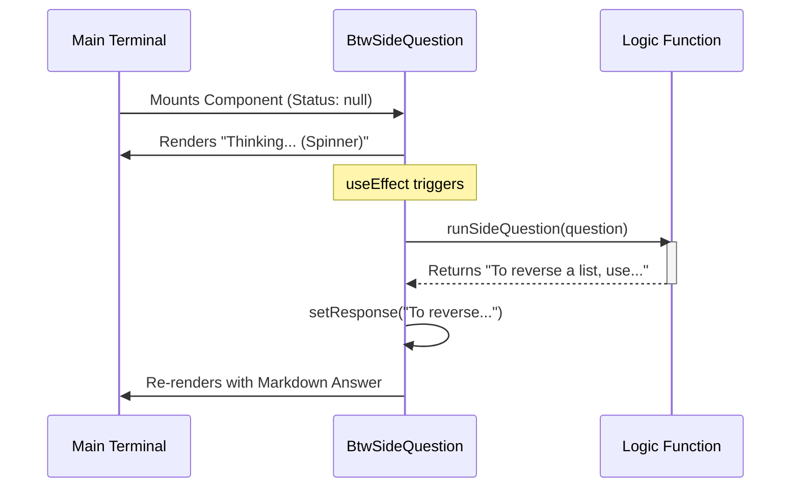

# Chapter 2: Side Question UI Component

Welcome back!

In the previous chapter, **[Command Registration](01_command_registration.md)**, we added our `btw` command to the application's "menu." The app now knows the command exists and lazily loads the code when the user types it.

Now, we face the next challenge: **Visuals.**

Standard command-line tools just print text line-by-line. But `btw` is different. It needs to:
1.  Show a "thinking" spinner while the AI works.
2.  Update the screen with the answer once it arrives.
3.  Allow the user to scroll through long answers.
4.  Disappear cleanly when the user is done.

In this chapter, we will build the **Side Question UI Component**.

## The Motivation

Imagine you are working on a physical desk. You are writing an essay (your main terminal task). Suddenly, you need to do a quick calculation.

You don't throw away your essay. You grab a **Sticky Note**, do the math, and then throw the note away.

The `Side Question UI` is that Sticky Note. It is a temporary "Mini-App" that renders **on top** of your terminal history without deleting what was there before.

## The Tool: Ink (React for CLI)

To build this, we use a library called **Ink**.

If you have used React for web development, you use HTML tags like `<div>` and `<h1>`. Ink uses the exact same React logic, but with components made for text:
*   `<Box>`: Like a `<div>`. It holds layout logic (flexbox, padding, margins).
*   `<Text>`: Like a `<span>`. It holds text, colors, and bold styling.

## Defining the Component

We are building a component called `BtwSideQuestion`. Let's look at its skeleton.

### Step 1: The Props

First, what data does our Sticky Note need to exist?

```typescript
type BtwComponentProps = {
  question: string;  // The text the user typed
  onDone: () => void; // A function to close the sticky note
  // ... context data
};
```

### Step 2: The States

React components use "State" to remember things. Our component needs to remember three things:

1.  **Response:** The answer from the AI (initially empty).
2.  **Error:** If something goes wrong.
3.  **Frame:** A number used to animate the spinner.

```typescript
function BtwSideQuestion({ question, onDone }: BtwComponentProps) {
  // Is the AI done? If null, we are still thinking.
  const [response, setResponse] = useState<string | null>(null);
  
  // Did something break?
  const [error, setError] = useState<string | null>(null);

  // ...
```

### Step 3: Visual Logic (The Render)

This is the heart of the UI. We use a ternary operator (an `if/else` statement inside UI) to decide what to show.

*   **If Error:** Show Red Text.
*   **If Response:** Show the Markdown answer.
*   **If Neither:** Show the Spinner (Thinking...).

```tsx
return (
  <Box flexDirection="column" paddingLeft={2} marginTop={1}>
    {/* 1. Always show the user's question first */}
    <Box>
      <Text bold color="warning">/btw </Text>
      <Text dimColor>{question}</Text>
    </Box>

    {/* 2. Show the content based on state */}
    <Box marginTop={1}>
      {error ? (
        <Text color="error">{error}</Text>
      ) : response ? (
        <Markdown>{response}</Markdown>
      ) : (
        // Still loading...
        <Box>
            <SpinnerGlyph />
            <Text color="warning"> Answering...</Text>
        </Box>
      )}
    </Box>
  </Box>
);
```

## Internal Implementation: The Lifecycle

How does the component go from "Thinking" to "Answered"? We use a React hook called `useEffect`.

This hook runs **immediately** after the component appears on the screen.

### The Flow Diagram



### The Code Implementation

Here is a simplified version of the logic inside our component. We use `useEffect` to trigger the AI processing.

```typescript
  useEffect(() => {
    // Define the async work
    async function fetchResponse() {
      try {
        // 1. Call the heavy logic (We will build this later)
        const result = await runSideQuestion({ question });
        
        // 2. Update state, which triggers a re-render
        setResponse(result.response);
      } catch (err) {
        setError("Failed to get response");
      }
    }

    // Execute immediately on mount
    fetchResponse();
  }, [question]); 
```

## The Entry Point

Finally, how do we actually tell Ink to render this specific component?

Recall from Chapter 1 that the app calls a `load()` function. That file exports a `call` function. This is the bridge between the raw command line string and our React UI.

```typescript
// btw.tsx
export async function call(onDone, context, args) {
  const question = args?.trim();

  // Validation: Did the user type a question?
  if (!question) {
    onDone('Usage: /btw <your question>');
    return null;
  }

  // Render our React Component
  return (
    <BtwSideQuestion 
      question={question} 
      context={context} 
      onDone={onDone} 
    />
  );
}
```

## Summary

In this chapter, we built the visual shell of our feature:
1.  **Ink Components**: We used `<Box>` and `<Text>` to structure the terminal output.
2.  **State Management**: We handled three visual states (Thinking, Error, Result).
3.  **Lifecycle**: We used `useEffect` to trigger the work automatically when the UI appears.

However, if you ran this code right now, you would notice two problems:
1.  You can't scroll up and down.
2.  You can't close the window (pressing Escape does nothing).

A "Modal" isn't useful if you are trapped inside it! In the next chapter, we will make our component interactive.

[Next Chapter: Event Handling & Navigation](03_event_handling___navigation.md)

---

Generated by [Code IQ](https://github.com/adityasoni99/Code-IQ)