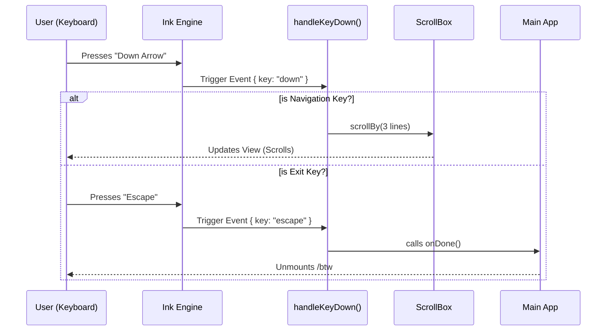

# Chapter 3: Event Handling & Navigation

Welcome back!

In the previous chapter, **[Side Question UI Component](02_side_question_ui_component.md)**, we built the visual "body" of our application. It looks great, displaying the question and a placeholder for the answer.

However, right now, our application is like a car with no steering wheel. If the answer is too long, you can't scroll down to read it. If you want to close the popup, pressing `Escape` does nothing.

In this chapter, we will build the **Nervous System**. We will teach our component how to listen to the keyboard and react to user commands.

## The Motivation

Terminals are text-based. Usually, when you press `Up Arrow`, the terminal shows you the previous command you typed. When you press `Enter`, it executes a command.

But when `btw` is running, we want to **hijack** these keys.
1.  **Escape / Enter**: Should close our "sticky note" UI, not the whole terminal window.
2.  **Up / Down**: Should scroll the text inside our specific box, not the terminal history.

We need a "driver" that sits inside our component, catches these keys before the terminal sees them, and performs specific actions.

## Key Concept: The Event Listener

In web development, you might use `onClick` for a mouse. In CLI development with Ink, we use `onKeyDown`.

For a component to "hear" the keyboard, it must have **Focus**. Think of Focus as the spotlight on a stage. Only the actor in the spotlight gets to speak.

## Implementation Steps

We will implement a function called `handleKeyDown`. This function will act as our traffic controller.

### Step 1: Making the Component Focusable

First, we need to tell Ink that our specific `<Box>` (the container of our UI) wants attention.

```tsx
// Inside BtwSideQuestion return statement
<Box 
  flexDirection="column" 
  // 1. Allow this component to receive focus
  tabIndex={0} 
  // 2. Grab focus immediately when it appears
  autoFocus={true} 
  // 3. Attach our "Driver" function
  onKeyDown={handleKeyDown}
>
  {/* ... content ... */}
</Box>
```

*   **`tabIndex={0}`**: Makes the element capable of receiving focus.
*   **`autoFocus={true}`**: Automatically puts the "spotlight" on this box as soon as `btw` starts.
*   **`onKeyDown`**: Whenever a key is pressed, run the `handleKeyDown` function.

### Step 2: The Driver Function (Dismissing)

Now let's write the logic. The most important feature is the ability to **exit**. If the user is done reading, they should be able to dismiss the view.

We check which key was pressed. If it's `Escape` or `Enter`, we call `onDone`.

```typescript
function handleKeyDown(e: KeyboardEvent) {
  // Check for exit keys
  if (e.key === 'escape' || e.key === 'return') {
    
    // Stop the terminal from doing its default action
    e.preventDefault();
    
    // Close the app nicely
    onDone(undefined, { display: 'skip' });
    return;
  }
  
  // ... scrolling logic coming next
}
```

*   **`e.preventDefault()`**: This is crucial. It tells the terminal, "I handled this key, don't print a weird character on the screen."
*   **`onDone`**: This is the function passed down from the parent (see Chapter 2) that tells the main app "We are finished."

### Step 3: Navigation (Scrolling)

If the AI writes a long essay, the user needs to scroll. We use a "Ref" (a direct link to the scrolling component) to move the text up and down.

```typescript
  // Inside handleKeyDown...
  
  // Scroll Up
  if (e.key === 'up') {
    e.preventDefault();
    // Move the view up by 3 lines
    scrollRef.current?.scrollBy(-3);
  }

  // Scroll Down
  if (e.key === 'down') {
    e.preventDefault();
    // Move the view down by 3 lines
    scrollRef.current?.scrollBy(3);
  }
```

## Internal Implementation: Under the Hood

What actually happens when you press a key on your physical keyboard?

1.  **OS / Terminal**: The Operating System sends the signal to your Terminal (e.g., iTerm, VSCode).
2.  **Node.js**: The Node process receives a raw data stream.
3.  **Ink**: Ink (our UI library) reads this stream and converts it into a clean "Event Object" (like `{ key: "escape" }`).
4.  **Bubbling**: Ink looks for which component has `autoFocus`. It sends the event there.

Here is the flow of our `handleKeyDown` logic:



### The Full Code Structure

Here is how the pieces fit together inside `btw.tsx`.

We wrap the handler in `useMemo` or define it inside the render body so it has access to the latest `scrollRef` and `onDone` function.

```typescript
// btw.tsx (Simplified)

function BtwSideQuestion({ onDone, ...props }) {
  const scrollRef = useRef(null);

  // The logic to handle keystrokes
  const handleKeyDown = (e) => {
    // 1. Handle Closing
    if (e.key === 'escape' || e.key === 'return') {
      e.preventDefault();
      onDone(); // Close the modal
      return;
    }

    // 2. Handle Scrolling
    if (e.key === 'up') scrollRef.current?.scrollBy(-3);
    if (e.key === 'down') scrollRef.current?.scrollBy(3);
  };

  return (
    // 3. Attach the handler to the Box
    <Box 
      tabIndex={0} 
      autoFocus={true} 
      onKeyDown={handleKeyDown}
      flexDirection="column"
    >
      <ScrollBox ref={scrollRef}>
        {/* Answer goes here */}
      </ScrollBox>
      
      <Text dimColor>
        Use Arrows to scroll • Esc to close
      </Text>
    </Box>
  );
}
```

## Summary

In this chapter, we breathed life into our component.
1.  **Focus**: We learned that a CLI component needs `tabIndex` and `autoFocus` to hear the user.
2.  **Intercepting**: We used `e.preventDefault()` to stop standard terminal behavior.
3.  **Control**: We mapped specific keys (Arrows, Escape) to specific actions (Scrolling, Closing).

Now our UI is beautiful **and** functional. But there is one major piece missing.

The answer text is still fake! We haven't actually asked the AI anything yet. We need to talk to the AI, but we must do it carefully so the interface doesn't freeze while waiting for a response.

[Next Chapter: Async Execution & Abort Control](04_async_execution___abort_control.md)

---

Generated by [Code IQ](https://github.com/adityasoni99/Code-IQ)