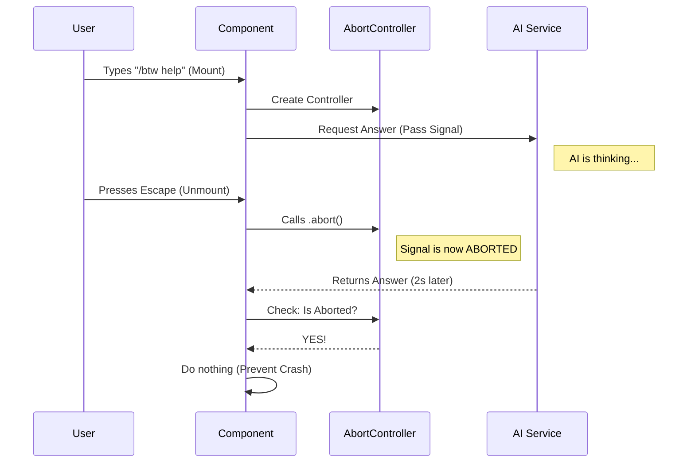

# Chapter 4: Async Execution & Abort Control

Welcome back!

In the previous chapter, **[Event Handling & Navigation](03_event_handling___navigation.md)**, we taught our component how to respond to keyboard inputs like scrolling and closing.

However, our application has a secret: the answer text we displayed was fake. We haven't actually connected to the AI yet!

Connecting to an AI is not instant. It takes time to think and generate text. In programming, we call this **Asynchronous Execution**.

In this chapter, we will learn:
1.  How to trigger the AI request when our component loads.
2.  How to handle the "wait time" without freezing the app.
3.  **Crucially**: How to "hang up the phone" if the user closes the window before the AI replies (Abort Control).

## The Motivation

Imagine you are at a busy coffee shop.
1.  **Request**: You order a latte.
2.  **Async Wait**: The barista starts making it. You wait at the counter.
3.  **Abort**: Suddenly, you realize you are late for a meeting. You leave the shop immediately.

If the barista finishes the latte and screams "Latte for Dave!", but Dave is gone, it creates confusion.

In our CLI tool:
1.  User types `/btw "optimize this query"`.
2.  We send the request to the AI.
3.  The user realizes they made a typo and hits `Escape` to close the window.

If the AI finishes 2 seconds later and tries to update the window that no longer exists, our application will crash or leak memory. This is called "updating an unmounted component."

We need a way to tell the barista (the AI logic): **"I'm leaving, stop making the coffee."**

## Key Concept: The AbortController

JavaScript provides a built-in tool for this called the `AbortController`.

Think of it like a **Safety Cord** on a treadmill.
*   **The Signal**: A wire connecting you to the machine.
*   **The Abort()**: Pulling the cord to stop everything instantly.

## Implementation Steps

We will work inside the `useEffect` hook of our `BtwSideQuestion` component. This hook runs the moment the component appears on the screen.

### Step 1: creating the Controller

First, we create our safety mechanism.

```typescript
useEffect(() => {
  // 1. Create the remote control
  const abortController = createAbortController();

  // ... code continues
}, [question]);
```

### Step 2: Defining the Async Work

Inside the effect, we write a function to fetch the data. Note that we pass `abortController.signal` to the AI function. This connects the "safety cord" to the worker.

```typescript
  // ... inside useEffect
  async function fetchResponse() {
    try {
      // 2. Prepare context (Chat History, etc.)
      const cacheSafeParams = await buildCacheSafeParams(context);
      
      // 3. Ask the AI (Async Operation)
      const result = await runSideQuestion({ 
        question, 
        cacheSafeParams 
      });
      // ... handling results next
    } catch (err) {
      // Handle errors
    }
  }
```

### Step 3: The Safety Check

When the AI finally replies, we must check: **Is the component still alive?** or **Did the user pull the cord?**

If `abortController.signal.aborted` is true, we do nothing. We ignore the result.

```typescript
      // ... after await runSideQuestion
      
      // 4. Check if we were cancelled
      if (!abortController.signal.aborted) {
        if (result.response) {
          // Safe to update the UI!
          setResponse(result.response);
        } else {
          setError("No response received");
        }
      }
```

### Step 4: The Cleanup Function

Finally, `useEffect` allows us to return a "cleanup" function. React runs this function automatically when the component is removed from the screen (e.g., user hits `Escape`).

This is where we pull the cord.

```typescript
  // ... inside useEffect
  
  // 5. Start the process
  fetchResponse();

  // 6. Return the cleanup function
  return () => {
    // If the user leaves, CANCEL everything.
    abortController.abort();
  };
}, [question, context]); // Dependencies
```

## Internal Implementation: Under the Hood

What happens internally when a user opens `btw` and then quickly closes it?

1.  **Mount**: The UI appears. `useEffect` runs. We create a Controller.
2.  **Fetch**: We start `runSideQuestion`. This spins up a background process.
3.  **Unmount**: User hits `Escape`. React removes the UI.
4.  **Cleanup**: React calls our cleanup function -> `abortController.abort()`.
5.  **Signal**: The `aborted` flag flips to `true`.
6.  **Ignore**: When the background process finishes, our code sees the flag is `true` and refuses to call `setResponse`.



## The Code Structure

Let's look at the actual implementation in `btw.tsx`. We combine the state logic from Chapter 2, the inputs from Chapter 3, and the async logic here.

We wrap the entire logic in `useEffect`.

```typescript
// btw.tsx

useEffect(() => {
  const abortController = createAbortController();

  const fetchResponse = async function fetchResponse() {
    try {
      // Get context (history) to send to AI
      const cacheSafeParams = await buildCacheSafeParams(context);
      
      // Send the request
      const result = await runSideQuestion({
        question,
        cacheSafeParams
      });

      // ONLY update if not aborted
      if (!abortController.signal.aborted) {
        setResponse(result.response);
      }
    } catch (err) {
      if (!abortController.signal.aborted) {
        setError("Failed to get response");
      }
    }
  };

  fetchResponse();

  // Cleanup: Cancel if user exits
  return () => {
    abortController.abort();
  };
}, [question, context]);
```

### What is `buildCacheSafeParams`?

You might have noticed a function called `buildCacheSafeParams` in the code above.

The AI doesn't just need your question ("How do I fix this?"); it needs the **Context**—the conversation history and previous commands you ran in the terminal. Without this, the AI has no idea what "this" refers to!

However, sending context is tricky. If we just send everything, it might be too slow or expensive. We need to handle this data carefully.

## Summary

In this chapter, we added the brain to our application:
1.  **Async Execution**: We moved the heavy AI thinking off the main thread.
2.  **Lifecycle Management**: We used `useEffect` to start work when the window opens.
3.  **Abort Control**: We ensured that closing the window safely cancels any pending work, keeping our application snappy and bug-free.

We have a working application! But there is one final optimization. Every time we run `btw`, we are potentially re-reading the entire terminal history. This is slow.

In the final chapter, we will learn how to efficiently manage the data we send to the AI.

[Next Chapter: Context Forking & Caching](05_context_forking___caching.md)

---

Generated by [Code IQ](https://github.com/adityasoni99/Code-IQ)