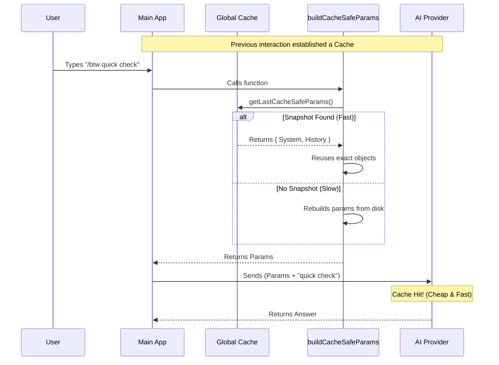

# Chapter 5: Context Forking & Caching

Welcome to the final chapter of our **btw** tutorial series!

In the previous chapter, **[Async Execution & Abort Control](04_async_execution___abort_control.md)**, we learned how to manage the lifecycle of our AI request so the application remains responsive and crash-free.

Now, we tackle the final challenge: **Memory and Performance.**

When you ask a side question, the AI needs to know what you were working on (Context). However, sending that data can be slow and expensive. Furthermore, we don't want our "side question" to clutter up the main chat history.

In this chapter, we will implement **Context Forking & Caching**.

## The Motivation

Imagine you are writing a very long essay on a physical piece of paper. You suddenly need to do some quick math to check a fact.

**Option A (The Bad Way):**
You write the math equation directly on your essay. Now your essay is messy, and you have to erase it later.

**Option B (The `btw` Way):**
You take your essay to a photocopier. You make a copy. You scribble your math on the **copy**. Once you get the answer, you throw the copy away and go back to the pristine original.

This is **Context Forking**.

### The Performance Twist (Caching)
Now, imagine the photocopier charges you $1.00 for every page it scans. If your essay is 100 pages long, that's expensive!

But, if the photocopier sees that the first 99 pages are *exactly the same* as the last time you used it, it skips scanning them and only charges you for the new page.

This is **Prompt Caching**. To use it, we must ensure the data we send is **byte-identical** to the previous request.

## Key Concepts

### 1. Cache Safe Params
This is a bundle of data that represents the "State of the World" before you asked your side question. It includes:
*   **System Prompt**: The AI's personality and rules.
*   **User Context**: Information about your project.
*   **Message History**: Everything typed in the main chat so far.

### 2. The Snapshot (`getLastCacheSafeParams`)
The main application stores a "snapshot" of the last thing it sent to the AI. If we can grab this snapshot, we guarantee that our data matches the cache exactly.

## The Implementation

We will use a function called `buildCacheSafeParams`. This acts as our "Smart Photocopier."

### Step 1: Cleaning the Input

Sometimes, you might type `btw` while the main AI is still typing a sentence. We don't want to send a half-finished sentence to our fork, as it might confuse the AI.

```typescript
// Helper function to remove half-finished messages
function stripInProgressAssistantMessage(messages: Message[]) {
  const last = messages.at(-1);
  
  // If the last message was from the AI and wasn't finished...
  if (last?.type === 'assistant' && last.message.stop_reason === null) {
    // ...chop it off!
    return messages.slice(0, -1);
  }
  return messages;
}
```

### Step 2: Checking for a Saved Copy

Now for the core logic. We check if the main application has a saved snapshot.

```typescript
// btw.tsx
async function buildCacheSafeParams(context) {
  // 1. Clean up the current messages
  const cleanMessages = stripInProgressAssistantMessage(context.messages);
  
  // 2. Ask: "Do we have a cached snapshot?"
  const saved = getLastCacheSafeParams();
```

### Step 3: Reusing the Snapshot (The Happy Path)

If `saved` exists, we reuse its heavy data (`systemPrompt`, `userContext`). This ensures the "prefix" of our request is identical to what the API has seen before, triggering the cache optimization.

```typescript
  if (saved) {
    return {
      // REUSE the exact objects from memory
      systemPrompt: saved.systemPrompt,
      userContext: saved.userContext,
      systemContext: saved.systemContext,
      
      // Add current tool context
      toolUseContext: context,
      forkContextMessages: cleanMessages
    };
  }
```

### Step 4: Building from Scratch (The Backup Path)

If this is the very first thing the user has done, there might not be a snapshot yet. In that case, we have to do the hard work of building the parameters from scratch.

```typescript
  // If no cache, we must build it manually (Slower)
  const [rawSystemPrompt, userContext, systemContext] = await Promise.all([
    getSystemPrompt(context.options.tools, ...),
    getUserContext(),
    getSystemContext()
  ]);

  return {
    systemPrompt: asSystemPrompt(rawSystemPrompt),
    userContext,
    systemContext,
    toolUseContext: context,
    forkContextMessages: cleanMessages
  };
} // end function
```

## Internal Implementation: Under the Hood

How does this flow work when the user actually runs the command?

1.  **Main Thread**: The user has been chatting. The App sent a request to the AI (Request A). The API cached this Request A.
2.  **`btw` Command**: User types `/btw`.
3.  **Forking**: `btw` grabs the parameters used for Request A.
4.  **Extension**: It adds the new side question to the end.
5.  **Execution**: It sends "Request A + Question" to the AI.
6.  **Cache Hit**: The AI realizes "Request A" is familiar and processes the answer instantly.



### Applying it to our Component

Finally, let's look at how this fits into our `useEffect` in `btw.tsx`. This connects the logic we just wrote to the UI we built in Chapter 2 and the Async handler from Chapter 4.

```typescript
// btw.tsx - inside BtwSideQuestion component

useEffect(() => {
  async function fetchResponse() {
    try {
      // 1. Fork the context efficiently
      const cacheSafeParams = await buildCacheSafeParams(context);
      
      // 2. Run the question using the forked context
      const result = await runSideQuestion({ 
        question, 
        cacheSafeParams 
      });
      
      // ... handle result
    } catch (err) { /* handle error */ }
  }
  // ...
}, [question]);
```

## Conclusion

Congratulations! You have successfully built the `btw` command from scratch.

Let's review what we built across these five chapters:

1.  **[Command Registration](01_command_registration.md)**: We put our command on the menu and set up lazy loading.
2.  **[Side Question UI](02_side_question_ui_component.md)**: We created a visual component using Ink.
3.  **[Event Handling](03_event_handling___navigation.md)**: We added keyboard navigation and focus management.
4.  **[Async & Abort](04_async_execution___abort_control.md)**: We safely managed the AI request lifecycle.
5.  **Context Forking (This Chapter)**: We optimized performance and kept the chat history clean by reusing cached parameters.

You now have a fully functional, high-performance CLI tool that integrates seamlessly with an AI agent. By using these patterns—Lazy Loading, Component State, AbortControllers, and Cache Forking—you can build robust terminal applications that feel professional and snappy.

**Happy Coding!**

---

Generated by [Code IQ](https://github.com/adityasoni99/Code-IQ)