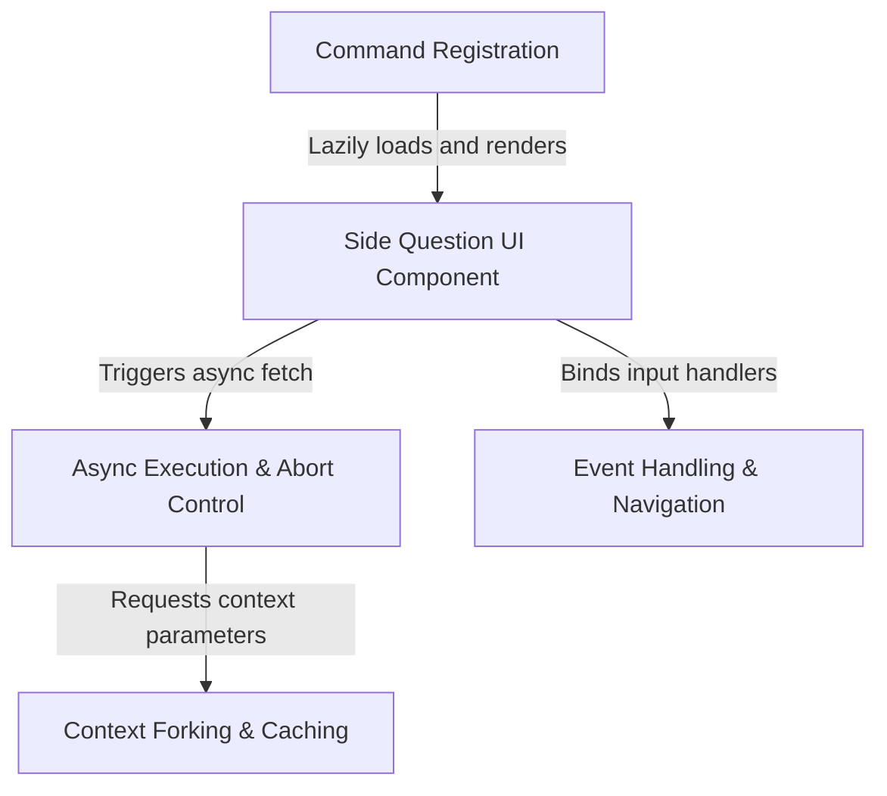

# Tutorial: btw

This project implements a **side question** feature for a CLI AI assistant, allowing users to ask quick queries (via `/btw`) without disrupting the main conversation flow. It renders a temporary *overlay UI* to handle these requests and uses **context forking** to efficiently reuse the existing chat history without modifying it.

## Chapters

1. [Command Registration](01_command_registration.md)
2. [Side Question UI Component](02_side_question_ui_component.md)
3. [Event Handling & Navigation](03_event_handling___navigation.md)
4. [Async Execution & Abort Control](04_async_execution___abort_control.md)
5. [Context Forking & Caching](05_context_forking___caching.md)

---

Generated by [Code IQ](https://github.com/adityasoni99/Code-IQ)