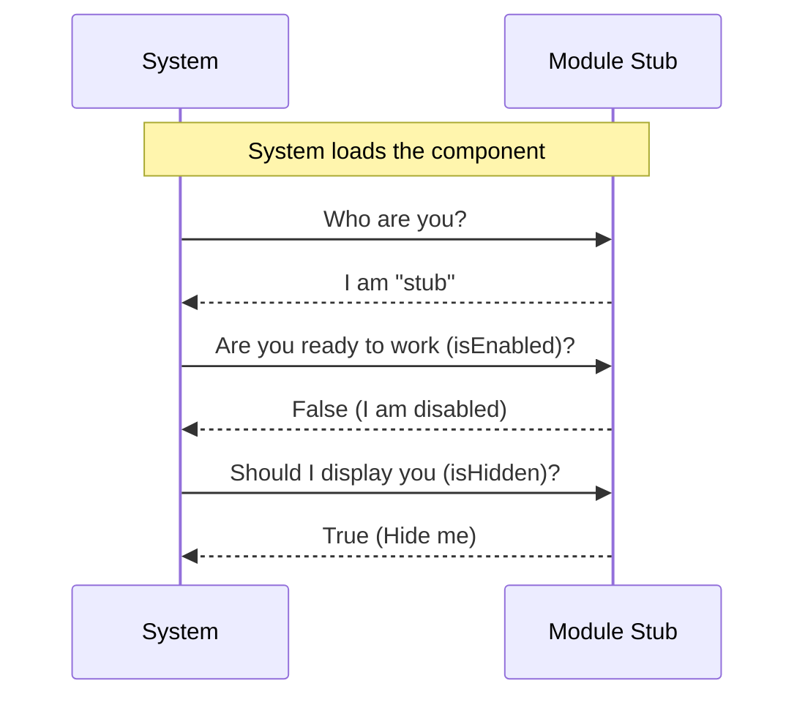

# Chapter 1: Module Stub

Welcome to **bughunter**! Whether you are a seasoned developer or writing your first line of code, this tutorial will guide you through the architecture of our system.

## The Problem: Building with Missing Pieces

Imagine you are planning a large dinner party. You have a seating chart, and you know exactly where everyone should sit. However, one of your guests, "Bob," hasn't arrived yet.

If you leave Bob's chair completely empty, the waiters might get confused and remove the setting, or someone else might take the chair. You need a way to say, "This space is taken, even if the person isn't ready."

In programming, we face a similar problem. When building a system like `bughunter`, we often need to define the **structure** of a component (like a bug-tracking tool) before we have actually written the **logic** for it. We need a placeholder that satisfies the system's requirements so the application doesn't crash looking for something that doesn't exist.

## The Solution: The "Reserved" Sign

This is where the **Module Stub** comes in.

A **Module Stub** is like a "Reserved" sign on a dinner table.
1.  It occupies the space.
2.  It satisfies the rules (it's sitting at the table).
3.  It doesn't actually eat any food or drink any wine (it does no work).

In `bughunter`, we use the Module Stub to create a valid, loadable component that does absolutely nothing. This allows us to test the system's loading mechanism without needing a finished feature.

## How to Use It

Let's look at how we verify that our "Reserved" sign works. Our goal is to import this stub and ensure the system recognizes it as a valid component, even though it is disabled.

### Step 1: Importing the Stub
First, we treat the stub like any other module in our system.

```javascript
// importing the stub module
import stub from './index.js';

// checking if the module loaded
console.log("Loaded module:", stub.name);
```

**Explanation:**
We import the file. If this runs without error, we know our file structure is correct. The system sees the "Reserved" sign.

### Step 2: Checking Capabilities
The system needs to know if it can use this module. Since it is a stub, the answer should be "No".

```javascript
// Check if the module is turned on
const active = stub.isEnabled();

console.log("Is the module active?", active);
// Output: Is the module active? false
```

**Explanation:**
The system asks, "Can I run this?" The stub politely replies, "No, I am just a placeholder."

## Under the Hood

What actually happens when the system interacts with a Module Stub? It's a simple conversation.

### The Conversation (Sequence Diagram)

Here is how the main System talks to the Stub:



### The Implementation

Now, let's look at the actual code that makes this happen. It is surprisingly simple.

**File:** `index.js`

```javascript
export default { 
  isEnabled: () => false, 
  isHidden: true, 
  name: 'stub' 
};
```

Let's break this down line by line:

1.  **`export default { ... }`**: This wraps our logic in an object that other files can import.
2.  **`isEnabled: () => false`**: This is a function that returns `false`. This relates to **[Feature Gating](03_feature_gating.md)**. It tells the system, "Do not execute any logic for me."
3.  **`isHidden: true`**: This is a simple property. This relates to **[Visibility State](04_visibility_state.md)**. It tells the user interface, "Do not draw a button for me."
4.  **`name: 'stub'`**: This is the ID tag. This relates to **[Component Identity](02_component_identity.md)**. It gives the system a way to refer to this specific object.

## Summary

In this chapter, we learned that a **Module Stub** is a placeholder. It allows us to reserve a spot in our application for future code. It is safe, disabled by default, and hidden from the user.

Now that we have a placeholder, we need to understand how the system keeps track of it among many other modules.

[Next Chapter: Component Identity](02_component_identity.md)

---

Generated by [Code IQ](https://github.com/adityasoni99/Code-IQ)