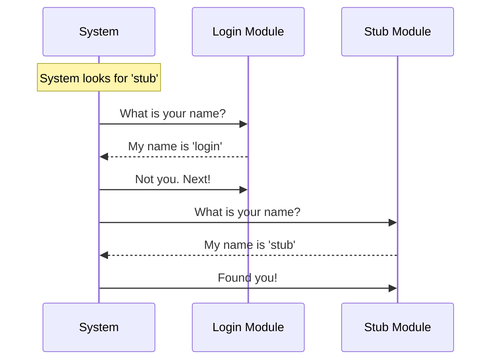

# Chapter 2: Component Identity

Welcome back! In the previous chapter, **[Module Stub](01_module_stub.md)**, we learned how to create a "Reserved" sign (a placeholder) for our code. We created an object that sits in the system but doesn't do anything yet.

However, imagine we have **50** different placeholders. We have a placeholder for "Login," one for "Settings," and one for "Profile." If they all just say "Reserved," how does the system know which is which?

This brings us to **Component Identity**.

## The Problem: The "Hey You!" Confusion

Imagine you are a manager at a large company. You have 100 employees. If you walk into the room and yell, "Hey you, do the work!", everyone will look confused. You need to be specific. You need to say, "Hey **Alice**, please do the work."

In `bughunter`, our system loads many different modules. To perform specific actions (like turning a feature on or off), the central system needs a reliable way to address exactly one specific module.

We cannot rely on the file name or the folder location because those might change. We need a permanent ID card.

## The Solution: The Employee Badge

**Component Identity** is simply a unique nametag or ID badge attached to the module.

In our code, we solve this by adding a simple property called `name`. This string acts as the unique identifier ('stub') that the system uses to reference this specific module internally.

## How to Use It

Our goal is to simulate a "System Registry." We want to look through a pile of modules and find the specific one we care about by checking its ID badge.

### Step 1: Defining the ID
We've actually already done this in our stub file! Let's look at it again, focusing only on the identity.

```javascript
// index.js
export default {
  // ... other properties ...
  name: 'stub' 
};
```

**Explanation:**
This acts as the badge. It declares, "My internal name is 'stub'." It must be unique across the entire application.

### Step 2: The Roll Call
Now, let's pretend we are the main `bughunter` system. We have a list of loaded modules, and we need to find the 'stub' module.

```javascript
const allModules = [
  { name: 'login', isEnabled: () => true },
  { name: 'stub',  isEnabled: () => false } // This is ours
];

// We want to find the module named 'stub'
const found = allModules.find(item => item.name === 'stub');

console.log("Found module:", found.name);
// Output: Found module: stub
```

**Explanation:**
1.  `allModules` represents the list of everyone "in the room."
2.  We use the `.find()` command to go through the list one by one.
3.  We check: `Does your name equal 'stub'?`
4.  When we find a match, we save it into the `found` variable.

## Under the Hood

How does the system physically check these IDs? It's like a security guard checking badges at a gate.

### The Inspection (Sequence Diagram)

Here is what happens when `bughunter` looks for a specific component.



### The Implementation Details

In the actual `bughunter` project, this identity concept is usually the first property defined in a module file. It acts as the anchor for everything else.

**File:** `index.js`

```javascript
export default { 
  // 1. Feature Gating logic (Chapter 3)
  isEnabled: () => false, 

  // 2. Visibility State logic (Chapter 4)
  isHidden: true, 

  // 3. Component Identity (This Chapter)
  name: 'stub' 
};
```

**Explanation:**
*   **`name: 'stub'`**: This is a simple Javascript **String**. We use strings because they are easy to read and easy to debug. If something goes wrong, the error message will say "Error in module 'stub'", which is very helpful.

This property is static. Unlike **[Feature Gating](03_feature_gating.md)** (which uses a function because the answer might change), the name of a component never changes while the app is running. Your name is your name.

## Why is this important?

Without Component Identity, the other features we will build are useless.
*   You can't hide a button (**[Visibility State](04_visibility_state.md)**) if you don't know *which* button to hide.
*   You can't turn off a feature (**[Feature Gating](03_feature_gating.md)**) if you can't find the switch.

The `name` property links the abstract code to the concrete requirements of the system.

## Summary

In this chapter, we learned that **Component Identity** is just a simple string property called `name`. It acts like an ID badge, allowing the system to pick a specific module out of a list.

Now that we can identify our module ("Hello, Stub!"), the next logical step is to ask it questions. The most important question is: "Are you allowed to run?"

[Next Chapter: Feature Gating](03_feature_gating.md)

---

Generated by [Code IQ](https://github.com/adityasoni99/Code-IQ)