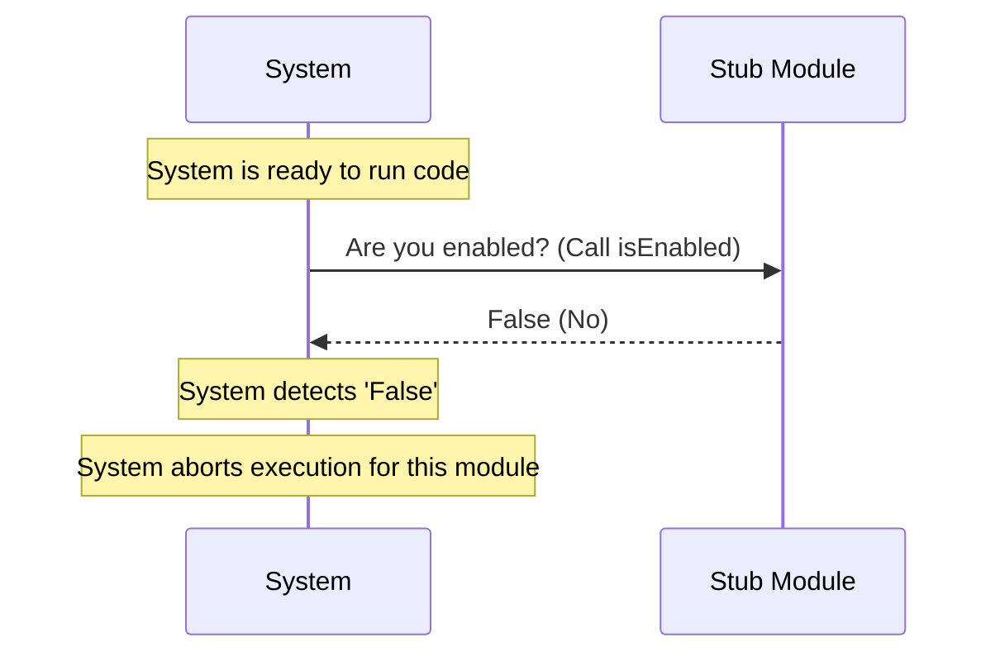

# Chapter 3: Feature Gating

Welcome back! In the previous chapter, **[Component Identity](02_component_identity.md)**, we gave our module a name tag so the system could find it.

Now that the system knows *who* the module is, it needs to know *what state* it is in. Is it ready to work? Is it under construction?

This brings us to **Feature Gating**.

## The Problem: The Unfinished Room

Imagine you are building a house. You have a room that is fully framed and has a door, but the electrical wiring inside isn't finished yet.

If you flip the light switch in that room, sparks might fly, or the whole house might lose power. You need a safety mechanism to cut off power to that specific room while leaving the rest of the house running.

In software, we often have code that is half-written or "stubbed out" (like our module). If the system tries to run this incomplete logic, the application could crash. We need a way to tell the system, "The code is here, but do not run it."

## The Solution: The Master Circuit Breaker

**Feature Gating** acts as a master circuit breaker.

In `bughunter`, we encapsulate this logic in a function called `isEnabled`.
1.  **If it returns `true`**: The breaker is ON. Power flows, and the code runs.
2.  **If it returns `false`**: The breaker is OFF. The system skips this module entirely.

Currently, for our stub module, we want the breaker permanently switched **OFF**.

## How to Use It

Our goal is to write a safety check. Before the system executes any complex logic belonging to our module, it must check the gate.

### Step 1: The Safety Check
Imagine the main `bughunter` application is looping through modules. It attempts to start our stub module.

```javascript
import stub from './index.js';

// The system asks: Is the power on?
if (stub.isEnabled()) {
    console.log("System: Running complex logic...");
    // This code would run the bug tracker
} else {
    console.log("System: Module is disabled. Skipping.");
}
```

**Output:**
```text
System: Module is disabled. Skipping.
```

**Explanation:**
The `if` statement acts as the gate. Because `stub.isEnabled()` returns `false`, the code inside the block (the "complex logic") is never touched. It is safe.

## Under the Hood

How does the system know the switch is off? It asks the module directly.

### The Conversation (Sequence Diagram)

Here is the flow of control when the system encounters our Feature Gate.



### The Implementation

Let's look at how we implemented this "Circuit Breaker" in our file.

**File:** `index.js`

```javascript
export default {
  // This is the Feature Gate
  isEnabled: () => false, 

  // Other properties
  isHidden: true, 
  name: 'stub' 
};
```

**Explanation:**
*   **`isEnabled`**: This is the property key. The system looks for this specific name.
*   **`() => false`**: This is a Javascript **Arrow Function**.
    *   It accepts no arguments `()`.
    *   It immediately returns `false`.

### Why use a function?
You might wonder, why not just use a variable like `enabled: false`?

We use a function (`() => false`) because it gives us **power for the future**. Right now, it is hardcoded to `false`. But later, we could change the function to be smarter without changing the system code:

```javascript
// Future possibility (Hypothetical)
isEnabled: () => {
    // Only turn on if today is Monday
    return new Date().getDay() === 1; 
}
```

By using a function, our Feature Gate becomes a dynamic decision-maker, not just a static label.

## Relationship to Other Concepts

*   **[Component Identity](02_component_identity.md)**: The system uses the `name` ('stub') to find the module *before* checking if it is enabled.
*   **[Visibility State](04_visibility_state.md)**: This is distinct from Feature Gating.
    *   **Feature Gating (`isEnabled`)**: Controls if the *logic/code* works. (Can I run?)
    *   **Visibility State (`isHidden`)**: Controls if the *user interface* appears. (Can I be seen?)

It is possible for a module to be Enabled (logic works) but Hidden (user can't click it). But for our stub, we want it Disabled AND Hidden.

## Summary

In this chapter, we learned about **Feature Gating**. We implemented an `isEnabled` function that acts as a master circuit breaker. By returning `false`, we ensure that our "under construction" module never causes the application to crash.

However, even if the power is cut, the light switch might still be on the wall. We need to make sure the user doesn't see a button that doesn't work.

[Next Chapter: Visibility State](04_visibility_state.md)

---

Generated by [Code IQ](https://github.com/adityasoni99/Code-IQ)