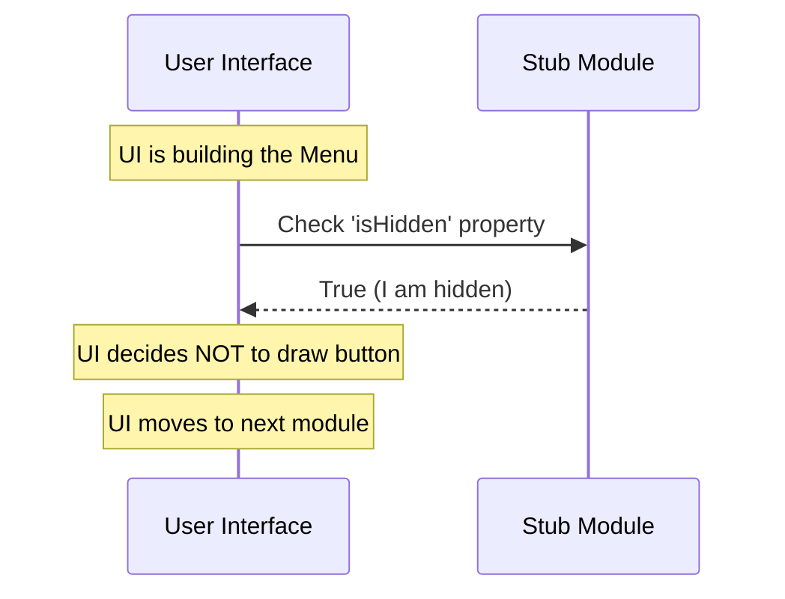

# Chapter 4: Visibility State

Welcome back! In the previous chapter, **[Feature Gating](03_feature_gating.md)**, we learned how to "cut the power" to our module using `isEnabled`. We ensured that no incomplete code runs behind the scenes.

However, simply turning off the logic isn't enough. Imagine you have a TV that is unplugged. The TV won't turn on (Feature Gating), but the TV set is still physically sitting in the middle of your living room taking up space.

If users see a button labeled "Bug Tracker" but nothing happens when they click it because we disabled it, they will think the app is broken. We need a way to remove the button entirely.

This brings us to **Visibility State**.

## The Problem: The "Ghost" Button

When building a User Interface (UI), we usually have a menu or a sidebar that lists all available tools.

If we simply list every module that exists in the code, our "Stub" module will show up in the menu.
1.  The user sees a button named "stub".
2.  The user clicks it.
3.  Nothing happens (because `isEnabled` is false).
4.  The user gets frustrated.

We need a way to separate the **existence** of a module (it is loaded in the code) from its **visual presence** (it shows up on the screen).

## The Solution: Stealth Mode

**Visibility State** is managed by a property called `isHidden`.

Think of this like "Stealth Mode" on a modern aircraft.
*   **Physically Present:** The plane is flying in the sky (The module is loaded in the system).
*   **Radar:** The Air Traffic Controller looks at their screen (The User Interface renders the menu).
*   **Stealth Mode:** The plane does not reflect radar waves, so it does not appear as a blip on the screen.

In `bughunter`, setting `isHidden` to `true` activates this stealth mode. The module is there, but the menu system ignores it.

## How to Use It

Our goal is to write a "Menu Renderer." This is a loop in our system that decides which buttons to draw on the screen.

### Step 1: The Rendering Loop

Imagine the system is building the main navigation bar. It looks at our module to decide if it should create a button.

```javascript
import stub from './index.js';

// The system asks: Should I put this on the radar?
if (stub.isHidden) {
    console.log("System: Skipping visual rendering.");
    // Do NOT draw a button
} else {
    console.log("System: Drawing button for " + stub.name);
    // Draw the button
}
```

**Output:**
```text
System: Skipping visual rendering.
```

**Explanation:**
The system checks the property. Because `isHidden` is `true`, the system quietly skips over this module. It doesn't throw an error; it just pretends the module isn't there for visual purposes.

### Relationship to Feature Gating

It is important to understand the difference between this and Chapter 3:

*   **[Feature Gating](03_feature_gating.md)** (`isEnabled`): Can the code run? (Security/Stability)
*   **[Visibility State](04_visibility_state.md)** (`isHidden`): Can the user see it? (User Experience)

Usually, if a feature is disabled, we also want it hidden. But sometimes, you might want a feature to be **Enabled but Hidden** (like a background process that runs automatically without a button).

## Under the Hood

How does the UI decide what to show? It conducts a quick interview with every module.

### The Inspection (Sequence Diagram)

Here is how the User Interface (UI) interacts with our Stub.



### The Implementation

Let's look at the final piece of our `index.js` file.

**File:** `index.js`

```javascript
export default { 
  isEnabled: () => false, 
  
  // This is the Visibility State
  isHidden: true, 
  
  name: 'stub' 
};
```

**Explanation:**
*   **`isHidden: true`**: This is a boolean value.
    *   **True**: The module acts like a background service or a placeholder. It is invisible to the user.
    *   **False**: The module is a standard tool. The system will look at **[Component Identity](02_component_identity.md)** (the `name` property) to figure out what label to put on the button.

In this specific case, because we are building a **[Module Stub](01_module_stub.md)** (a placeholder), we want it to be invisible. We don't want users trying to interact with an empty shell.

## Summary

In this chapter, we learned about **Visibility State**. We used the `isHidden` property to enable "Stealth Mode" for our module. This ensures that while our code is safely loaded into the system, it does not clutter the user interface or confuse the user with broken buttons.

### Tutorial Conclusion

Congratulations! You have successfully built the architecture for a `bughunter` module. You have mastered four core concepts:

1.  **[Module Stub](01_module_stub.md)**: Creating a safe placeholder.
2.  **[Component Identity](02_component_identity.md)**: Giving the module a unique name.
3.  **[Feature Gating](03_feature_gating.md)**: Safely disabling the logic.
4.  **[Visibility State](04_visibility_state.md)**: Hiding the module from the UI.

You now have a perfectly valid, safe, and invisible component loaded into the system. As you develop the actual features of `bughunter`, you simply flip these switches: change `isHidden` to `false`, change `isEnabled` to `true`, and write your logic!

Happy Coding!

---

Generated by [Code IQ](https://github.com/adityasoni99/Code-IQ)