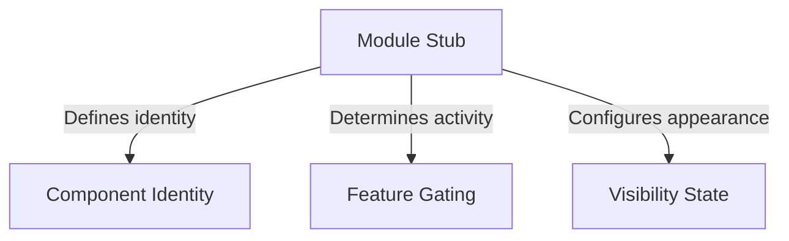

# Tutorial: bughunter

This project defines a **structural placeholder** (or "stub") for a software component, ensuring the system can recognize it without requiring concrete logic yet. It uses specific properties to establish the component's *identity* while keeping it structurally present but explicitly *disabled* and *hidden* from the user interface.

## Chapters

1. [Module Stub](01_module_stub.md)
2. [Component Identity](02_component_identity.md)
3. [Feature Gating](03_feature_gating.md)
4. [Visibility State](04_visibility_state.md)

---

Generated by [Code IQ](https://github.com/adityasoni99/Code-IQ)