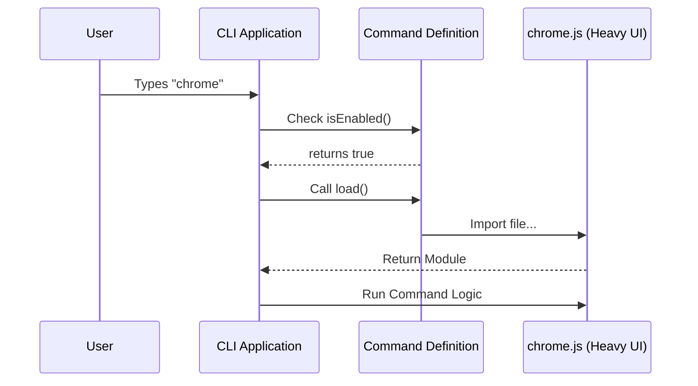

# Chapter 1: Command Module Definition

Welcome to the first chapter of the **Chrome** project tutorial!

In this project, we are building a CLI (Command Line Interface) integration for Chrome. Before we build complex user interfaces or talk to the browser, we need to tell our CLI application that this new feature simply *exists*.

This brings us to our first core concept: **Command Module Definition**.

## Why do we need this?

Imagine you walk into a large restaurant. The menu might have 50 different dishes.
*   **Without Command Definitions:** The kitchen cooks *every single dish* on the menu as soon as you walk in, just in case you order one. This is slow and wasteful.
*   **With Command Definitions:** The waiter hands you a **menu**. The menu describes the dishes (Name, Description), but the kitchen doesn't start cooking until you actually *order* a specific item.

In our CLI, if we loaded all the heavy code for every feature at startup, the application would be very slow. The **Command Module Definition** acts as the "Menu Item." It provides just enough information to list the command, but defers loading the heavy code until the user types the command.

### The Use Case

We want to add a command called `chrome` to our CLI.
1.  When the user types `--help`, they should see `chrome` listed with a description.
2.  The application should start fast.
3.  The heavy code for the Chrome settings should only load when the user actually runs `chrome`.

## Defining a Command

Let's look at how we define this "Menu Item" in code. We use a lightweight JavaScript/TypeScript object.

### Step 1: Metadata

First, we define the basic identity of our command. This includes its name and description.

```typescript
// index.ts
import type { Command } from '../../commands.js'

const command: Command = {
  name: 'chrome',
  description: 'Claude in Chrome (Beta) settings',
  // ... more properties below
}
```

*   **`name`**: This is what the user types in the terminal (e.g., `$ my-cli chrome`).
*   **`description`**: This text appears when the user asks for help.

### Step 2: Availability & Rules

Next, we define *who* can see this command and *when* it is allowed to run.

```typescript
// index.ts (continued)
import { getIsNonInteractiveSession } from '../../bootstrap/state.js'

// ... inside the command object
  availability: ['claude-ai'],
  isEnabled: () => !getIsNonInteractiveSession(),
  type: 'local-jsx',
```

*   **`availability`**: Defines which product tier has access to this command.
*   **`isEnabled`**: A function that returns `true` or `false`. Here, we disable the command if the session is non-interactive (automated). We learn more about state in [Environment & State Context](04_environment___state_context.md).
*   **`type`**: Tells the CLI that this command renders a UI locally.

### Step 3: Lazy Loading (The "Kitchen")

This is the most important part. We use a specific function to load the actual logic only when needed.

```typescript
// index.ts (continued)
  // The heavy code is NOT loaded yet.
  // It is only imported when this function runs.
  load: () => import('./chrome.js'),
}

export default command
```

*   **`load`**: This function uses a dynamic `import()`. The file `./chrome.js` contains the heavy User Interface code. By putting it inside a function, we ensure it stays "in the fridge" until ordered.

## Under the Hood: How it Works

What happens when you run the application? Here is the flow of events.

1.  **Boot**: The CLI starts up. It reads the `index.ts` file we just wrote.
2.  **Menu**: It sees the `command` object. It knows the name is `chrome`.
3.  **Wait**: It does **not** look at `./chrome.js` yet.
4.  **Action**: You type `chrome`. The CLI sees a match.
5.  **Load**: The CLI executes the `load()` function, importing the heavy code.

### Sequence Diagram



### Deep Dive: The Implementation

Let's look at the complete file `index.ts` to see how it all fits together.

```typescript
import { getIsNonInteractiveSession } from '../../bootstrap/state.js'
import type { Command } from '../../commands.js'

const command: Command = {
  name: 'chrome',
  description: 'Claude in Chrome (Beta) settings',
  availability: ['claude-ai'],
  // Check if we are in a valid state to run this
  isEnabled: () => !getIsNonInteractiveSession(),
  // Defines the rendering mode (covered in Chapter 2)
  type: 'local-jsx',
  // The Lazy Load magic
  load: () => import('./chrome.js'),
}

export default command
```

This file acts as a bridge. It connects the core CLI system to your specific feature.
*   The `type: 'local-jsx'` property gives the system a hint that the file we are loading (`./chrome.js`) will export a React-based UI. We will build that UI in [Interactive CLI UI (React/Ink)](02_interactive_cli_ui__react_ink_.md).
*   The `export default command` makes this definition available to the main application loader.

## Summary

In this chapter, you learned:
1.  **Command Module Definition** is like a menu item; it's lightweight metadata.
2.  We separate the **definition** (`index.ts`) from the **implementation** (`chrome.js`).
3.  We use the `load()` function with dynamic imports to make our application start faster.

Now that we have defined *how* to call the command, we need to build what the user actually sees when the command loads.

[Next Chapter: Interactive CLI UI (React/Ink)](02_interactive_cli_ui__react_ink_.md)

---

Generated by [Code IQ](https://github.com/adityasoni99/Code-IQ)