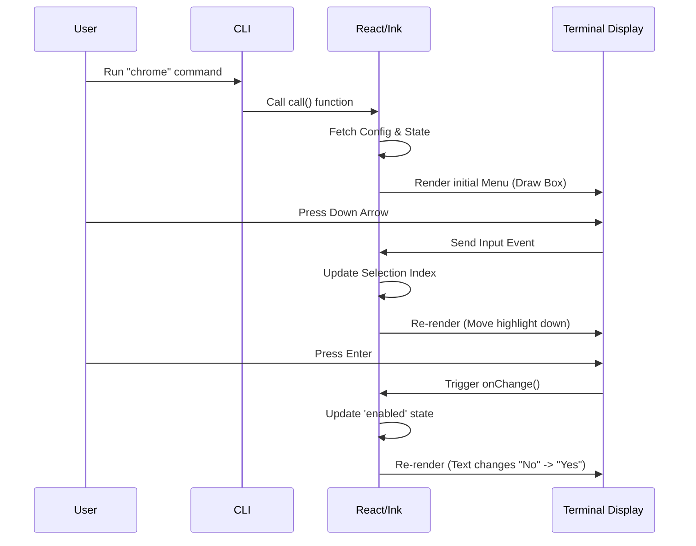

# Chapter 2: Interactive CLI UI (React/Ink)

Welcome to Chapter 2!

In [Command Module Definition](01_command_module_definition.md), we created the "Menu Item" for our Chrome command. We told the CLI that the command exists, but we haven't actually cooked the dish yet.

Now, we are going to build the actual user interface that appears when you run `claude chrome`.

## The Problem: Boring Terminals

Traditional Command Line Interfaces (CLIs) are often "fire and forget." You type a command, text scrolls by, and the program exits.
*   **Traditional:** User types flags (`--enable --verbose`). It feels like filling out a tax form.
*   **Interactive:** User sees a menu, toggles switches, and reads dialogs. It feels like using a modern app.

We want our Chrome integration to look like a proper application with menus and status indicators, right inside the terminal.

## The Solution: React + Ink

To achieve this, we use a library called **Ink**.

If you have used **React** for web development, you already know how to build this CLI.
*   **Web React:** Renders `<div />` and `<span />` to the Browser DOM.
*   **Ink React:** Renders `<Box />` and `<Text />` to the Terminal (using text characters).

This abstraction allows us to manage **State** (is the setting on or off?) and **Effects** (did the user press "Enter"?) just like a web app.

## Building the UI Component

We are building the file `chrome.tsx`. This is the file that our Command Definition loads dynamically.

### 1. The Structure

We start by defining a standard React Functional Component. We use Ink's building blocks: `Box` (for layout like flexbox) and `Text` (for strings).

```tsx
import React, { useState } from 'react';
import { Box, Text } from '../../ink.js';
import { Dialog } from '../../components/design-system/Dialog.js';

function ClaudeInChromeMenu(props) {
  // UI logic goes here
  return (
    <Dialog title="Claude in Chrome (Beta)">
       <Text>Welcome to the settings menu</Text>
    </Dialog>
  );
}
```

*   **`<Dialog />`**: A custom wrapper that draws a nice border and title around our content.
*   **`<Text />`**: Renders the string inside.

### 2. Managing Local State

A static menu isn't useful. We need to know if the Chrome extension is installed or if the feature is enabled. We use standard React `useState`.

```tsx
// Inside ClaudeInChromeMenu...

// State: Is the feature enabled in config?
const [enabled, setEnabled] = useState(props.configEnabled);

// State: Is the extension installed?
const [isInstalled, setIsInstalled] = useState(props.isExtensionInstalled);
```

Just like a web app, when these state variables change, Ink re-renders the text in the terminal instantly.

### 3. Creating the Menu Options

We want the user to be able to toggle settings. We prepare a list of options for our menu.

```tsx
// Calculating menu options based on state
const options = [
  {
    label: `Enabled by default: ${enabled ? 'Yes' : 'No'}`,
    value: 'toggle-default',
  },
  {
    label: 'Manage permissions',
    value: 'manage-permissions',
  }
];
```

Notice how the `label` changes dynamically based on the `enabled` state.

### 4. Handling User Interaction

We use a helper component called `Select`. This component listens for keyboard events (Up/Down arrows, Enter) and calls our function when the user chooses something.

```tsx
import { Select } from '../../components/CustomSelect/select.js';

// ... inside the render return
<Select
  options={options}
  onChange={(action) => {
    if (action === 'toggle-default') {
      // Update state when user clicks "Enter"
      setEnabled(!enabled);
      // We will learn about saving this in Chapter 5
    }
  }}
/>
```

### 5. The Entry Point

Finally, we need to export a function that the CLI can call to start this React process. This is the `call` function we referenced in Chapter 1's `load()` method.

```tsx
// chrome.tsx
import { isChromeExtensionInstalled } from '../../utils/claudeInChrome/setup.js';

export const call = async function(onDone) {
  // 1. Fetch data before rendering
  const installed = await isChromeExtensionInstalled();

  // 2. Return the React Node
  return (
    <ClaudeInChromeMenu
      onDone={onDone}
      isExtensionInstalled={installed}
    />
  );
};
```

## How It Works Under the Hood

When the user types `chrome`, the CLI doesn't just print text; it starts a rendering engine.

1.  **Preparation:** The `call` function runs. It fetches necessary data (like checking if the Chrome extension is real).
2.  **Mount:** The CLI "mounts" the React component. Ink takes over the terminal output (stdout).
3.  **Render Loop:** Ink calculates the layout (using flexbox logic) and translates it into ANSI escape codes (colors, cursor movements) to draw the box and text.
4.  **Input Loop:** Ink listens to `stdin` (keyboard presses). If you press "Down", it updates the selected index state and re-draws the arrow in the new position.

### Sequence Diagram



## Deep Dive: The Implementation

Let's look at the real `chrome.tsx` file (simplified for clarity). It combines all the concepts above.

### The Component Definition

```tsx
// chrome.tsx - The Menu Component
function ClaudeInChromeMenu({ onDone, configEnabled, isWSL }) {
  // We use AppState to check for connections
  // (Covered in Chapter 4)
  const mcpClients = useAppState(s => s.mcp.clients); 
  
  const [enabledByDefault, setEnabledByDefault] = useState(configEnabled);

  // Define what happens when a user clicks a menu item
  const handleAction = (action) => {
     switch(action) {
        case 'toggle-default':
           const newValue = !enabledByDefault;
           // Save to disk (Covered in Chapter 5)
           saveGlobalConfig(c => ({...c, claudeInChromeDefaultEnabled: newValue}));
           setEnabledByDefault(newValue);
           break;
     }
  };

  // ... (options definition hidden for brevity)

  return (
    <Dialog title="Claude in Chrome (Beta)" onCancel={onDone}>
       <Box flexDirection="column" gap={1}>
          <Text>Control your browser directly from Claude Code.</Text>
          
          {/* Conditional Rendering based on Environment */}
          {isWSL && <Text color="error">Not supported in WSL</Text>}
          
          {/* The Interactive Menu */}
          <Select options={options} onChange={handleAction} />
       </Box>
    </Dialog>
  );
}
```

### The Async Loader

This sets up the stage before the UI appears.

```tsx
// chrome.tsx - The Exported Function
export const call = async function (onDone) {
  // Gather environment data
  const isExtensionInstalled = await isChromeExtensionInstalled();
  const config = getGlobalConfig();
  
  // Render the component
  return (
    <ClaudeInChromeMenu 
       onDone={onDone} 
       isExtensionInstalled={isExtensionInstalled}
       configEnabled={config.claudeInChromeDefaultEnabled}
    />
  );
};
```

This separation ensures that our UI component (`ClaudeInChromeMenu`) is "pure" and focuses only on rendering, while the `call` function handles the "dirty" work of fetching initial data from the disk or system.

## Summary

In this chapter, you learned:
1.  **Interactive CLI UI:** We treat the terminal like a web browser using **React** and **Ink**.
2.  **Components:** We use `<Box>`, `<Text>`, and `<Dialog>` to structure visual elements.
3.  **State Management:** We use `useState` to make the menu responsive to user input without restarting the program.
4.  **Async Entry:** We use an async `call` function to prepare data before the UI renders.

We now have a menu that looks good. But for this menu to actually *do* anything useful—like talking to the web browser—we need a way to communicate outside the terminal.

[Next Chapter: Browser Extension Bridge](03_browser_extension_bridge.md)

---

Generated by [Code IQ](https://github.com/adityasoni99/Code-IQ)