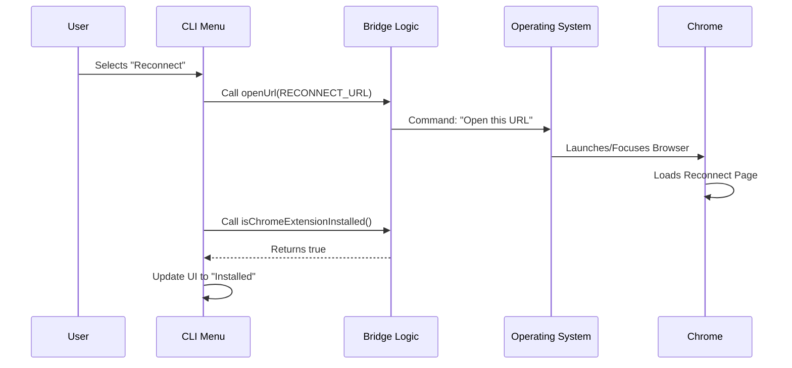

# Chapter 3: Browser Extension Bridge

Welcome to Chapter 3!

In the previous chapter, [Interactive CLI UI (React/Ink)](02_interactive_cli_ui__react_ink_.md), we built a beautiful menu with buttons like "Install Extension" and "Reconnect." However, if you pressed those buttons, nothing happened. We built the dashboard of the car, but we haven't connected the steering wheel to the tires yet.

This brings us to the **Browser Extension Bridge**.

## The Motivation: Crossing the Divide

Your CLI runs in a **Terminal** window. The Chrome Extension runs in a **Web Browser**. These are two completely different worlds. They usually cannot talk to each other.

*   **The Terminal** is like a submarine underwater.
*   **The Browser** is like a plane in the sky.

To make them work together, we need a **Bridge** (or a radio signal) that allows the submarine to verify the plane is there and send signals to it.

### The Use Case

Imagine the user selects **"Manage Permissions"** in your CLI menu.
1.  The CLI needs to know: "Is Chrome installed?"
2.  The CLI needs to command: "Open Chrome to this specific settings URL."

## Key Concept 1: The Remote Control Analogy

Think of this Bridge code as a **Universal Remote Control**.
*   **The TV:** The Chrome Browser with our Extension.
*   **The Remote:** Our CLI Bridge code.

Before we try to change the channel, the remote needs to check: *Is there even a TV in the room?*

### Step 1: Defining the Targets

First, we need to define "channels" (URLs) that our remote can tune into. We store these as constants so we don't make typing mistakes later.

```typescript
// utils/claudeInChrome/common.ts

export const CHROME_EXTENSION_URL = 'https://claude.ai/chrome';
export const CHROME_PERMISSIONS_URL = 'https://clau.de/chrome/permissions';
export const CHROME_RECONNECT_URL = 'https://clau.de/chrome/reconnect';
```

**Explanation:**
These are the specific addresses our "Remote" will command the "TV" to show.

## Key Concept 2: Status Checks (Is the TV on?)

Before we show the "Enabled" status in our UI, we must ask the system if the extension is actually installed.

### The Check Function

We wrap complex system logic into a simple function that returns `true` or `false`.

```typescript
// utils/claudeInChrome/setup.ts

export async function isChromeExtensionInstalled() {
  // Complex logic to check registry or file system
  // ... implementation details hidden ...
  return true; // or false
}
```

**Explanation:**
The UI we built in Chapter 2 calls this function.
*   If it returns `false`, the UI shows the "Install Extension" option.
*   If it returns `true`, the UI shows "Reconnect" or "Manage Permissions".

## Key Concept 3: The Act of Navigation

When the user presses "Enter" on a menu item, we need to "fire" the signal to the browser.

### The Open Function

We use a helper function to open URLs.

```typescript
// utils/claudeInChrome/common.ts

export function openInChrome(url: string) {
  // Uses system commands to force Chrome to open this URL
  open(url, { app: { name: 'google chrome' } });
}
```

**Explanation:**
This doesn't just open any browser; it specifically tries to talk to Chrome, where our extension lives.

## Integrating the Bridge into the UI

Now, let's look at how we connect this Bridge to the UI we built in [Interactive CLI UI (React/Ink)](02_interactive_cli_ui__react_ink_.md).

Recall the `handleAction` function in our `chrome.tsx` file.

### 1. Handling Installation

```typescript
// chrome.tsx (Inside handleAction)

case 'install-extension':
  // 1. Show a hint to the user
  setShowInstallHint(true);
  // 2. Use the Bridge to open the store URL
  openUrl(CHROME_EXTENSION_URL);
  break;
```

**What happens:** The CLI tells the OS to open the default browser to the extension installation page.

### 2. Handling Reconnection

```typescript
// chrome.tsx (Inside handleAction)

case 'reconnect':
  // 1. Check if it's really installed now
  isChromeExtensionInstalled().then(installed => {
     setIsExtensionInstalled(installed);
  });
  // 2. Open the special reconnection page
  openUrl(CHROME_RECONNECT_URL);
  break;
```

**What happens:** This acts like a "Refresh" button. It re-checks the installation status via the Bridge and simultaneously opens a webpage that forces the extension to wake up.

## Under the Hood: The Flow

Let's visualize what happens when a user clicks "Reconnect".



## Deep Dive: Handling Different Environments

Not all computers are the same. A major challenge in CLI development is handling things like **WSL** (Windows Subsystem for Linux), where the terminal is Linux but the browser is in Windows.

Our Bridge needs to be smart enough to handle this.

```typescript
// chrome.tsx

import { env } from '../../utils/env.js';

// ... inside the component
const isWSL = env.isWslEnvironment();

// We conditionally render an error if in WSL
{isWSL && (
  <Text color="error">
    Claude in Chrome is not supported in WSL.
  </Text>
)}
```

**Explanation:**
The Bridge acts as a guard. If we are in an environment where the Bridge cannot reach the "TV" (like WSL currently), we disable the controls to prevent the user from being frustrated.

## Summary

In this chapter, you learned:
1.  **The Bridge Pattern:** Separating the UI code from the logic that talks to the outside world.
2.  **Constants:** Defining our "Channels" (URLs) in one place.
3.  **Status Checks:** Using `isChromeExtensionInstalled` to verify the "TV is plugged in."
4.  **Navigation:** Using `openInChrome` to send commands to the browser.

We now have a CLI that can display a menu and launch the browser. But wait—how does the CLI know if the browser successfully connected? How do we know if the user is logged in?

For that, we need a shared "brain" that tracks what is happening across the entire application.

[Next Chapter: Environment & State Context](04_environment___state_context.md)

---

Generated by [Code IQ](https://github.com/adityasoni99/Code-IQ)