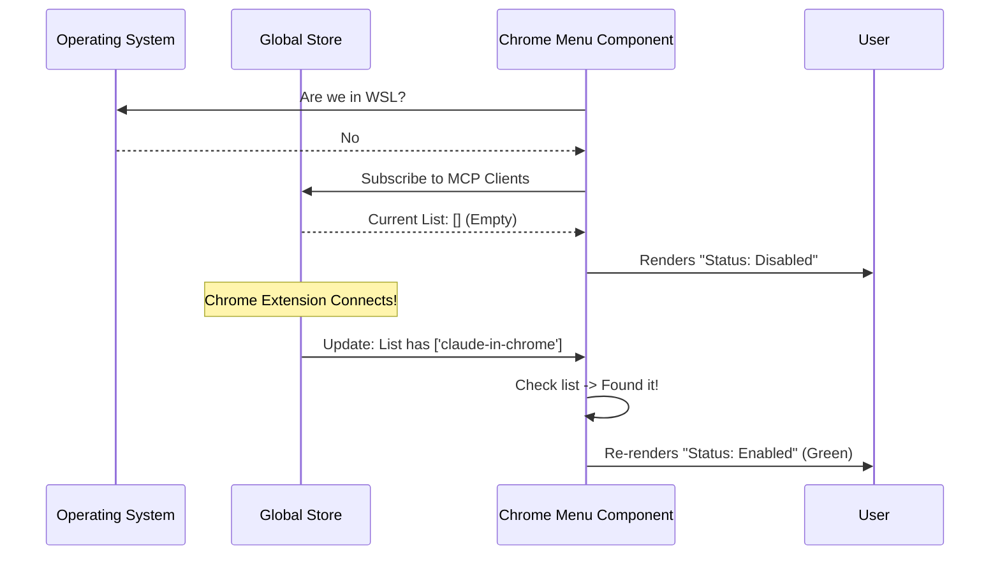

# Chapter 4: Environment & State Context

Welcome to Chapter 4!

In the previous chapter, [Browser Extension Bridge](03_browser_extension_bridge.md), we built the remote control to talk to the browser. In [Interactive CLI UI (React/Ink)](02_interactive_cli_ui__react_ink_.md), we built the dashboard.

Now we face a new problem: **Reality.**

Just because we *have* a remote control doesn't mean the TV is plugged in, or that we are even in a room with a TV. We need a system to check our surroundings and the current status of the application. We call this **Environment & State Context**.

## The Motivation: The Pre-Flight Check

Imagine you are a pilot. Before you press the "Take Off" button, you look at your dashboard.
1.  **Environment:** Is the runway icy? (If yes, don't fly).
2.  **Identity:** Do I have my pilot's license? (If no, don't fly).
3.  **State:** Is the engine running? (If yes, the status light is Green).

Our CLI needs to do the exact same thing:
1.  **Environment:** Are we running in WSL (Windows Subsystem for Linux)? (The feature doesn't work there yet).
2.  **Identity:** Is the user a paid subscriber? (The feature is premium only).
3.  **State:** Is the Chrome Extension actually connected right now? (We need to show "Enabled" or "Disabled").

Without this context, the application would crash or confuse the user by offering features that won't work.

## Key Concept 1: The Environment (Where am I?)

First, we need to ask the Operating System where we are running. Some environments, like **WSL**, have limitations. WSL is a Linux terminal running inside Windows; it has trouble talking directly to the Windows Chrome browser in the specific way we need.

We use a helper utility to check this.

```typescript
// utils/env.ts (Simplified)
export const env = {
  // Returns true if we are in Windows Subsystem for Linux
  isWslEnvironment: () => {
    // Checks system files for "microsoft" or "wsl" keywords
    return process.platform === 'linux' && isWsl();
  }
};
```

**Explanation:**
This function acts like a sensor. It checks the system fingerprints to see if we are in a simulated Linux environment.

## Key Concept 2: User Identity (Who am I?)

Next, we need to check if the user is allowed to use this feature. We don't want to show a "Connect" button if the user isn't authorized.

```typescript
// utils/auth.ts
export function isClaudeAISubscriber() {
  // Checks the local session token for subscription details
  const session = getSession();
  return session?.isProTier === true;
}
```

**Explanation:**
This is our security guard. It looks at the user's login session to verify their subscription tier.

## Key Concept 3: Global App State (What is happening?)

This is the most dynamic part. We need to know if the Chrome Extension is currently talking to our CLI.

We use a system called **MCP** (Model Context Protocol). You don't need to know how the protocol works, just that it creates a list of "Clients" (connected tools). We need to search this list.

We use a global state store (like a central database in memory) that any component can read.

```typescript
// Inside a React Component
import { useAppState } from '../../state/AppState.js';

// Subscribe to the list of connected clients
const mcpClients = useAppState(state => state.mcp.clients);
```

**Explanation:**
`useAppState` is a "Hook." It connects our UI component to the live heartbeat of the application. If a new client connects, this variable updates automatically.

## Solving the Use Case

Now, let's put these three concepts together inside our `chrome.tsx` file (which we started in Chapter 2).

We want to:
1.  Disable the feature if in WSL.
2.  Disable the feature if not a subscriber.
3.  Show a green "Enabled" text if the Chrome Extension is connected.

### Step 1: Gathering the Data

In our entry function, we gather the static data (Environment and Identity).

```tsx
// chrome.tsx - The call() function
export const call = async function(onDone) {
  // 1. Check Environment
  const isWSL = env.isWslEnvironment();
  
  // 2. Check Identity
  const isSubscriber = isClaudeAISubscriber();

  // Pass these facts to the UI
  return <ClaudeInChromeMenu isWSL={isWSL} isSubscriber={isSubscriber} ... />;
};
```

### Step 2: Consuming State in the UI

Inside the component, we listen to the live App State to check for connections.

```tsx
// chrome.tsx - The Component
function ClaudeInChromeMenu({ isWSL, isSubscriber }) {
  // 3. Check Live State
  const clients = useAppState(s => s.mcp.clients);
  
  // Search for our specific chrome server
  const chromeClient = clients.find(c => c.name === 'claude-in-chrome');
  const isConnected = chromeClient?.type === 'connected';

  // ... Rendering logic below ...
}
```

### Step 3: Conditional Rendering

Finally, we tell the UI what to draw based on these facts.

```tsx
return (
  <Box flexDirection="column">
    {/* Guard Clause: Error if in WSL */}
    {isWSL && <Text color="error">Not supported in WSL</Text>}

    {/* Guard Clause: Error if not paid */}
    {!isSubscriber && <Text color="error">Subscription required</Text>}

    {/* Status Indicator */}
    <Text>
      Status: {isConnected ? <Text color="green">Enabled</Text> : <Text color="gray">Disabled</Text>}
    </Text>
  </Box>
);
```

**What happens here?**
*   If `isWSL` is true, the user sees a red error message.
*   If `isConnected` is true (the extension is talking to us), the text turns **Green**.
*   If `isConnected` is false, the text stays **Gray**.

## Under the Hood

How does the data flow from the system to your screen?

1.  **Initialization:** The `call` function runs once. It grabs "static" facts (WSL, Subscription) that won't change while the menu is open.
2.  **Mount:** The React component loads.
3.  **Subscription:** The `useAppState` hook registers a listener with the global store.
4.  **Update:** If the Chrome Extension connects in the background, the global store updates.
5.  **Re-render:** React notices the data changed and repaints the screen, turning "Disabled" to "Enabled" instantly.

### Sequence Diagram



## Deep Dive: The Connection Logic

Let's look closer at how we identify the connection. We don't just check if *any* client is connected; we look for a specific name.

```typescript
// utils/claudeInChrome/common.ts
export const CLAUDE_IN_CHROME_MCP_SERVER_NAME = 'claude-in-chrome';

// chrome.tsx
const chromeClient = mcpClients.find(
  client => client.name === CLAUDE_IN_CHROME_MCP_SERVER_NAME
);
```

We use a constant `CLAUDE_IN_CHROME_MCP_SERVER_NAME`. This prevents typos. If we typed `claude-chrome` (missing the "in"), our code would never find the client, and the light would never turn green.

This connects back to [Command Module Definition](01_command_module_definition.md) where we defined static metadata. Here, we use static constants to ensure our dynamic state checking is accurate.

## Summary

In this chapter, you learned:
1.  **Environment Context:** Using `env` to detect limitations like WSL.
2.  **User Context:** Using `auth` to enforce subscription requirements.
3.  **State Context:** Using `useAppState` to reactively update the UI when the extension connects or disconnects.

We have built a smart UI that knows *where* it is and *what* is happening. But there is one piece missing.

If the user sets the feature to "Enabled by default," sets it to `true`, and then closes the app... does the app remember that choice next time? Currently, no.

We need a memory system.

[Next Chapter: Configuration Persistence](05_configuration_persistence.md)

---

Generated by [Code IQ](https://github.com/adityasoni99/Code-IQ)