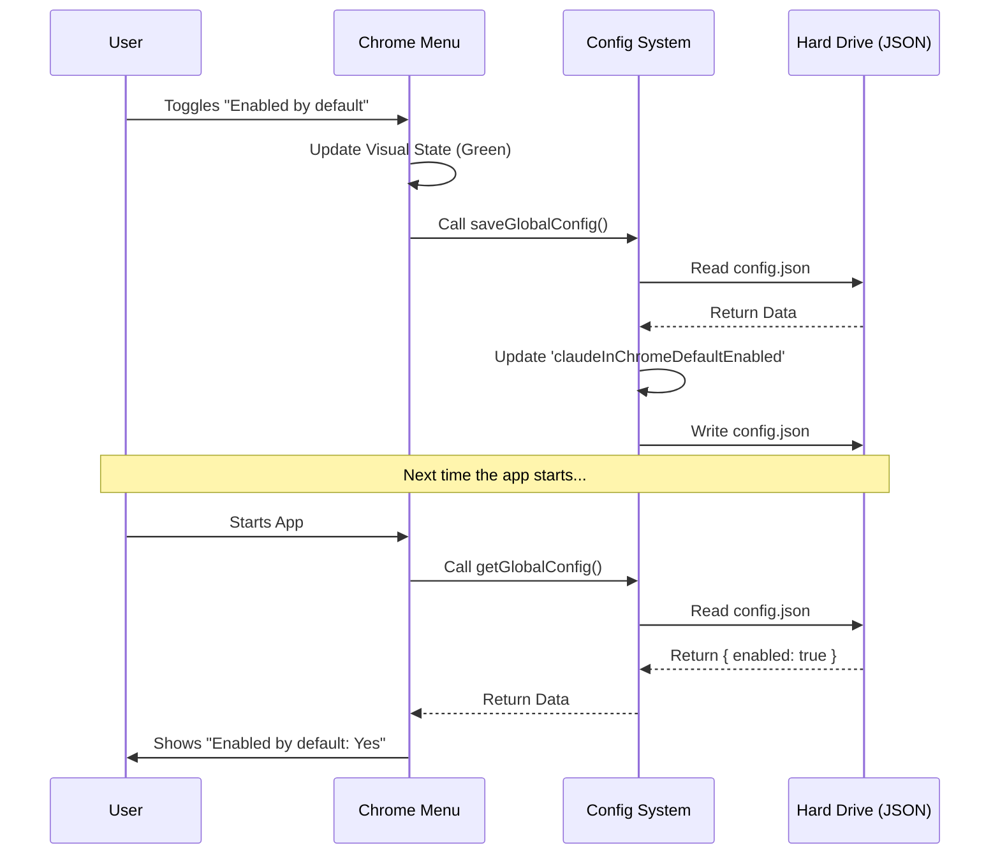

# Chapter 5: Configuration Persistence

Welcome to the final chapter of our tutorial!

In [Environment & State Context](04_environment___state_context.md), we gave our CLI "awareness" of its surroundings. It knows if the user is a subscriber or if the environment is valid.

However, our application currently suffers from **Amnesia**.

## The Problem: "50 First Dates"

Imagine the following scenario:
1.  You open the CLI.
2.  You see the option **"Enabled by default: No"**.
3.  You toggle it to **"Yes"**.
4.  You close the CLI.
5.  You open the CLI again.
6.  It says **"Enabled by default: No"**.

The application forgot your choice! This happens because React state (`useState`) only lives in memory while the program is running. As soon as the program closes, that memory is wiped.

To fix this, we need **Configuration Persistence**. We need to write your choices to a physical file on your hard drive, so the application remembers them the next time it wakes up.

## Key Concept 1: The Settings File

Think of Configuration Persistence as a **Notebook** that the CLI keeps in its pocket.
*   **Without Persistence:** The CLI memorizes your order but forgets it when it leaves the room.
*   **With Persistence:** The CLI writes your order down in the notebook.

In our project, this "Notebook" is a JSON file stored on your computer (usually in `~/.claude/config.json`).

## Key Concept 2: Reading the Notebook

To see what the user chose in the past, we use a function called `getGlobalConfig`. This function opens the notebook and reads the current settings.

```typescript
// utils/config.ts (Usage Example)
import { getGlobalConfig } from '../../utils/config.js';

const config = getGlobalConfig();

console.log(config.claudeInChromeDefaultEnabled); 
// Output: true (or false/undefined)
```

**Explanation:**
This function is synchronous. It reads the file immediately and returns a simple JavaScript object containing all the user's settings.

## Key Concept 3: Writing to the Notebook

To change a setting, we use `saveGlobalConfig`. We don't just overwrite the whole file (which might erase other important settings); instead, we use an **Updater Function**.

```typescript
import { saveGlobalConfig } from '../../utils/config.js';

saveGlobalConfig(currentConfig => {
  // We return a NEW object with our changes
  return {
    ...currentConfig, // Keep all old settings (copy them)
    claudeInChromeDefaultEnabled: true // Change only this one
  };
});
```

**Explanation:**
1.  `saveGlobalConfig` gives us the `currentConfig` (the current page of the notebook).
2.  We copy everything from the current page (`...currentConfig`).
3.  We update the specific line we care about.
4.  The system saves this new page back to the disk.

## Solving the Use Case

Let's apply this to our `chrome.tsx` file. We need to do two things:
1.  **Read** the saved setting when the menu opens.
2.  **Save** the setting when the user toggles the switch.

### Step 1: Loading the Saved Preference

We do this in the `call` function (our entry point), just like we did for environment checks in [Environment & State Context](04_environment___state_context.md).

```tsx
// chrome.tsx - The call() function
export const call = async function(onDone) {
  // 1. Read the notebook from disk
  const config = getGlobalConfig();
  
  // 2. Pass the specific setting to the Menu
  return (
    <ClaudeInChromeMenu 
       configEnabled={config.claudeInChromeDefaultEnabled}
       // ... other props ...
    />
  );
};
```

**What happens:**
Before the UI even draws the first pixel, we check the hard drive to see if the user previously enabled this feature.

### Step 2: Saving the New Preference

Now we update the `handleAction` inside our component to save to disk whenever the user changes the value.

```tsx
// chrome.tsx - Inside the component
const handleAction = (action) => {
  if (action === 'toggle-default') {
    const newValue = !enabledByDefault;
    
    // 1. Update the UI immediately (Visual feedback)
    setEnabledByDefault(newValue);

    // 2. Write to the Notebook (Persistence)
    saveGlobalConfig(current => ({
      ...current,
      claudeInChromeDefaultEnabled: newValue
    }));
  }
};
```

**What happens:**
1.  The user presses "Enter" on the toggle.
2.  `setEnabledByDefault` updates the React state, so the text on screen changes from "No" to "Yes" instantly.
3.  `saveGlobalConfig` runs in the background to ensure that if you quit right now, "Yes" is remembered.

## Under the Hood

What actually happens when you call `saveGlobalConfig`?

1.  **Read:** The system reads the `config.json` file.
2.  **Modify:** It applies your changes to the object in memory.
3.  **Serialize:** It turns the JavaScript object back into a text string (JSON).
4.  **Write:** It saves that string to your hard drive.

### Sequence Diagram



## Deep Dive: The Safety Copy (Immutability)

You might have noticed this strange syntax: `...current`.

```typescript
// The "Spread" operator
...current
```

This is crucial for safety. The configuration file holds settings for *everything* in the CLI (login tokens, themes, font sizes).

If we did this:
```typescript
// BAD CODE - DO NOT DO THIS
return { claudeInChromeDefaultEnabled: true };
```
We would be creating a new object with *only* one property. We would accidentally delete the user's login token and log them out!

By doing `{ ...current, ...changes }`, we are saying: "Take everything that was already there, and *only* overwrite the one thing I changed."

## Conclusion

Congratulations! You have successfully built the **Claude in Chrome** feature integration.

Let's review the journey you took:

1.  **[Command Module Definition](01_command_module_definition.md):** You created the "Menu Item" so the CLI knows the command exists.
2.  **[Interactive CLI UI (React/Ink)](02_interactive_cli_ui__react_ink_.md):** You built the visual interface using React components.
3.  **[Browser Extension Bridge](03_browser_extension_bridge.md):** You created a remote control to send signals to the Chrome browser.
4.  **[Environment & State Context](04_environment___state_context.md):** You added intelligence to check if the user is a subscriber or if the environment is supported.
5.  **[Configuration Persistence](05_configuration_persistence.md):** You ensured the user's choices are remembered forever.

You have gone from a blank file to a fully functional, state-aware, persistent CLI feature. You are now ready to build your own commands!

---

Generated by [Code IQ](https://github.com/adityasoni99/Code-IQ)