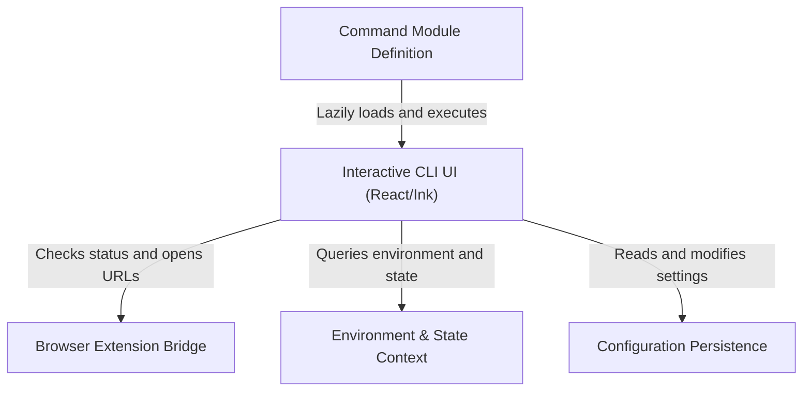

# Tutorial: chrome

This project implements an interactive **CLI menu** that allows users to configure the "Claude in Chrome" feature directly from their terminal. It acts as a bridge to a *browser extension*, enabling users to check connection status, manage permissions, and toggle preferences through a **React-based** textual interface that adapts to the local **environment**.

## Chapters

1. [Command Module Definition](01_command_module_definition.md)
2. [Interactive CLI UI (React/Ink)](02_interactive_cli_ui__react_ink_.md)
3. [Browser Extension Bridge](03_browser_extension_bridge.md)
4. [Environment & State Context](04_environment___state_context.md)
5. [Configuration Persistence](05_configuration_persistence.md)

---

Generated by [Code IQ](https://github.com/adityasoni99/Code-IQ)