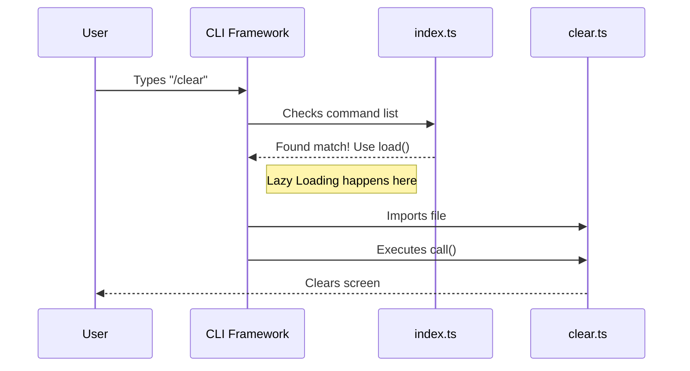

# Chapter 1: Command Definition & Routing

Welcome to the first chapter of our tutorial! Today, we are building the foundation for the `clear` command.

## Motivation: The Restaurant Menu
Imagine walking into a restaurant. You sit down and look at the **menu**. You see "Spaghetti Carbonara" listed with a description.

Does the chef immediately start cooking that pasta the moment you walk in the door? No! That would waste food and make the kitchen chaotic. The chef waits until you actually **order** it.

In our CLI (Command Line Interface) app, we face a similar challenge:
1.  **The Problem:** If we load all the heavy code for every command (like `/clear`, `/help`, `/image`) right when the app starts, the app will be slow to open.
2.  **The Solution:** We create a "Menu" (Command Definition). This tells the app *what* commands exist (names, descriptions) but only loads the code (the "cooking") when the user types the command.

This chapter explains how to set up that menu item using **Command Definition & Routing**.

---

## Part 1: Defining the Command (The Menu Item)

To tell the CLI framework that our command exists, we need to create a definition file. This is like printing the text on the restaurant menu.

We need to define:
*   **Name:** What the user types (e.g., `clear`).
*   **Aliases:** Other names that do the same thing (e.g., `reset`).
*   **Description:** A helpful hint about what it does.

### The Metadata
Here is how we define the basic identity of the command in `index.ts`.

```typescript
// File: index.ts
import type { Command } from '../../commands.js'

const clear = {
  type: 'local',
  name: 'clear',
  description: 'Clear conversation history and free up context',
  aliases: ['reset', 'new'],
  supportsNonInteractive: false, 
  // ... loading logic comes next
}
```

**Explanation:**
*   `type: 'local'`: Tells the system this runs on your machine, not a remote server.
*   `aliases: ['reset', 'new']`: If the user types `/reset`, it routes to this same command.
*   `supportsNonInteractive`: Set to `false` because clearing a session usually implies an interactive start to a new one.

---

## Part 2: Lazy Loading (The Routing)

Now for the magic trick. We want to route the user to the actual code, but only **on demand**.

We use a specific function called `load`. This function uses a JavaScript feature called "dynamic import". It promises to go fetch the file `./clear.js` only when the command is actually triggered.

```typescript
// File: index.ts (continued)

const clear = {
  // ... previous metadata ...
  
  // This is the "Routing" part
  load: () => import('./clear.js'),
} satisfies Command

export default clear
```

**Explanation:**
*   `() => import('./clear.js')`: This is the lazy loader. It acts like a pointer. It says, "If anyone asks for `clear`, go read `clear.ts` right then."
*   `satisfies Command`: This is a TypeScript helper to ensure we didn't forget any required fields.

---

## Part 3: Under the Hood

What happens when a user actually types `/clear`? Let's visualize the flow.

### The Flow
1.  The User types `/clear`.
2.  The CLI Framework looks at the **Metadata** (from `index.ts`). It sees a match!
3.  The Framework calls the `load()` function.
4.  The system imports the heavy code from `clear.ts`.
5.  The command executes.

### Sequence Diagram



### The Destination Code
When the router routes the request, it lands in `clear.ts`. This file must export a `call` function. This is where the actual work begins.

```typescript
// File: clear.ts
import type { LocalCommandCall } from '../../types/command.js'
import { clearConversation } from './conversation.js'

export const call: LocalCommandCall = async (_, context) => {
  // This is the "heavy lifting" we delayed loading
  await clearConversation(context)
  
  return { type: 'text', value: '' }
}
```

**Explanation:**
*   `export const call`: This is the standard entry point the framework looks for after loading the file.
*   `clearConversation(context)`: This function performs the actual logic of wiping the slate clean. We will build this in the next chapter, [Conversation Clearing Orchestrator](02_conversation_clearing_orchestrator.md).
*   `return`: We return an empty text value to signal the command finished successfully without printing extra noise.

---

## Conclusion

Congratulations! You have successfully defined the "Menu Item" for the Clear command.

**What we learned:**
1.  **Metadata:** How to name a command and give it aliases like `/reset`.
2.  **Routing:** How to wire the name to a specific code file.
3.  **Lazy Loading:** How to keep the app fast by only importing code when it is needed.

Now that the routing is set up, we need to implement the actual logic that happens when the command runs.

**Next Step:** Let's look at how we orchestrate the cleanup process.

[Next Chapter: Conversation Clearing Orchestrator](02_conversation_clearing_orchestrator.md)

---

Generated by [Code IQ](https://github.com/adityasoni99/Code-IQ)