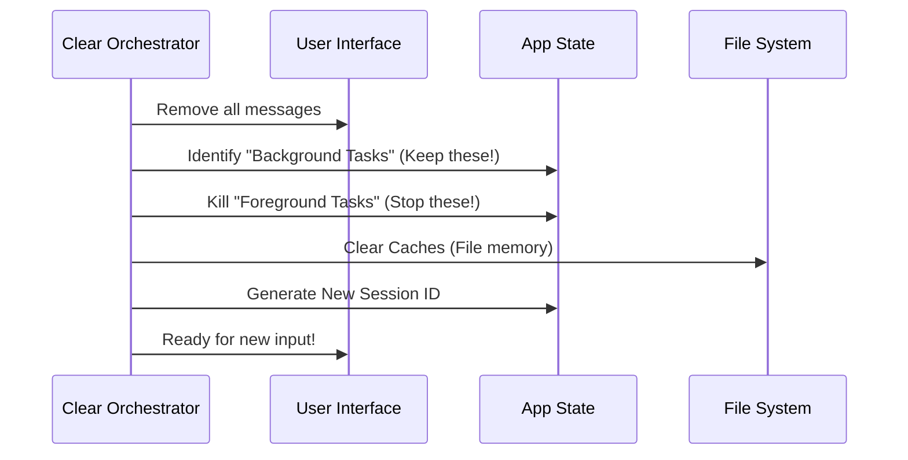

# Chapter 2: Conversation Clearing Orchestrator

Welcome back! In the previous chapter, [Command Definition & Routing](01_command_definition___routing.md), we created the "Menu Item" for our `/clear` command. We set up the routing so that when a user types `/clear`, the application knows where to look for the code.

Now, we need to actually write the code that does the cleaning. This is the **Conversation Clearing Orchestrator**.

---

## Motivation: The Whiteboard Analogy

Imagine you are working on a complex math problem on a whiteboard. The board is covered in numbers, diagrams, and notes. You are finished with that problem and want to start drawing a landscape.

To do this, you need to wipe the board. But you have to be careful:
1.  **Don't crash:** You can't just throw the whiteboard out the window. You need to keep the frame (the application) intact.
2.  **Don't lose your tools:** You have a calculator and some markers (Background Tasks) sitting on the tray. You don't want to throw those away with the eraser dust.
3.  **Fresh Start:** You want a perfectly clean surface, free of "ghost" marks from the previous session.

The **Orchestrator** is the careful cleaner. It wipes the writing but keeps the tools and the board itself safe.

---

## The Concept: Orchestration

In software, an "Orchestrator" is a function that manages several different systems at once to achieve a goal.

Our `clearConversation` function doesn't just do one thing. It coordinates three major systems:
1.  **The UI:** Clearing the messages you see on the screen.
2.  **The State:** Stopping active processes (like a running script) while protecting background ones.
3.  **The Identity:** Giving the session a new ID so logs and history start fresh.

---

## Step-by-Step Flow

Before we look at code, let's visualize what happens when this function runs.



---

## Implementation: The `clearConversation` Function

We are working in the file `conversation.ts`. This function takes a "Context Object"—a bundle of tools it needs to interact with the rest of the app.

Let's build this function piece by piece.

### 1. The Setup
First, we define the function. It accepts a list of helpers (passed in from the command handler we built in Chapter 1).

```typescript
// conversation.ts
export async function clearConversation({
  setMessages,       // Tool to update the UI
  setAppState,       // Tool to update internal state
  getAppState,       // Tool to read current state
  readFileState,     // Tool to manage file caches
}: ClearContext) {
  // ... logic goes here
}
```

### 2. Clearing the Visuals
The most immediate thing the user expects is for the text to disappear. We use `setMessages` to set the message list to an empty array.

```typescript
  // 1. Wipe the visual slate clean
  setMessages(() => [])
  
  // 2. Unblock the input if it was stuck
  // (We explain this mechanism in detail in Chapter 4)
  setContextBlocked(false)
```
*Effect: The chat window becomes blank.*

### 3. Preserving Background Tasks
This is a critical step. If you have a server running in the background (like a local web server), you don't want `/clear` to kill it. We need to identify which tasks are "Backgrounded" and save them.

```typescript
  // We will dive deep into this in Chapter 3
  const preservedAgentIds = new Set<string>()

  if (getAppState) {
    const tasks = getAppState().tasks
    for (const task of Object.values(tasks)) {
      // If a task is explicitly backgrounded, keep it alive!
      if (task.isBackgrounded) {
        preservedAgentIds.add(task.agentId)
      }
    }
  }
```
*Effect: We have a list of VIPs (Very Important Processes) that survive the wipe.*
*(We cover the details of this in [Background Task Preservation](03_background_task_preservation.md))*

### 4. Resetting the Application State
Now we perform the actual reset. We update the global `AppState`. We keep the preserved tasks, but kill and remove everything else.

```typescript
  if (setAppState) {
    setAppState(prev => {
      // Create a new empty list of tasks
      const nextTasks = {} 

      // Only copy over the tasks we decided to save
      // ... (We filter the tasks here)

      // Return the fresh state
      return {
        ...prev,
        tasks: nextTasks, // Only background tasks remain
        fileHistory: { snapshots: [], trackedFiles: new Set() }
      }
    })
  }
```
*Effect: Foreground processes (like a running loop) are killed. Memory of edited files is wiped.*
*(See [App State Reset](04_app_state_reset.md) for the full logic).*

### 5. Cleaning Caches
The application remembers files it has read to save time. We need to force it to "forget" so it doesn't use old data.

```typescript
  // Reset the file reader cache
  readFileState.clear()

  // Clear specific session caches (except for our preserved agents)
  clearSessionCaches(preservedAgentIds)
```
*Effect: Next time the AI reads a file, it reads it fresh from the disk.*
*(See [Global Cache Eviction](05_global_cache_eviction.md)).*

### 6. New Identity (Session ID)
Finally, we generate a new Session ID. This separates the logs of the old conversation from the new one. It ensures our analytics don't get confused.

```typescript
  // Generate a totally new random ID for this session
  regenerateSessionId({ setCurrentAsParent: true })

  // Reset the pointer for where we write logs on disk
  await resetSessionFilePointer()
```
*Effect: The application acts as if it was just restarted, but faster.*

---

## Conclusion

You have just built the brain of the cleanup operation!

**What we learned:**
1.  **Orchestration:** Clearing is not just one action; it is a sequence of UI updates, state management, and cache clearing.
2.  **Safety:** We must differentiate between things to delete (foreground tasks) and things to keep (background tasks).
3.  **Identity:** Generating a new Session ID gives us a "clean slate" for logs.

However, we glazed over a very complex part: **How do we actually keep the background tasks alive while destroying everything around them?**

That requires some clever engineering, which we will tackle in the next chapter.

[Next Chapter: Background Task Preservation](03_background_task_preservation.md)

---

Generated by [Code IQ](https://github.com/adityasoni99/Code-IQ)