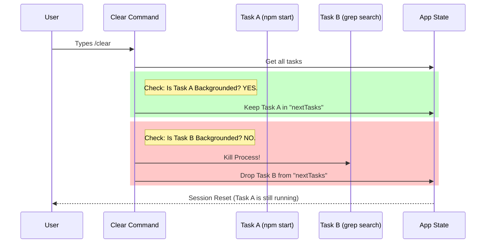

# Chapter 3: Background Task Preservation

Welcome to Chapter 3! In the previous chapter, [Conversation Clearing Orchestrator](02_conversation_clearing_orchestrator.md), we built the high-level manager that wipes our application clean.

However, we faced a dilemma. We want a clean slate, but we don't want to destroy *everything*. Specifically, if you have a web server running in the background, you don't want `/clear` to shut it down.

This chapter explains **Background Task Preservation**—the logic that decides who stays and who goes.

---

## Motivation: The Office Cleaning Service

Imagine an office building at night. A cleaning crew (our `/clear` command) comes in to reset the room for the next day.

They have strict instructions:
1.  **Trash:** Throw away used coffee cups, old sticky notes, and scratch paper (The Conversation History).
2.  **Keep:** Do **not** unplug the servers, the refrigerator, or the security cameras (The Background Tasks).

If the cleaning crew simply unplugged everything in the room, the company would go offline.

In our app, a "Background Task" might be a local server (like `npm start`) that the user wants to keep running while they clear the chat to start a new line of questioning. We need a way to identify these tasks and protect them.

---

## Part 1: Identifying the VIPs

The first step in preservation is identification. We need to look at every running task and check its badge.

In our code (inside `conversation.ts`), every task has a property called `isBackgrounded`.

### The Logic
We create a list (a `Set`) of IDs that we intend to save.

```typescript
// conversation.ts

const preservedAgentIds = new Set<string>()

// Helper function to check the "Badge"
const shouldKillTask = (task: any): boolean => {
  // If it is NOT backgrounded, it dies.
  return task.isBackgrounded === false
}
```

**Explanation:**
*   `Set<string>`: Think of this as the "Lifeboat List."
*   `shouldKillTask`: This is our bouncer. It looks at a task. If the task is *not* marked as backgrounded, it returns `true` (meaning: "Yes, kill this").

### Filling the Lifeboat
Now we loop through all tasks currently in our Application State (`getAppState`).

```typescript
if (getAppState) {
  const allTasks = getAppState().tasks
  
  for (const task of Object.values(allTasks)) {
    // If the bouncer says "Don't kill", we save it
    if (!shouldKillTask(task)) {
      preservedAgentIds.add(task.agentId)
    }
  }
}
```

**Explanation:**
*   We iterate through every active task.
*   If `shouldKillTask` returns `false` (meaning it is a background task), we add its ID to our preserved list. These are our survivors.

---

## Part 2: The Filtering Process

Now that we know *who* to save, we perform the actual filtering when we update the Application State.

We create a new object for tasks (`nextTasks`). We only copy over the survivors. Everyone else gets terminated.

```typescript
setAppState(prev => {
  const nextTasks = {} // Start with an empty list

  for (const [taskId, task] of Object.entries(prev.tasks)) {
    if (!shouldKillTask(task)) {
      // It's a VIP! Copy it to the new state.
      nextTasks[taskId] = task 
      continue
    }
    
    // logic to kill the task goes here...
  }

  return { ...prev, tasks: nextTasks }
})
```

**Explanation:**
*   **The Survivor:** If the task is preserved, it gets added to `nextTasks`. It survives into the next session.
*   **The Victim:** If the task is not preserved, it is *not* added to `nextTasks`. It effectively disappears from the app's memory.

---

## Part 3: Terminating the Rest

If a task is not chosen for the lifeboat, it must be destroyed immediately to free up computer resources. We can't just "forget" it; we have to actively stop it.

```typescript
    // Inside the 'else' block from above...
    
    // 1. Stop the actual system process (e.g., kill the shell command)
    if (task.status === 'running') {
      task.shellCommand?.kill()
    }

    // 2. Stop any JavaScript timers or listeners
    task.abortController?.abort()
```

**Explanation:**
*   `shellCommand?.kill()`: This sends a signal to the operating system to stop the process (like pressing Ctrl+C).
*   `abortController?.abort()`: This tells our internal code to stop waiting for that task to finish.

---

## Visualizing the Flow

Let's look at how the data flows when you run `/clear`.



---

## Part 4: The "Magic Mirror" (Symlinks)

There is one final tricky part.

When we run `/clear`, we generate a **new Session ID** (we will learn why in the next chapter). This means we create a brand new folder on your computer for logs.

*   **Problem:** The Background Task (which survived) is still writing logs to the **Old** Session folder.
*   **Solution:** We create a "Symlink" (Symbolic Link). This is like a shortcut or a tunnel.

We point a link from the **Old** file to the **New** session, so the user can see the logs in the new clean screen.

```typescript
// conversation.ts

// Loop through the survivors
for (const task of preservedLocalAgents) {
  if (task.status === 'running') {
    // Create a shortcut so we can see the old logs in the new session
    initTaskOutputAsSymlink(
      task.id, 
      getAgentTranscriptPath(task.agentId)
    )
  }
}
```

**Explanation:**
*   This ensures that even though the session ID changed, the "live feed" of the background server isn't broken.

---

## Conclusion

You have learned how we selectively preserve important work while cleaning up the clutter.

**Key Takeaways:**
1.  **Identification:** We check the `isBackgrounded` property of every task.
2.  **Filtering:** We rebuild the task list, keeping only the VIPs.
3.  **Termination:** We actively kill the processes of tasks that didn't make the cut.
4.  **Continuity:** We use file system tricks (Symlinks) to keep the logs flowing to the new session.

Now that we have filtered our tasks, we need to handle the rest of the application state (like the file history and the session ID itself).

**Next Step:** Let's wipe the rest of the application memory.

[Next Chapter: App State Reset](04_app_state_reset.md)

---

Generated by [Code IQ](https://github.com/adityasoni99/Code-IQ)