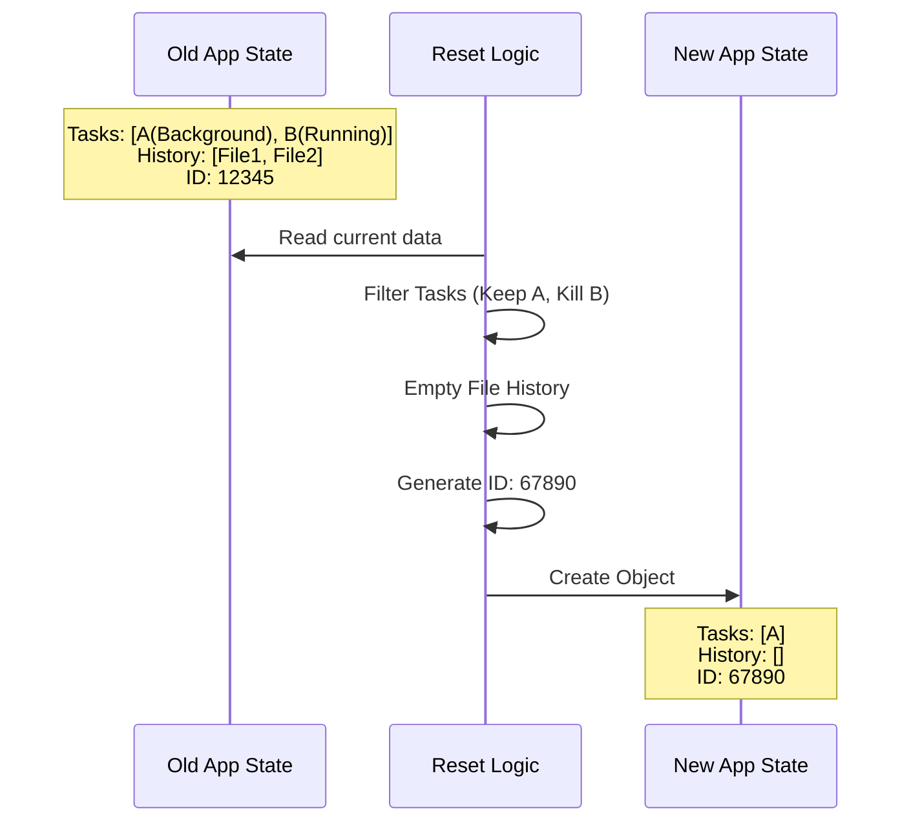

# Chapter 4: App State Reset

Welcome back! In the previous chapter, [Background Task Preservation](03_background_task_preservation.md), we did the detective work. We identified which "VIP" tasks (like background servers) needed to survive our cleanup process.

Now, we are ready to perform the surgery.

This chapter covers **App State Reset**. This is the moment we actually touch the application's brain (the State) and rewrite its memory.

---

## Motivation: The Factory Reset

Imagine you have a smartphone that is acting sluggish. You decide to do a **Factory Reset**.

When you do this, you want to:
1.  **Delete** your text message history.
2.  **Delete** your call logs.
3.  **Reset** your settings to default.
4.  **Keep** the Operating System so the phone still turns on.

In our CLI application, the **App State** is a giant JavaScript object that holds everything the app knows: running tasks, file edit history, connected tools, and user messages.

If we don't reset this state correctly, the "Ghost" of the old conversation will haunt the new one. The AI might try to "Undo" a file edit that happened three hours ago in a different context.

We need to wipe the slate clean while carefully placing our "VIP" tasks back onto the board.

---

## The Concept: State Immutability

We don't just delete variables. We use a pattern common in React and Redux called **Immutable State Updates**.

Instead of saying `state.history = []`, we do this:
1.  Take the **Previous State**.
2.  Create a **New State** based on the old one.
3.  Modify the specific parts we want to change.
4.  Replace the whole state tree with the new version.

---

## Step 1: The Tasks (Applying the Filter)

In Chapter 3, we created a list of survivors called `nextTasks`. Now, we simply slot them into our new state object.

```typescript
// Inside conversation.ts

setAppState(prev => {
  // 'prev' is the Old State
  // 'nextTasks' contains only our VIP background tasks (from Chapter 3)

  return {
    ...prev,            // Copy everything else for a moment...
    tasks: nextTasks,   // ...but REPLACE the tasks with our survivor list
    
    // ... other resets follow below
  }
})
```

**Explanation:**
*   `setAppState`: This function tells the app "I want to update the data."
*   `...prev`: This spreads the old state properties. It ensures we don't accidentally delete something we forgot to mention.
*   `tasks: nextTasks`: We explicitly overwrite the task list with our clean list. Any task not in `nextTasks` is now gone forever.

---

## Step 2: Wiping File History

The application remembers every change it makes to files so the user can say "undo that." When we clear the conversation, that "undo" history is no longer relevant. We need to wipe it.

```typescript
    // Continuing inside the return object...

    fileHistory: {
      snapshots: [],          // Delete all file backups
      trackedFiles: new Set(), // Forget which files we touched
      snapshotSequence: 0,     // Reset the counter
    },
```

**Explanation:**
*   `snapshots: []`: This is the stack of "undo" points. We empty it.
*   `trackedFiles`: The app stops watching the files it was editing in the previous session.

---

## Step 3: Resetting Tools (MCP)

Our app uses the **Model Context Protocol (MCP)** to connect to external tools (like database connectors or filesystem tools). We want to reset these connections to a neutral state, forcing them to re-initialize if needed.

```typescript
    mcp: {
      clients: [],      // Disconnect active clients
      tools: [],        // Clear available tools
      resources: {},    // Clear cached resources
      
      // Keep this! It allows plugins to reconnect automatically.
      pluginReconnectKey: prev.mcp.pluginReconnectKey,
    },
```

**Explanation:**
*   We clear the `clients` and `tools` to ensure no "stale" connections remain.
*   We **preserve** `pluginReconnectKey`. This is a small piece of configuration that says, "Hey, even though we are resetting, remember which plugins were installed."

---

## Step 4: The Session Identity

Finally, outside of the state object, we need to change the identity of the session itself.

Every conversation has a **Session ID**. This ID determines where log files are stored on your hard drive. If we keep the old ID, the new empty chat will append logs to the old full chat file on the disk.

```typescript
// conversation.ts

// 1. Generate a brand new random UUID
regenerateSessionId({ setCurrentAsParent: true })

// 2. Tell the file system to start a new log folder
await resetSessionFilePointer()
```

**Explanation:**
*   `regenerateSessionId`: This creates a new ID (e.g., changing from `Session-A` to `Session-B`).
*   `setCurrentAsParent: true`: This links them in the database for analytics. It says "Session-B is the child of Session-A."
*   `resetSessionFilePointer`: This ensures the next line of text written to disk goes into the new folder.

---

## Visualizing the Transformation

Let's see the sequence of how the state transforms.



---

## Internal Implementation: Putting it together

When we combine all these pieces, we get the full implementation inside `conversation.ts`.

Here is the simplified flow of the function:

1.  **Define Survivors:** Determine which tasks are backgrounded (Chapter 3).
2.  **Kill Victims:** Terminate processes for tasks being removed.
3.  **Update State:** Return the new object with empty history and filtered tasks.
4.  **Update Metadata:** Generate the new Session ID.

### The Code Block

Here is the core logic that combines these concepts:

```typescript
// conversation.ts (Simplified)

setAppState(prev => {
  // 1. Filter the tasks (as learned in Ch 3)
  const nextTasks = filterTasks(prev.tasks)

  // 2. Return the clean slate
  return {
    ...prev,                  // Keep basics
    tasks: nextTasks,         // Only VIPs remain
    
    // Wipe history
    fileHistory: { snapshots: [], trackedFiles: new Set(), snapshotSequence: 0 },
    
    // Reset attribution (who committed what)
    attribution: createEmptyAttributionState(),
    
    // Reset tools
    mcp: { ...prev.mcp, clients: [], tools: [] } 
  }
})
```

---

## Conclusion

We have successfully performed the "Factory Reset."

**What we achieved:**
1.  **Surgical Precision:** We kept the operating system (the app) running.
2.  **Selective Memory:** We kept background tasks but forgot file history.
3.  **Fresh Start:** We generated a new Session ID so logs start fresh.

However, even though the *State* is clean, the computer's **File System** might still be holding onto cached data (like the contents of files we read previously). If we don't clear that, the AI might hallucinate file contents that no longer exist.

**Next Step:** Let's scrub the file system caches.

[Next Chapter: Global Cache Eviction](05_global_cache_eviction.md)

---

Generated by [Code IQ](https://github.com/adityasoni99/Code-IQ)