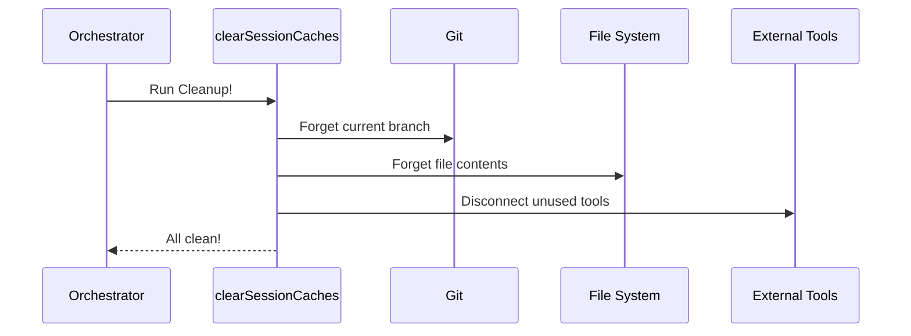

# Chapter 5: Global Cache Eviction

Welcome to the final chapter of our tutorial on the `/clear` command!

In the previous chapter, [App State Reset](04_app_state_reset.md), we performed a "Factory Reset" on the application's central brain (the App State). We wiped the history and reset the settings.

 However, there is one place left where "ghosts" of the old conversation might still be hiding: **The Caches**.

---

## Motivation: The Browser Cookie Analogy

Imagine you are having trouble with a website. You refresh the page, but it still looks broken. A tech support agent tells you: *"You need to clear your cache and cookies."*

Why? Because your browser (to be fast) saved a copy of the website from 10 minutes ago. Even though the website changed, your browser is showing you the old version it remembers.

**Our CLI tool does the same thing:**
1.  **Performance:** When the AI reads a file or checks Git status, it saves the result in memory so it doesn't have to check again 1 second later.
2.  **The Problem:** If you run `/clear`, you expect a fresh start. If the AI still remembers the old file contents from the previous session, it might get confused or hallucinate.

**Global Cache Eviction** is the "Deep Clean" that forces every part of the system to forget what it knows and look at the world with fresh eyes.

---

## The Concept: The Cleanup Crew

In our code, cache eviction isn't just one function; it's a collection of many small cleanup tasks.

Think of it like a cleaning crew entering a house. One person cleans the windows (File Cache), another vacuums the rug (Git Cache), and another wipes the counters (Tool Cache).

We group all these tasks into one main utility function called `clearSessionCaches`.

### What gets cleaned?
*   **Git Status:** "What branch am I on?"
*   **File Content:** "What is written in `index.ts`?"
*   **LSP Diagnostics:** "Are there any red squiggly error lines?"
*   **Tool Definitions:** "What tools (like database connectors) are available?"

---

## Usage: Calling the Cleaner

In Chapter 2, [Conversation Clearing Orchestrator](02_conversation_clearing_orchestrator.md), we saw this function being called.

It takes one important input: the **Preserved Agent IDs**.

remember from [Background Task Preservation](03_background_task_preservation.md) that we might keep some background servers running. If a server is running, we **cannot** wipe the memory associated with it, or it might crash.

```typescript
// conversation.ts

// 1. Identify who is staying (from Chapter 3)
const preservedAgentIds = new Set<string>(['agent-123'])

// 2. Call the deep cleaner
// We pass the list of VIPs so their data doesn't get wiped
clearSessionCaches(preservedAgentIds)
```

**Explanation:**
*   We pass the `preservedAgentIds` to the function.
*   The function will scrub everything *except* the data belonging to those specific agents.

---

## Internal Implementation: Under the Hood

Let's look at `caches.ts`. This file imports almost every system in the app just to tell them to "reset."

### High-Level Flow



### Step 1: Clearing Basic Context
First, we clear the simple things: user context (who are you?) and system context (what machine is this?).

```typescript
// caches.ts

export function clearSessionCaches(preservedIds: Set<string>) {
  
  // Clear basic identity caches
  getUserContext.cache.clear?.()
  getSystemContext.cache.clear?.()
  
  // Clear Git status (Forget which branch we are on)
  getGitStatus.cache.clear?.()
}
```

**Note:** The syntax `.cache.clear?.()` is a common pattern in this project. It means "If this function has a memory cache attached to it, empty it now."

### Step 2: Clearing Tools and Commands
Next, we clear the memory of what commands and tools are available.

```typescript
  // Forget the list of available slash commands
  clearCommandsCache()

  // Forget images we've seen (to save memory)
  clearStoredImagePaths()

  // Forget suggestions for filenames (for tab-completion)
  clearFileSuggestionCaches()
```

### Step 3: The VIP Protection
Here is where the logic gets smart. We check if there are any preserved agents (background tasks).

```typescript
  const hasPreserved = preservedIds.size > 0

  // Only clear these if NO background tasks are running.
  // If a background task is running, it might need these callbacks.
  if (!hasPreserved) {
    resetPromptCacheBreakDetection()
    clearAllPendingCallbacks()
    clearAllDumpState()
  }
```

**Why do we do this?**
If a background task is waiting for a permission check (e.g., "Allow this command?"), wiping the `pendingCallbacks` would cause that task to hang forever. We only wipe these if the room is truly empty.

### Step 4: External Integrations
Finally, we clean up heavy external tools. These are often loaded dynamically (using `import()`) so we don't slow down the app if they aren't used.

```typescript
  // Clear the cache of web pages we've read
  void import('../../tools/WebFetchTool/utils.js').then(
    ({ clearWebFetchCache }) => clearWebFetchCache(),
  )

  // Clear Language Server Protocol (LSP) errors
  resetAllLSPDiagnosticState()
```

**Explanation:**
*   `void import(...)`: This loads the tool's code *now*.
*   `.then(...)`: Once loaded, it runs the clear function specific to that tool.
*   This ensures that if we read a webpage, then run `/clear`, the next read fetches the live page again.

---

## Conclusion

Congratulations! You have completed the full journey of the `/clear` command.

We started with a simple user command and traced it all the way down to the deepest memory centers of the application.

**Recap of the Journey:**
1.  **[Command Definition & Routing](01_command_definition___routing.md):** We created the menu item so the app knows `/clear` exists.
2.  **[Conversation Clearing Orchestrator](02_conversation_clearing_orchestrator.md):** We built the manager that coordinates the entire process.
3.  **[Background Task Preservation](03_background_task_preservation.md):** We learned to identify and save "VIP" background processes.
4.  **[App State Reset](04_app_state_reset.md):** We performed a factory reset on the application state.
5.  **Global Cache Eviction (This Chapter):** We scrubbed the internal caches to prevent stale data leaks.

By combining these five chapters, you now understand how to build a robust "Reset" feature that is safe, thorough, and smart enough to keep important tasks running.

**End of Tutorial.**

---

Generated by [Code IQ](https://github.com/adityasoni99/Code-IQ)