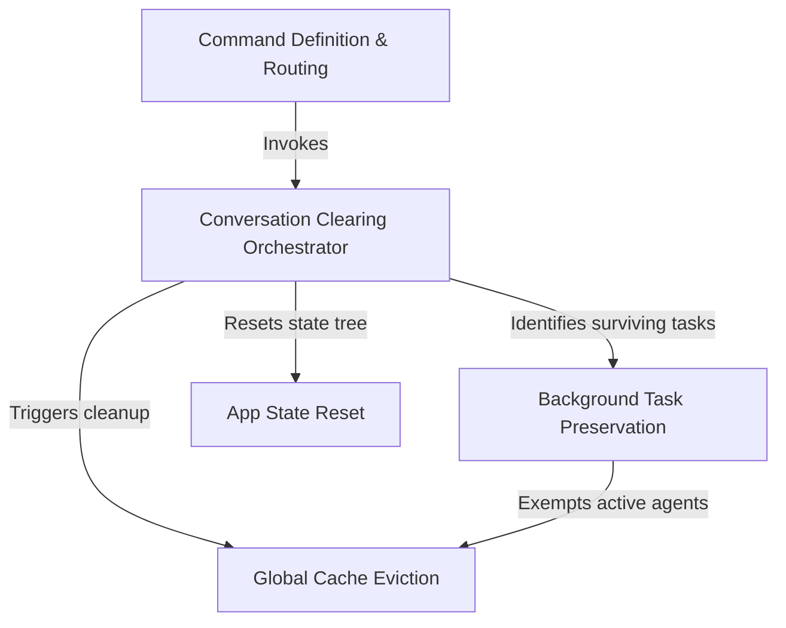

# Tutorial: clear

This project implements a **smart reset mechanism** for an AI assistant's conversation session. It uses a central *orchestrator* to wipe chat history, reset application state, and scrub internal caches, while intelligently identifying and preserving **background tasks** so long-running processes continue uninterrupted.

## Chapters

1. [Command Definition & Routing](01_command_definition___routing.md)
2. [Conversation Clearing Orchestrator](02_conversation_clearing_orchestrator.md)
3. [Background Task Preservation](03_background_task_preservation.md)
4. [App State Reset](04_app_state_reset.md)
5. [Global Cache Eviction](05_global_cache_eviction.md)

---

Generated by [Code IQ](https://github.com/adityasoni99/Code-IQ)