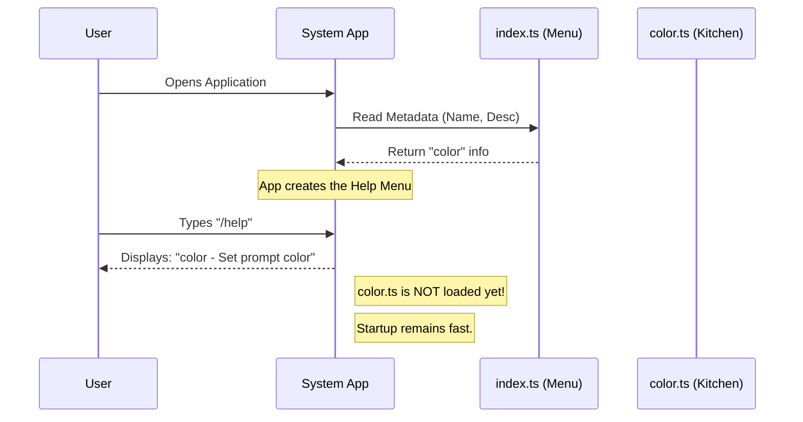

# Chapter 1: Command Definition & Metadata

Welcome to the first chapter of our journey building the `color` project! 

In this chapter, we will learn how to introduce a new command to our system without slowing it down. We will focus on defining the **Metadata**—the "ID card" of your command.

### The Problem: The Heavy Backpack
Imagine you are packing for a hiking trip. You have a map that lists all the items you *might* need: a tent, a heavy cooking stove, a sleeping bag, etc. 

If you had to carry every single item in your hands right from the start, you wouldn't be able to walk! Instead, you keep them packed away (or declared on a list) and only pull them out when you actually need to use them.

In software, if we load all the complex code for every command (the heavy stove) when the application starts, the app becomes slow and sluggish.

### The Solution: The Restaurant Menu
To solve this, we separate the **Definition** (the metadata) from the **Implementation** (the code).

Think of this like a **Restaurant Menu**:
1.  **The Menu (`index.ts`):** Lists the name of the dish ("Steak") and a description ("Grilled to perfection"). It is light and easy to hold.
2.  **The Kitchen (`color.ts`):** Where the ingredients are kept and the chef cooks. This is heavy and busy.

When you sit down, you get the menu immediately. The kitchen doesn't start cooking until you actually order.

### Use Case: The `/color` Command
We want to build a command that changes the color of our terminal prompt. 
*   **User Action:** User types `/help` to see what commands exist.
*   **System Response:** The system should show "color: Set the prompt bar color" *without* loading the code that actually changes the colors.

### Step 1: Defining the Metadata
We define our command in a lightweight file called `index.ts`. This is our "Menu".

We need to tell the system three main things:
1.  **Name:** What defines the command (e.g., `color`).
2.  **Description:** What it does (for the help menu).
3.  **Argument Hint:** What inputs it expects (e.g., `<red|blue>`).

Here is how we start defining the `color` command:

```typescript
// File: index.ts
import type { Command } from '../../commands.js'

// We define the command object
const color = {
  name: 'color',
  description: 'Set the prompt bar color for this session',
  argumentHint: '<color|default>',
  // ... more properties later
}
```
**Explanation:**
*   `name`: This allows the user to run the command by typing `/color`.
*   `description`: This text appears when the user types `/help`.
*   `argumentHint`: Shows the user they need to provide a color name or "default".

### Step 2: The Command Type and Timing
Next, we need to add a few technical details to tell the system *how* to treat this command.

```typescript
// File: index.ts (continued inside the object)
  type: 'local-jsx', 
  immediate: true,
```
**Explanation:**
*   `type: 'local-jsx'`: This tells the system that this command renders a UI element locally (on your machine).
*   `immediate: true`: This means the command acts instantly rather than waiting for a long queue of other tasks.

### Step 3: Pointing to the Kitchen
Finally, the most important part! We need to tell the menu where the kitchen is, but we **don't** open the kitchen door yet.

```typescript
// File: index.ts
  // The 'load' function points to the heavy code
  // It only runs when the command is executed!
  load: () => import('./color.js'),
} satisfies Command

export default color
```

**Explanation:**
*   `load`: This is a function that returns the location of the actual logic.
*   `import('./color.js')`: This points to the file where the heavy lifting happens. Because it is inside a function `() => ...`, the file is **not** loaded yet. It waits until called.

### Internal Implementation: What Happens Under the Hood?
Let's visualize what happens when the application starts up. The system reads the `index.ts` file to build its "Menu", but it completely ignores `color.ts` for now.



### Deep Dive: The `load` Property
The magic of this system relies heavily on the `load` property.

```typescript
load: () => import('./color.js'),
```

This specific line prepares us for the **Lazy Loading Strategy**. By using a dynamic import, we ensure that the heavyweight logic (imports like `crypto`, `sessionStorage`, etc., found in `color.ts`) is only fetched when absolutely necessary.

This keeps the `index.ts` file tiny. It acts as a lightweight pointer or a signpost.

### Conclusion
In this chapter, we created the **Definition** of our command. We successfully:
1.  Created a "Menu" (`index.ts`) separate from the "Kitchen" (`color.ts`).
2.  Defined the command's name, description, and usage hints.
3.  Set up a pointer to the implementation file without actually loading it.

This ensures our application starts up incredibly fast, no matter how many commands we add!

But what happens when the user actually types `/color red`? How do we open the kitchen door?

In the next chapter, we will explore exactly how the system uses that `load` function to wake up the logic.

[Next Chapter: Lazy Loading Strategy](02_lazy_loading_strategy.md)

---

Generated by [Code IQ](https://github.com/adityasoni99/Code-IQ)