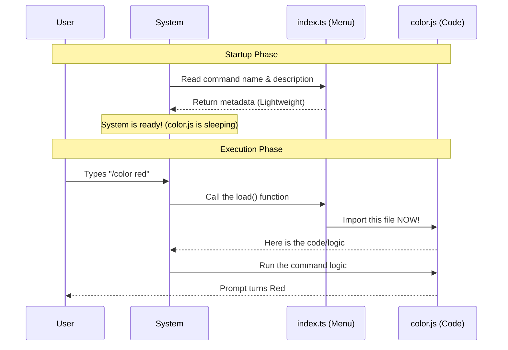

# Chapter 2: Lazy Loading Strategy

Welcome back! In the previous chapter, [Command Definition & Metadata](01_command_definition___metadata.md), we created the "Menu" for our `/color` command. We defined what the command looks like without writing the code that actually does the work.

In this chapter, we will answer a critical question: **How do we keep our application fast while adding powerful features?**

We will learn about the **Lazy Loading Strategy**, the technique used to ensure your terminal opens instantly, regardless of how many commands you add.

## The Problem: The "Moving Day" Jam

Imagine you are moving into a new house. You have 100 boxes in the moving truck.
*   **The Wrong Way:** You try to carry all 100 boxes into the living room at the exact same time before you even sit down.
    *   *Result:* You can't move. The door is blocked. It takes hours before you can relax.
*   **The Right Way:** You walk in with just your keys. You only go to the truck to get the "Kitchen Box" when you are hungry, or the "Bed Box" when you are tired.

In software, traditional applications often load **all** their code the moment you click the icon. If we did this for our `color` command (and 50 other commands), the application would freeze for seconds every time it started.

## The Solution: Streaming the Code

The best way to understand Lazy Loading is to think about **Streaming a Movie**.

When you watch a movie on Netflix or YouTube:
1.  You press "Play".
2.  The video starts almost immediately.
3.  The system downloads the ending of the movie **later**, while you are watching the beginning.

You never download the entire 2-hour file before you start watching.

**Lazy Loading** does the same thing for code. We tell the system: *"Don't download the code for changing colors until the user actually types `/color`."*

## Implementing Lazy Loading

In our `index.ts` file, we use a special JavaScript function to achieve this "streaming" effect.

### The Dynamic Import

Let's look at the `load` property we wrote in the previous chapter:

```typescript
// File: index.ts

const color = {
  name: 'color',
  // ... other metadata ...

  // This is the Lazy Loading Strategy:
  load: () => import('./color.js'),
}
```

**Explanation:**
1.  `import('./color.js')`: This is a **Dynamic Import**. Unlike normal imports at the top of a file, this does not happen immediately. It fetches the file only when this line of code runs.
2.  `() => ...`: We wrap the import in a function. This creates a "switch" that the system can flip later.

If we *didn't* use lazy loading, the top of our file would look like this (The "Bad" Way):

```typescript
// The "Bad" Way (Static Import)
// This loads the heavy file IMMEDIATELY when the app starts!
import heavyColorLogic from './color.js' 

const color = {
   // ...
}
```

By moving the import *inside* the `load` function, we delay the heavy lifting.

## Use Case: Triggering the Command

Let's see this in action. The user wants to change their prompt color to red.

1.  **App Starts:** The app reads `index.ts`. It sees the `color` command exists, but it **does not** read `color.js`. Memory usage is low. Startup is fast.
2.  **User Types:** `/color red`
3.  **System Reacts:** The system realizes the user wants the command. It finds the `load` function in `index.ts` and runs it.
4.  **Loading:** The system quickly imports `color.js`.
5.  **Execution:** The code runs and the color changes.

## Under the Hood: The Sequence of Events

Here is a visualization of how the System (the App) interacts with your command files using the Lazy Loading strategy.



## Deep Dive: How the System Calls Your Code

You don't need to write the system logic, but understanding how it uses your `load` function helps clarify the concept.

Imagine the system has a function like this internally:

```typescript
// Simplified Internal System Logic
async function executeCommand(commandDefinition, args) {
  
  // 1. The user typed the command. 
  // We trigger the lazy load function now.
  console.log("Loading module...");
  
  const module = await commandDefinition.load();

  // 2. The module is now loaded! 
  // We can execute the logic inside it.
  module.default(args);
}
```

**Key Concept: `await`**
Because fetching a file (even one on your own computer) takes a tiny bit of time, the operation is "asynchronous." The `await` keyword tells the system: *"Pause here for a millisecond, get the file, and then continue."*

This is the buffering circle you see when streaming a movie, but in code, it happens so fast you usually don't notice it.

## Why This Matters for `/color`

Our `color` command might seem simple now, but imagine if it grew.
*   What if `color.js` needed to load a massive library to calculate rainbow gradients?
*   What if it needed to connect to a database to save your favorite color?

If we loaded all those heavy libraries at startup, the user would wait 3 seconds just to see the prompt. With **Lazy Loading**, the user waits 0 seconds at startup, and maybe 0.1 seconds when they run the command.

## Conclusion

In this chapter, we learned:
1.  **The Problem:** Loading everything at once makes apps slow (The "Moving Day" Jam).
2.  **The Strategy:** We use **Lazy Loading** to "stream" code only when requested.
3.  **The Code:** We used `load: () => import(...)` in our metadata to create a deferred import.

We have defined the command, and we know how to load it efficiently. Now, we have finally imported the file! But what does the code inside that file actually look like? How do we interact with the user's input?

In the next chapter, we will open up `color.ts` and build the actual logic using the Execution Interface.

[Next Chapter: Command Execution Interface](03_command_execution_interface.md)

---

Generated by [Code IQ](https://github.com/adityasoni99/Code-IQ)