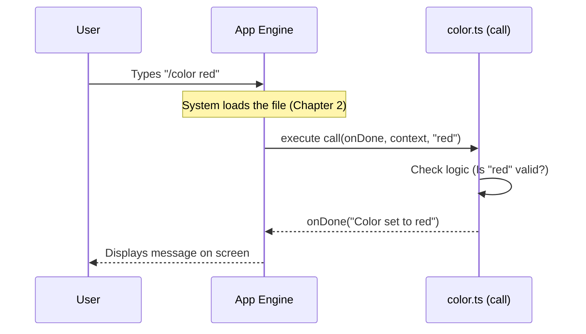

# Chapter 3: Command Execution Interface

Welcome to Chapter 3! 

In the previous chapter, [Lazy Loading Strategy](02_lazy_loading_strategy.md), we learned how to "stream" our command code, ensuring the application only loads the `color.ts` file when the user actually needs it.

Now, we have reached the moment of truth. The file is loaded. The computer is ready. **How do we actually run the logic?**

In this chapter, we will build the **Command Execution Interface**. This is the standard "plug" that connects your specific logic to the general system.

## The Problem: How to Talk to Strangers

Imagine you are building a computer. You want people to be able to plug in a mouse, a keyboard, or a printer. 
*   A mouse sends movement data.
*   A keyboard sends letter data.
*   A printer receives document data.

They are all completely different! If you had to write custom code in your Operating System for every single brand of mouse or printer, you would never finish.

## The Solution: The Universal USB Port

The solution is a **Standard Interface** (like a USB port). 
The computer says: *"I don't care what you are. As long as you have this specific plug, I can talk to you."*

In our `color` project, this plug is a function named `call`.

Every command file **must** export a function named `call`. The system will blindly look for this function and run it.

## The Anatomy of `call`

Let's look at the "USB Plug" for our command. It takes three specific inputs (arguments).

```typescript
// File: color.ts

export async function call(
  onDone: LocalJSXCommandOnDone,      // 1. The "Speaker"
  context: ToolUseContext,            // 2. The "Toolbox"
  args: string,                       // 3. The "User Input"
): Promise<null> { 
  // ... logic goes here
}
```

### Breaking Down the Inputs

1.  **`onDone` (The Speaker):** 
    Since your command runs in the background, it can't just `console.log` to the screen. The system gives you this function. When you want to send a message back to the user (like "Color changed!"), you call `onDone`.

2.  **`context` (The Toolbox):**
    This contains powerful tools to interact with the app. It allows you to change the state of the application (like the actual colors on the screen).

3.  **`args` (The User Input):**
    If the user types `/color red`, this variable holds the string `"red"`.

## Implementing the `/color` Logic

Let's build the `color` command logic step-by-step using this interface.

### Step 1: Handling "No Input"
First, we check the `args`. If the user just types `/color` without specifying "red" or "blue", we need to tell them how to use it.

```typescript
// Inside the call() function...

  // Check if args is empty
  if (!args || args.trim() === '') {
    
    // Use onDone to talk back to the user
    onDone(
      `Please provide a color. Available: red, blue, default`, 
      { display: 'system' }
    )
    
    return null // Stop here!
  }
```
**Explanation:**
*   We check if `args` is empty.
*   We call `onDone(...)`. The `{ display: 'system' }` part tells the app to style this message as a system notification (usually gray text), not a user chat message.
*   We `return null` to finish the command execution.

### Step 2: Validating the Color
Next, we need to make sure the user didn't type a nonsense color like `/color pizza`.

```typescript
  const colorArg = args.trim().toLowerCase()
  
  // AGENT_COLORS is a list of valid colors we imported
  if (!AGENT_COLORS.includes(colorArg)) {
    
    // Complain to the user if the color isn't valid
    onDone(
      `Invalid color "${colorArg}". Try: red, blue, green...`,
      { display: 'system' },
    )
    return null
  }
```
**Explanation:**
*   We clean up the input (`trim()` removes spaces, `toLowerCase()` handles "RED" vs "red").
*   We check our allowed list (`AGENT_COLORS`).
*   If it's not in the list, we use `onDone` to report the error.

### Step 3: Success!
If the code reaches this point, the user provided a valid color. We will tell the user we succeeded.

*(Note: We will cover actually updating the screen state in the next chapter. for now, let's focus on the communication).*

```typescript
  // (We will update AppState here in the next chapter)

  // Notify the user of success
  onDone(
    `Session color set to: ${colorArg}`, 
    { display: 'system' }
  )

  return null
```

## Internal Implementation: Under the Hood

How does the system actually use this `call` function? It treats your command like a black box.

### The Execution Flow

Here is what happens when you press "Enter" in the terminal:



### The System Code (Simplified)
You don't need to write this part, but here is a simplified view of the code running inside the System engine that makes this possible.

```typescript
// Hypothetical System Engine Code

async function runUserCommand(commandName, userArgs) {
  // 1. Get the definition (Chapter 1)
  const def = commands[commandName]; 

  // 2. Load the file (Chapter 2)
  const module = await def.load(); 

  // 3. THE INTERFACE (Chapter 3)
  // The system blindly calls 'call'
  await module.call(
    (msg, opts) => showMessageToUser(msg, opts), // The onDone function
    globalContext,                               // The Toolbox
    userArgs                                     // The text "red"
  );
}
```

**Key Takeaway:** The System engine acts as a bridge. It creates the `onDone` function and passes it to you. You just have to call it.

## Conclusion

In this chapter, we learned about the **Command Execution Interface**.
1.  We learned that `call` is the standard "USB plug" for all commands.
2.  We used `args` to read what the user typed.
3.  We used `onDone` to send messages back to the user.

However, if you ran the code exactly as written above, the system would verify the color "red" and say "Success!"... **but the screen would verify stay gray.**

Why? Because we haven't actually touched the application's **State** yet. We validated the input, but we didn't change the settings.

In the next chapter, we will use the `context` argument to finally paint the screen.

[Next Chapter: State Management (AppState)](04_state_management__appstate_.md)

---

Generated by [Code IQ](https://github.com/adityasoni99/Code-IQ)