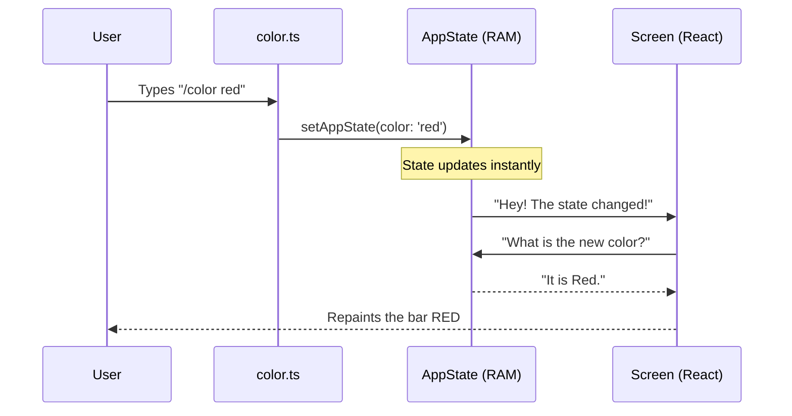

# Chapter 4: State Management (AppState)

Welcome to Chapter 4!

In the previous chapter, [Command Execution Interface](03_command_execution_interface.md), we built the logic to check if the user typed a valid color (like "red"). We learned how to talk back to the user using `onDone`.

 However, there was a major missing piece: **The screen didn't actually change color.** We said "Success!", but the interface remained gray.

In this chapter, we will fix that. We will learn about **State Management**, the mechanism that connects your code to the visual interface.

## The Problem: The "Light Switch"

Imagine a **Digital Dashboard** in your car.
*   **Action:** You flip a switch to turn on the headlights.
*   **Expectation:** The little green icon on the dashboard lights up *instantly*.

If the dashboard waited for the mechanic to write a record in a logbook before turning on the light, you would be driving in the dark for seconds. That is too slow.

In software:
1.  **Disk/Database:** Is the "Logbook." It is permanent but slow.
2.  **RAM (Memory):** Is the "Dashboard." It is temporary but instant.

To make the UI feel snappy, we need to update the **RAM** immediately. In our project, this in-memory representation is called **AppState**.

## The Solution: `context.setAppState`

To turn on the "light" (change the color), we use the **Toolbox** (`context`) we saw in the last chapter.

Inside this toolbox is a special tool called `setAppState`.

### How AppState Works
Think of `AppState` as a giant JavaScript object that describes exactly what the application looks like *right now*.

```javascript
// Simplified view of AppState in RAM
const AppState = {
  userName: "Alice",
  isLoading: false,
  theme: "dark",
  // This is what we want to change:
  standaloneAgentContext: {
     color: "gray" 
  }
}
```

If we change `color: "gray"` to `color: "red"`, the screen automatically repaints itself to match the new reality.

## Implementing the Change

Let's modify our `color.ts` file to use this tool. We are working inside the `call` function.

### Step 1: The "Photocopy" Rule (Immutability)
When updating state in modern applications (like those built with React), we follow a strict rule: **Don't scribble on the original paper.**

Instead:
1.  Take the current state (`prev`).
2.  Make a photocopy of it (`...prev`).
3.  Change one detail on the copy.
4.  Replace the old one with the new one.

### Step 2: The Code

Here is how we update the color to "red" (or whatever the user typed).

```typescript
// File: color.ts

// context is the "Toolbox" passed to our function
context.setAppState(prev => ({
  // 1. Copy all existing state
  ...prev,

  // 2. Target the specific section we want to change
  standaloneAgentContext: {
    // 3. Copy the existing data inside this section too
    ...prev.standaloneAgentContext,
    
    // 4. Finally, apply our new color!
    color: 'red', // or the variable colorArg
  },
}))
```

**Explanation:**
*   `setAppState`: This function tells the system "I want to make a change."
*   `prev`: This variable holds the state *before* we touched it.
*   `...prev`: The `...` (spread operator) copies everything from the previous state so we don't accidentally delete the user's name or other data.
*   `color`: We overwrite only the color property.

### Handling "Reset" (Default Color)
If the user wants to reset the color (make it gray again), we simply set the color to `undefined` or `default`.

```typescript
// Handling the "reset" or "default" command
context.setAppState(prev => ({
  ...prev,
  standaloneAgentContext: {
    ...prev.standaloneAgentContext,
    // Setting this to undefined usually reverts to the CSS default
    color: undefined, 
  },
}))
```

## Internal Implementation: What Happens Under the Hood?

When you call `setAppState`, you trigger a chain reaction in the User Interface (UI).

### The Reactive Loop



1.  **Update:** Your command updates the object in memory.
2.  **Notify:** The State Manager notices the object changed.
3.  **Render:** It forces the specific part of the screen (the prompt bar) to re-draw itself using the new data.

### Deep Dive: The System Context

The `context` object isn't magic; it is passed down from the very top of the application.

In the file `commands.ts` (the central command handler), the system prepares this context before calling your command.

```typescript
// Simplified System Code (hypothetical)

// This represents the entire application state
let internalState = { color: 'gray', ... };

const context = {
  // This is the function you are calling!
  setAppState: (updaterFunction) => {
    // 1. Run your function to get the new state
    const newState = updaterFunction(internalState);
    
    // 2. Save it
    internalState = newState;
    
    // 3. Tell the UI library (e.g., React) to update
    triggerReRender();
  }
};

// Then the system hands this toolbox to you
yourCommand.call(onDone, context, args);
```

## Putting it Together

Now our `color` command is fully interactive!

1.  User types `/color blue`.
2.  We validate "blue" is a real color.
3.  We call `context.setAppState(...)`.
4.  **The UI turns blue immediately.**
5.  We call `onDone("Color set to blue")`.

## Conclusion

In this chapter, we learned about **State Management** (`AppState`).
1.  **The Goal:** Instant feedback.
2.  **The Tool:** `context.setAppState`.
3.  **The Method:** We create a copy of the current state, modify the color property, and save it back.

We now have a working command! The prompt turns blue when we ask it to.

**But there is one catch.**

`AppState` lives in **RAM**. RAM is cleared when the computer (or browser tab) restarts.
If you refresh the page right now, your beautiful blue prompt will turn back to gray.

To make the color survive a refresh, we need to write it to the "Logbook" (Session Storage).

[Next Chapter: Session Persistence](05_session_persistence.md)

---

Generated by [Code IQ](https://github.com/adityasoni99/Code-IQ)