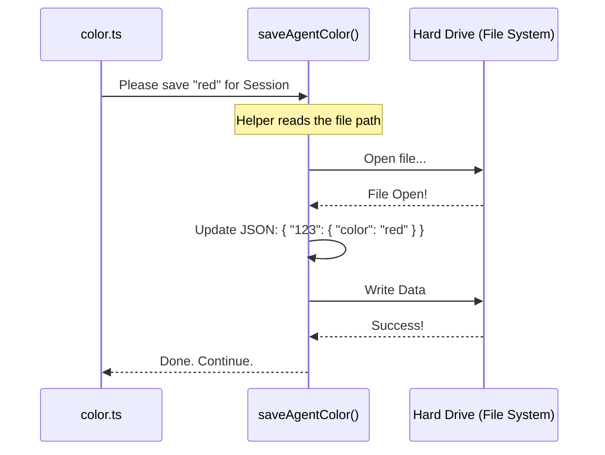

# Chapter 5: Session Persistence

Welcome to the final chapter of our tutorial series!

In the previous chapter, [State Management (AppState)](04_state_management__appstate_.md), we successfully changed the color of the prompt bar. When you typed `/color red`, the screen turned red instantly.

However, you might have noticed a frustrating issue: **If you refresh the page or restart the application, the color turns back to gray.**

In this chapter, we will fix this "amnesia" by implementing **Session Persistence**. We will learn how to save your settings to the hard drive so they last forever (or at least until you change them again).

## The Problem: The "Goldfish Memory"

Computers have two types of memory:
1.  **RAM (State):** This is like your "short-term memory." It is incredibly fast, but if you fall asleep (close the app), you forget everything.
2.  **Disk (Persistence):** This is like "long-term memory" or a diary. It is slower to write to, but the information survives even if the power goes out.

In Chapter 4, we only updated the RAM. That is why your color setting vanished on restart.

## The Solution: The Diary

To solve this, we need to **write a diary entry** every time the user changes their color.

When the application starts up tomorrow, it will read this diary entry and automatically set the color back to "red" before the user even types a command.

We will use three helper functions to achieve this:
1.  `getSessionId()`: To know *who* is writing the diary.
2.  `getTranscriptPath()`: To know *where* the diary is located.
3.  `saveAgentColor()`: To actually *write* the entry.

## Implementation Steps

Let's look at how we add persistence to our `color.ts` file. We will add this logic inside our `call` function, right before we update the AppState.

### Step 1: Who are you? (Session ID)
First, we need to identify the current session. If multiple people are using the system, we don't want to save your color preferences to someone else's file.

```typescript
import { getSessionId } from '../../bootstrap/state.js'

// Inside the call() function:
// Get the unique ID for this specific session
const sessionId = getSessionId()
```
**Explanation:** `sessionId` is a unique string of letters and numbers (a UUID) that acts like a fingerprint for the current user session.

### Step 2: Where is the file? (Transcript Path)
Next, we need to find the location of the file on the computer's hard drive where settings are stored.

```typescript
import { getTranscriptPath } from '../../utils/sessionStorage.js'

// Get the full file path to the "diary"
const fullPath = getTranscriptPath()
```
**Explanation:** This function returns a string path (e.g., `/Users/alice/.config/app/session.json`) so the system knows exactly where to look.

### Step 3: Write the Entry (Save)
Now we perform the actual save operation.

```typescript
import { saveAgentColor } from '../../utils/sessionStorage.js'

// We write the color 'red' (or whatever the user typed) to the disk
// NOTE: We use 'await' because writing to a hard drive takes time!
await saveAgentColor(sessionId, colorArg, fullPath)
```
**Explanation:**
*   `saveAgentColor`: A helper function designed specifically for this task.
*   `await`: Crucial! Writing to a physical disk is "slow" in computer terms. We pause execution for a millisecond to ensure the file is safely saved before moving on.

### Putting It All Together

Here is how the Persistence logic (Disk) sits side-by-side with the State logic (RAM) in our final code.

```typescript
// File: color.ts

// 1. PERSISTENCE (The Diary) - Saves for tomorrow
const sessionId = getSessionId()
const fullPath = getTranscriptPath()
await saveAgentColor(sessionId, colorArg, fullPath)

// 2. STATE (The "Now") - Updates the screen instantly
context.setAppState(prev => ({
  ...prev,
  standaloneAgentContext: {
    ...prev.standaloneAgentContext,
    color: colorArg,
  },
}))
```

**Why do we need both?**
*   If we only did **Persistence**, the file would save, but the screen wouldn't change color until you restarted the app.
*   If we only did **State**, the screen would change, but reset on restart.
*   Doing **both** gives us the best of both worlds: Instant feedback + Long-term memory.

## Use Case: Resetting to Default

What if the user types `/color reset`? We need to "erase" the diary entry.

In our system, we don't actually delete the line; we write a specific word: `"default"`.

```typescript
// Handling the "reset" command

// We save the word "default" to the disk
await saveAgentColor(sessionId, 'default', fullPath)

// We set the RAM state to undefined (which reverts to gray)
context.setAppState(prev => ({
  // ... (setup code)
  color: undefined, 
}))
```

## Internal Implementation: Under the Hood

What happens inside `saveAgentColor`?

### The Sequence



### The System Logic (Simplified)
The internal `saveAgentColor` function is a wrapper around the file system.

```typescript
// Simplified view of ../../utils/sessionStorage.ts

import fs from 'fs/promises'; // Node.js File System module

export async function saveAgentColor(id, color, path) {
  // 1. Read the existing file
  const fileContent = await fs.readFile(path, 'utf-8');
  const data = JSON.parse(fileContent);

  // 2. Update the data for this specific ID
  data[id] = { ...data[id], color: color };

  // 3. Write the file back to the disk
  await fs.writeFile(path, JSON.stringify(data));
}
```

This ensures that even if you close the terminal window, the text file on your hard drive remains. When you open the app again, the system reads this file during startup and applies your saved color.

## Conclusion

Congratulations! You have completed the **Color Project Tutorial**.

Let's review what you have built:
1.  **[Command Definition](01_command_definition___metadata.md):** You created the "Menu" so the app knows your command exists.
2.  **[Lazy Loading](02_lazy_loading_strategy.md):** You ensured the code only loads when needed, keeping the app fast.
3.  **[Execution Interface](03_command_execution_interface.md):** You built the standard "plug" (`call`) to talk to the system.
4.  **[State Management](04_state_management__appstate_.md):** You updated the live interface (RAM) to give the user instant feedback.
5.  **Session Persistence:** You saved the settings to the disk so user preferences last forever.

You now possess the foundational knowledge to build powerful, interactive, and persistent commands for this system. Happy coding!

---

Generated by [Code IQ](https://github.com/adityasoni99/Code-IQ)