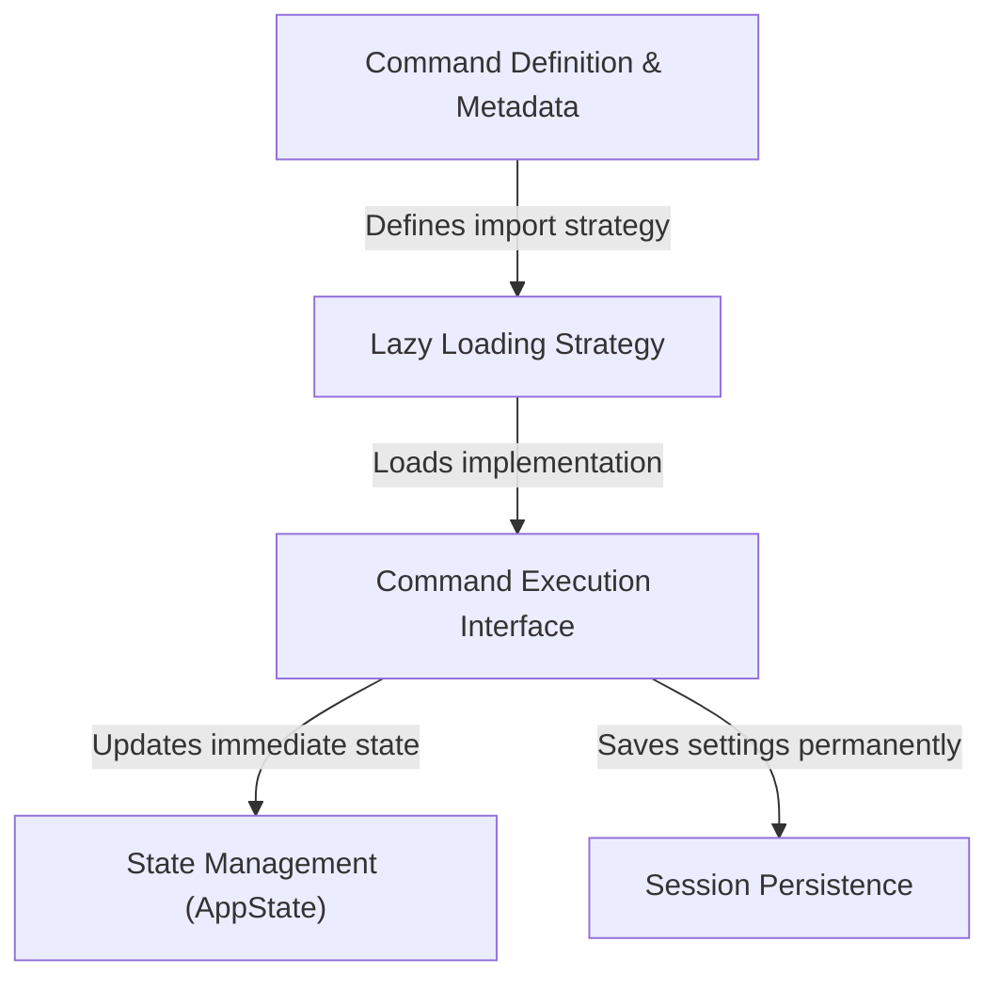

# Tutorial: color

This project enables users to **personalize** their workspace by changing the command prompt's color. It uses a *smart loading system* that keeps the application fast by only fetching the code when the user actually asks for a color change. Once a command is issued, the system instantly updates the screen's appearance and **automatically saves** the preference so it is remembered the next time the user logs in.

## Chapters

1. [Command Definition & Metadata](01_command_definition___metadata.md)
2. [Lazy Loading Strategy](02_lazy_loading_strategy.md)
3. [Command Execution Interface](03_command_execution_interface.md)
4. [State Management (AppState)](04_state_management__appstate_.md)
5. [Session Persistence](05_session_persistence.md)

---

Generated by [Code IQ](https://github.com/adityasoni99/Code-IQ)