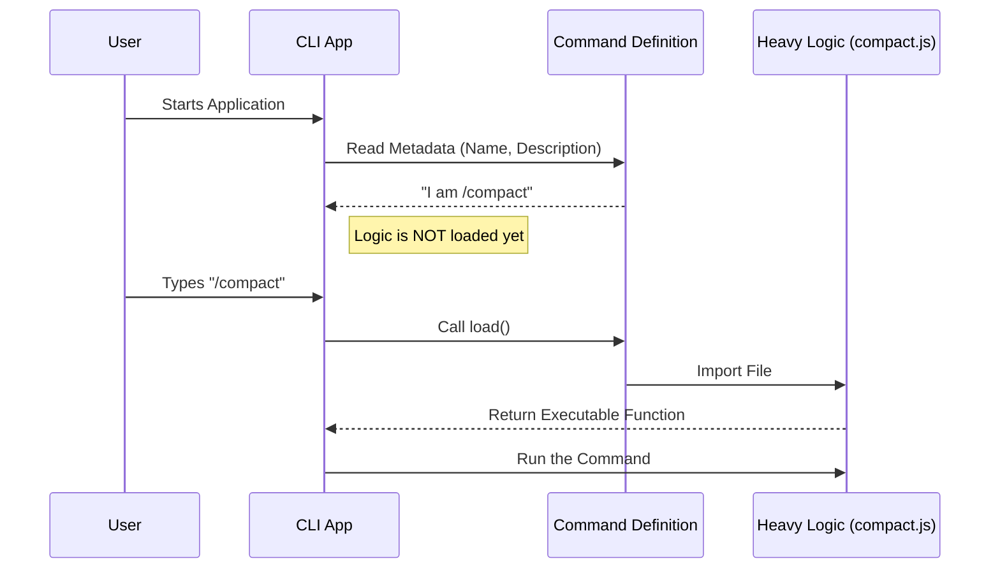

# Chapter 1: Command Definition

Welcome to the `compact` project! If you are building a Command Line Interface (CLI) tool, you might wonder how to add new features without making the application slow or messy.

In this first chapter, we will explore the **Command Definition**.

## Why do we need this?

Imagine you walk into a restaurant. You sit down and look at the **menu**. The menu describes the food (name, ingredients, price), but it **is not the food itself**. The kitchen doesn't start cooking a steak just because you walked in; they wait until you actually order it.

In our software, the **Command Definition** is the menu.

### The Use Case
We want to create a command called `/compact`. When a user types this, the application should summarize their conversation history to save space.

However, the code that does the summarizing is heavy and complex. We don't want to load all that heavy code every time the application starts, because the user might not even use `/compact`.

**Our Goal:** Tell the application that `/compact` exists, but only load the heavy machinery when the user asks for it.

---

## 1. The Identity Card (Metadata)

First, we need to define who our command is. This includes its name and a helpful description so the user knows what it does.

We act like a plugin. We provide a small object that acts as an "ID Card" for our command.

```typescript
const compact = {
  type: 'local',
  name: 'compact',
  // What does this command do?
  description:
    'Clear history but keep a summary. Optional: /compact [instructions]',
  // ... more settings later
}
```

**Explanation:**
*   `name`: This is what the user types (e.g., `/compact`).
*   `description`: This text appears in the help menu when the user asks "What commands can I use?".

---

## 2. Availability Rules

Sometimes, you might want to turn a command off without deleting the code. For example, maybe you want to disable `/compact` on a specific server via an environment variable.

We can add a rule to our definition to check if the command is allowed to run.

```typescript
import { isEnvTruthy } from '../../utils/envUtils.js'

// Inside our compact object:
const compact = {
  // ... name and description from before
  // Only enable if DISABLE_COMPACT is NOT set to true
  isEnabled: () => !isEnvTruthy(process.env.DISABLE_COMPACT),
}
```

**What happens here:**
*   Before the CLI shows the command to the user, it runs `isEnabled()`.
*   If this returns `false`, the command effectively disappears from the application.

---

## 3. The "Lazy Load" (The Magic Trick)

This is the most important part. Remember the restaurant analogy? We don't want to "cook the food" (load the heavy code) until the order is placed.

We use a technique called **Lazy Loading**. instead of importing the logic at the top of the file, we provide a function that imports it *only when called*.

```typescript
// Inside our compact object:
const compact = {
  // ... other properties
  
  // This function is ONLY called when the user types /compact
  load: () => import('./compact.js'),
}
```

**Explanation:**
*   `import('./compact.js')`: This points to the file where the actual hard work happens.
*   Because this is inside a function `() => ...`, the file `./compact.js` is **not** read when the application starts. It sits and waits.

---

## 4. Putting It Together

Here is the complete definition file `index.ts`. It combines the identity, the rules, and the lazy loading into one neat package.

```typescript
import type { Command } from '../../commands.js'
import { isEnvTruthy } from '../../utils/envUtils.js'

const compact = {
  type: 'local',
  name: 'compact',
  description: 'Clear conversation history but keep a summary.',
  isEnabled: () => !isEnvTruthy(process.env.DISABLE_COMPACT),
  supportsNonInteractive: true,
  argumentHint: '<optional custom summarization instructions>',
  load: () => import('./compact.js'),
} satisfies Command

export default compact
```

**Input:** The application starts up.
**Output:** The application now has a lightweight reference to `/compact` in its registry, consuming almost no memory.

---

## Under the Hood: How it Works

Let's visualize the lifecycle of this command.

1.  **Startup:** The CLI looks at `index.ts` (this file). It reads the name and description.
2.  **Waiting:** The CLI runs. The heavy logic file (`compact.js`) is asleep on the disk.
3.  **Trigger:** You type `/compact`.
4.  **Loading:** The CLI calls the `load()` function we defined.
5.  **Execution:** The heavy logic is imported and executed.



### Key Implementation Details

There are two specific properties we haven't discussed deeply yet:

1.  **`argumentHint`**:
    ```typescript
    argumentHint: '<optional custom summarization instructions>',
    ```
    This helps the UI show the user what they can type next to the command. For example: `/compact Make it short`.

2.  **`satisfies Command`**:
    ```typescript
    } satisfies Command
    ```
    This is a TypeScript feature. It ensures that our object follows the strict rules of a "Command". If we forgot to add a `name`, TypeScript would yell at us here.

## Conclusion

Congratulations! You have successfully defined the `/compact` command. You've created a lightweight entry point that tells the system *what* the command is and *how* to find it, without weighing down the application startup.

However, right now, our command points to a file (`./compact.js`) that we haven't built yet. The definition is the menu, but we still need to cook the meal!

In the next chapter, we will build the logic that handles the actual process of compacting the conversation.

[Next Chapter: Compaction Orchestration](02_compaction_orchestration.md)

---

Generated by [Code IQ](https://github.com/adityasoni99/Code-IQ)