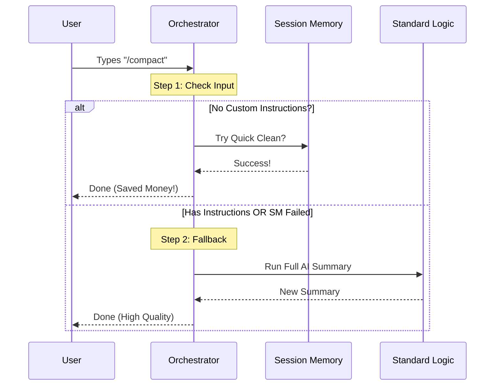

# Chapter 2: Compaction Orchestration

In the previous chapter, [Chapter 1: Command Definition](01_command_definition.md), we built the "menu" for our application. We defined the `/compact` command and set it up to lazy-load.

Now, we are going to look at what happens in the kitchen when that order is actually placed.

## The Concept: The Triage Nurse

Imagine you arrive at a hospital ER. You don't immediately get sent to a surgeon for a complex operation. First, you see a **Triage Nurse**.

The nurse makes a decision based on your needs:
1.  **Small cut?** Put a bandage on it (Quick, cheap, easy).
2.  **Specific complex condition?** Send to a specialist (Reactive).
3.  **General illness?** Send to the general doctor (Standard).

In our project, the **Compaction Orchestration** is that Triage Nurse. Summarizing a conversation with AI is expensive (it costs tokens and money). We want to use the cheapest, fastest method possible that still gets the job done.

### The Use Case

The user types `/compact`.
*   **Scenario A:** They just want to save memory. We should do a quick cleanup.
*   **Scenario B:** They type `/compact summarize as a poem`. We *must* use a smart AI model to follow those instructions.

We need code that handles both scenarios automatically.

---

## 1. Preparing the Data

Before we make any decisions, we need to gather our materials: the user's input (instructions) and the conversation history.

```typescript
export const call = async (args, context) => {
  // 1. Get the conversation history
  let { messages } = context;

  // 2. Get specific instructions (e.g., "Make it short")
  const customInstructions = args.trim();
  
  // ... logic continues
}
```

**Explanation:**
*   `messages`: The list of everything said in the chat so far.
*   `customInstructions`: Whatever the user typed after the command (e.g., the "summarize as a poem" part).

---

## 2. Attempt 1: The "Quick Clean" (Session Memory)

This is our "Band-aid" solution. It is very fast and costs almost nothing.

However, this method is simple. It cannot understand complex requests like "write a poem." So, we only try this if the user **did not** provide custom instructions.

```typescript
// If the user didn't ask for anything specific...
if (!customInstructions) {
  // ... try the fast, lightweight compaction
  const result = await trySessionMemoryCompaction(messages);

  if (result) {
    return { type: 'compact', compactionResult: result };
  }
}
```

**Explanation:**
*   `trySessionMemoryCompaction`: Checks if we can just delete old messages and keep a simple rolling buffer.
*   `if (result)`: If this worked, we return immediately! We skip all the expensive code below.

---

## 3. Attempt 2: The "Specialist" (Reactive Mode)

If the quick clean didn't work (or if the user gave instructions), we check if the "Reactive" mode is enabled. This is an advanced feature (which we will cover in [Chapter 3: Reactive Compaction Integration](03_reactive_compaction_integration.md)).

```typescript
// If the advanced "Reactive" feature is turned on...
if (reactiveCompact?.isReactiveOnlyMode()) {
  // ... delegate the work to the specialist
  return await compactViaReactive(
    messages, 
    context, 
    customInstructions
  );
}
```

**Explanation:**
*   This acts as a router. If the system is configured for advanced reactivity, we pass the job to a dedicated function `compactViaReactive`.

---

## 4. Attempt 3: The "General Doctor" (Standard Fallback)

If neither of the above worked, we fall back to the standard method. This sends the conversation to a Large Language Model (LLM) to be summarized.

```typescript
// Fallback: Run standard summarization
const result = await compactConversation(
  messages,
  context,
  // Pass the instructions (e.g., "Make it a poem")
  customInstructions 
);

return { type: 'compact', compactionResult: result };
```

**Explanation:**
*   `compactConversation`: This is the heavy lifter. It sends the data to the AI, waits for a summary, and replaces the history.

---

## Under the Hood: The Flow

Let's visualize how the Orchestrator makes its decisions.



## Implementation Details

The code handles a few extra cleanup tasks to ensure the application state remains consistent.

### Error Handling
We wrap the whole process in a `try/catch` block. If the AI fails or the user cancels, we want to show a nice error message, not crash the app.

```typescript
try {
  // ... the logic steps 1, 2, and 3 from above ...
} catch (error) {
  if (abortController.signal.aborted) {
    throw new Error('Compaction canceled.');
  }
  // Handle other specific errors
  throw new Error(`Error during compaction: ${error}`);
}
```

### Post-Compaction Cleanup
When we successfully summarize a conversation, the old messages are gone. This means any "References" (like UUIDs of old messages) are now invalid.

The orchestration logic ensures we clean up these loose ends.

```typescript
// Inside the standard fallback block, after success:

// 1. Reset the pointer for "Last Summarized Message"
setLastSummarizedMessageId(undefined);

// 2. Clear prompt cache to avoid stale data
getUserContext.cache.clear?.();

// 3. Run general cleanup hooks
runPostCompactCleanup();
```

## Conclusion

You have now built the **brain** of the compaction system.

Instead of blindly running expensive code, your Orchestrator acts as a smart filter:
1.  It tries to save resources with **Session Memory**.
2.  It checks for advanced **Reactive** configurations.
3.  It falls back to **Standard Summarization** only when necessary.

However, we touched on a mysterious "Specialist" called **Reactive Mode** in Step 3. What exactly is that, and how does it handle complex instructions?

In the next chapter, we will dive into how to integrate this advanced mode.

[Next Chapter: Reactive Compaction Integration](03_reactive_compaction_integration.md)

---

Generated by [Code IQ](https://github.com/adityasoni99/Code-IQ)