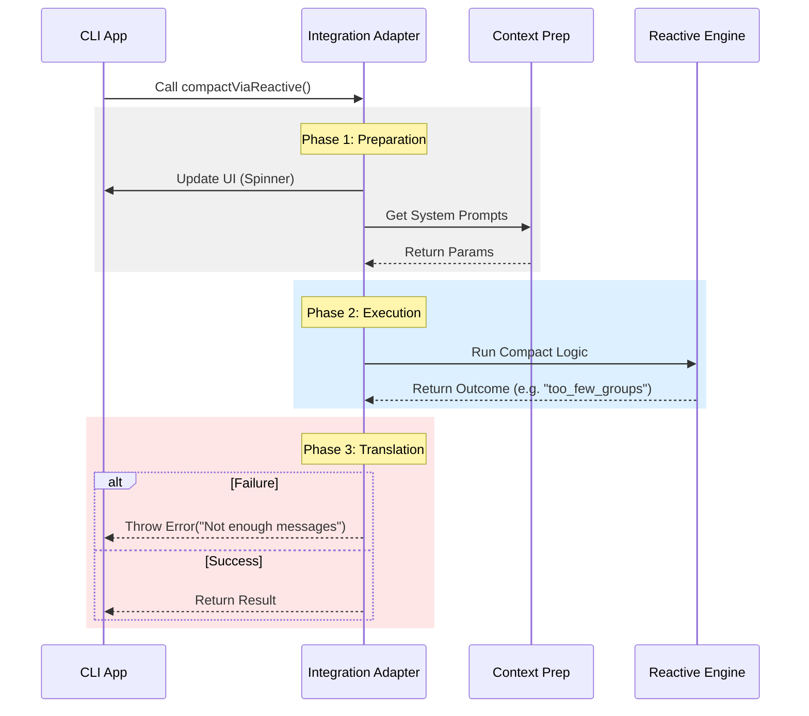

# Chapter 3: Reactive Compaction Integration

In the previous chapter, [Chapter 2: Compaction Orchestration](02_compaction_orchestration.md), we acted as a "Triage Nurse," deciding whether to use a quick cleanup or a heavy-duty specialist.

We mentioned a "Specialist" called **Reactive Mode**. This mode is powerful but complex. It requires specific data formats, has its own internal status codes, and needs to update the UI constantly.

If we put all that complexity directly into our main command file, it would become unreadable. Instead, we create a dedicated **Integration Adapter**.

## The Concept: The Travel Adapter

Imagine you are traveling to a country with different electrical outlets. You cannot plug your hairdryer directly into the wall; it won't fit, and the voltage might blow it up. You need a **Travel Adapter**.

*   **Input:** Your standard plug.
*   **The Adapter:** Handles the shape and voltage conversion.
*   **Output:** Power flows safely.

In our project, the **Reactive Compaction Integration** (`compactViaReactive`) is that adapter. It takes our standard application data, converts it into what the Reactive Engine needs, and translates the engine's "foreign" result codes back into standard errors.

### The Use Case

The user wants a "Reactive" summary (perhaps because the conversation is extremely long).
1.  **Input:** The user types `/compact`.
2.  **Process:** We need to lock the UI, show a progress bar, run the engine, and handle errors like "Not enough messages to group."
3.  **Output:** A clean success message or a readable error.

---

## 1. Setting the Stage (UI & Hooks)

Before we start the heavy lifting, we need to tell the user that something is happening. We also need to run any "Pre-Compact Hooks" (setup scripts that other plugins might have registered).

```typescript
// Inside compactViaReactive function
context.onCompactProgress?.({ 
  type: 'hooks_start', 
  hookType: 'pre_compact' 
});

context.setSDKStatus?.('compacting');
```
**Explanation:**
*   `onCompactProgress`: Sends a signal to the UI to maybe show a spinner.
*   `setSDKStatus`: Sets the internal state to 'compacting' so other parts of the app know we are busy.

---

## 2. Preparing the Luggage (Parallel Loading)

The Reactive Engine needs two things:
1.  **Hook Instructions:** Did another plugin say "Always include the date"?
2.  **Cache Parameters:** The System Prompt and Context data.

We load these at the same time to save time.

```typescript
const [hookResult, cacheSafeParams] = await Promise.all([
  // 1. Run external hooks
  executePreCompactHooks(
    { trigger: 'manual', customInstructions }, 
    context.abortController.signal
  ),
  // 2. Build the complex system prompt (See Chapter 4)
  getCacheSharingParams(context, messages),
]);
```

**Explanation:**
*   `Promise.all`: Runs two tasks simultaneously.
*   `executePreCompactHooks`: Checks if other plugins want to modify the instructions.
*   `getCacheSharingParams`: Packs the necessary data (we will explore this deeply in [Chapter 4: Context Assembly](04_context_assembly.md)).

---

## 3. The Call to the Engine

Now we have our data, we actually call the engine. This is the "Specialist" doing the work.

```typescript
// Update UI to show we are starting the main event
context.onCompactProgress?.({ type: 'compact_start' });

// Call the Reactive Engine
const outcome = await reactive.reactiveCompactOnPromptTooLong(
  messages,
  cacheSafeParams,
  { customInstructions: mergedInstructions, trigger: 'manual' },
);
```

**Explanation:**
*   `reactiveCompactOnPromptTooLong`: This is the heavy logic imported from the separate module. It takes the messages and the "luggage" (params) we prepared.

---

## 4. The Translator (Error Handling)

The Reactive Engine doesn't throw standard errors. It returns status codes like `'too_few_groups'` or `'aborted'`. Our main application doesn't know what those mean. We must translate them into standard JavaScript Errors.

```typescript
if (!outcome.ok) {
  switch (outcome.reason) {
    case 'too_few_groups':
      throw new Error('Not enough messages to compact');
    case 'aborted':
      throw new Error('User aborted the process');
    default:
      throw new Error('Incomplete response from AI');
  }
}
```

**Explanation:**
*   **The Switch:** We look at the `outcome.reason`.
*   **The Translation:** We throw a new `Error()` with a human-readable message that the rest of the app understands.

---

## Under the Hood: The Flow

Let's visualize how this Adapter works. It sits between the generic "Context" of the CLI and the specific "Engine".



## Implementation Details

There is one final crucial piece: **Cleanup**.

Whether the compaction succeeds or fails, we *must* turn off the "On Air" sign (the UI spinner). We use a `try/finally` block for this.

### The Safety Net (Finally)

```typescript
try {
  // ... run the engine ...
} finally {
  // This runs NO MATTER WHAT (Success or Error)
  context.setStreamMode?.('requesting');
  context.setResponseLength?.(() => 0);
  context.onCompactProgress?.({ type: 'compact_end' });
  context.setSDKStatus?.(null);
}
```

**Explanation:**
*   `finally`: Even if an error is thrown in the `try` block, the code in `finally` executes.
*   `context.setSDKStatus?.(null)`: This unlocks the UI, allowing the user to type commands again.

### Merging Instructions

Earlier, we fetched `hookResult` (external plugins) and `customInstructions` (what the user typed). We need to combine them before sending them to the engine.

```typescript
const mergedInstructions = mergeHookInstructions(
  customInstructions,
  hookResult.newCustomInstructions,
);
```

**Why?**
*   User types: "Make it funny."
*   Plugin says: "Always preserve code blocks."
*   **Merged:** "Make it funny. Always preserve code blocks."

## Conclusion

You have built a robust **Integration Layer**.

*   It prepares the complex data needed by the engine.
*   It updates the user interface (loading states).
*   It translates weird internal error codes into standard errors.
*   It ensures the app cleans up its state, even if things go wrong.

However, in **Step 2**, we called a function `getCacheSharingParams` to pack our "luggage." We glossed over that part. How do we actually bundle up the system prompt, tool definitions, and conversation context into a neat package for the AI?

That is the topic of the next chapter.

[Next Chapter: Context Assembly](04_context_assembly.md)

---

Generated by [Code IQ](https://github.com/adityasoni99/Code-IQ)