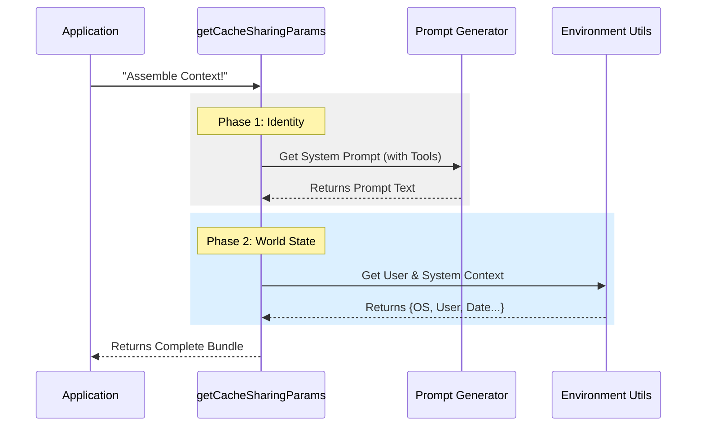

# Chapter 4: Context Assembly

In the previous chapter, [Chapter 3: Reactive Compaction Integration](03_reactive_compaction_integration.md), we built a "Travel Adapter" to send data to our specialized Reactive Engine. We mentioned that we had to "pack the luggage" before sending the AI on its trip.

In this chapter, we are going to look inside that luggage. This is the **Context Assembly**.

## Why do we need this?

Imagine you are sending a secret agent on a mission to summarize a meeting. You can't just hand them a transcript of the meeting and say "Go."

You need to give them a **Mission Briefing (Dossier)**:
1.  **Who are they?** (You are a helpful assistant).
2.  **What tools do they have?** (You can read files, but not delete them).
3.  **What is the environment?** (It is Tuesday, the user is on a Mac).
4.  **The Transcript:** (The actual conversation history).

If you forget the briefing, the agent (AI) might hallucinate, forget its constraints, or write the summary in the wrong format. **Context Assembly** is the process of gathering all this disparate information into one neat package.

### The Use Case

The user wants to compact a conversation. The AI needs to know:
*   The conversation history (`messages`).
*   The core system rules (`systemPrompt`).
*   Information about the user's computer (`userContext`, `systemContext`).

We need a function that gathers all these ingredients efficiently.

---

## 1. Fetching the Identity (System Prompt)

First, we need to know the "rules of engagement." The System Prompt defines how the AI behaves. It isn't just static text; it changes based on what tools (like file system access) are enabled.

```typescript
const appState = context.getAppState();

// 1. Generate the base prompt based on available tools
const defaultSysPrompt = await getSystemPrompt(
  context.options.tools,
  context.options.mainLoopModel,
  // Pass allowed directories...
  Array.from(appState.toolPermissionContext.additionalWorkingDirectories.keys()),
);
```

**Explanation:**
*   `context.options.tools`: A list of gadgets the AI can use.
*   `getSystemPrompt`: A helper that writes a prompt like "You are an AI. You have access to the FileSystem tool..."

---

## 2. Merging Custom Rules

Sometimes, the user adds their own global rules (e.g., "Always speak like a pirate"). We need to mix the standard rules with the user's custom rules to create the **Effective System Prompt**.

```typescript
// 2. Combine default rules with user custom rules
const systemPrompt = buildEffectiveSystemPrompt({
  toolUseContext: context,
  customSystemPrompt: context.options.customSystemPrompt,
  defaultSystemPrompt: defaultSysPrompt,
  appendSystemPrompt: context.options.appendSystemPrompt,
});
```

**Explanation:**
*   `buildEffectiveSystemPrompt`: Takes the default rules and layers the user's custom instructions on top.
*   This ensures we don't ignore the user's preferences during the compaction process.

---

## 3. gathering Environment Data

The AI needs to know the "World State."
*   **User Context:** Who is the user? What shell are they using?
*   **System Context:** What OS is this? What is the date/time?

We fetch these in parallel to save time.

```typescript
// 3. Fetch environment data concurrently
const [userContext, systemContext] = await Promise.all([
  getUserContext(),
  getSystemContext(),
]);
```

**Explanation:**
*   `Promise.all`: We ask for the User info and System info at the same time. We wait until both are ready.
*   This prevents the application from pausing twice.

---

## 4. The Final Package

Finally, we bundle everything into one object. This is the "Dossier" we hand to the compaction logic.

```typescript
return {
  systemPrompt,     // The Rules
  userContext,      // The User info
  systemContext,    // The OS info
  toolUseContext: context,
  forkContextMessages: messages, // The Conversation
};
```

**Explanation:**
*   This return value contains **everything** the AI needs to understand the current state of the world perfectly before it starts summarizing.

---

## Under the Hood: The Flow

Let's visualize how the application runs around to gather this data.



## Implementation Details

The actual function in the code is called `getCacheSharingParams`. It resides at the bottom of the file because it is a helper utility.

Here is the simplified logic flow from `compact.ts`:

```typescript
async function getCacheSharingParams(context, messages) {
  // 1. Get State
  const appState = context.getAppState()
  
  // 2. Build Prompt
  const defaultSysPrompt = await getSystemPrompt(/* params */)
  const systemPrompt = buildEffectiveSystemPrompt({ /* params */ })
  
  // 3. Get Environment
  const [userContext, systemContext] = await Promise.all([
    getUserContext(),
    getSystemContext(),
  ])

  // 4. Return Bundle
  return {
    systemPrompt,
    userContext,
    systemContext,
    toolUseContext: context,
    forkContextMessages: messages,
  }
}
```

### Why "Cache Sharing"?
You might wonder about the function name: `getCacheSharingParams`.

Large Language Models (LLMs) often use **Prompt Caching**. If you send the exact same text (System Prompt + Context) twice, the second time is much faster and cheaper.

By centralizing this assembly logic, we ensure that the "Context" part of our request looks exactly the same as the user's regular chat requests. This maximizes the chance that the API will say, "Hey, I recognize this data! I'll use the cached version," saving us money and time.

## Conclusion

You have learned how to assemble the "Context Dossier."

1.  We determined the AI's identity (`System Prompt`).
2.  We gathered the world state (`User/System Context`).
3.  We bundled it for efficiency (`Promise.all`).

Now our AI is fully briefed and ready to compact the conversation.

However, sometimes just running the code isn't enough. We might want *other* parts of the system to know when compaction starts or stops, or to clean up specific resources (like temporary files) after the job is done.

In the final chapter, we will look at how to manage these events.

[Next Chapter: Lifecycle Hooks](05_lifecycle_hooks.md)

---

Generated by [Code IQ](https://github.com/adityasoni99/Code-IQ)