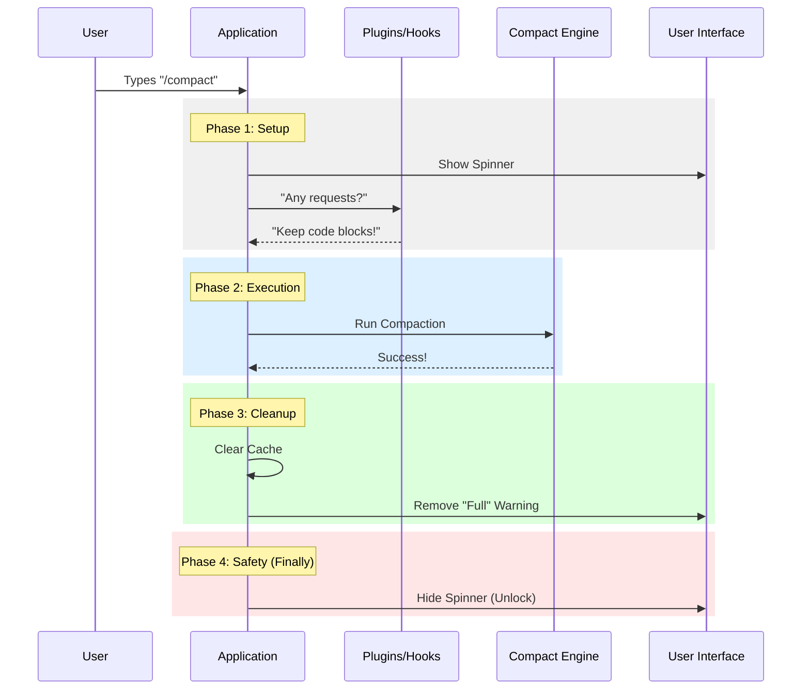

# Chapter 5: Lifecycle Hooks

In the previous chapter, [Chapter 4: Context Assembly](04_context_assembly.md), we learned how to pack all the necessary data (the "dossier") for our AI model. We gathered the system prompt, user context, and conversation history.

Now, we face the final challenge: **Managing the Aftermath.**

## The Concept: Moving House

Think of the compaction process like **moving houses**.
1.  **The Action:** You physically move your boxes from House A to House B.
2.  **The Lifecycle:**
    *   **Before (Setup):** You need to disconnect utilities, forward your mail, and pack.
    *   **After (Teardown):** You need to unpack, reconnect the internet, and update your driver's license.

If you only do the "Action" (moving the boxes) but forget the "Lifecycle" (reconnecting the internet), you will sit in your new house in the dark.

In software, **Lifecycle Hooks** are these setup and teardown tasks. They ensure the application is prepared before the heavy work starts, and properly cleaned up afterwards.

### The Use Case

The user runs `/compact`.
*   **The Problem:** The application might be showing a "Warning: Memory Full" banner.
*   **The Action:** We successfully compact the memory.
*   **The Missing Step:** If we don't tell the app "Hey, memory is empty now!", that warning banner will stay there forever, confusing the user.

We need a system to run cleanup tasks automatically.

---

## 1. Pre-Compaction Hooks (The Setup)

Before we start the heavy compaction process, other parts of the application (or external plugins) might want to say something.

For example, a "Coding Assistant Plugin" might want to inject a rule: *"If you summarize code, don't just describe it; keep the function signatures."*

We run these hooks **in parallel** with our context assembly to save time.

```typescript
// Inside compactViaReactive()
const [hookResult, cacheSafeParams] = await Promise.all([
  // 1. Run external hooks (Setup)
  executePreCompactHooks(
    { trigger: 'manual', customInstructions },
    context.abortController.signal,
  ),
  // 2. Build context (from Chapter 4)
  getCacheSharingParams(context, messages),
]);
```

**Explanation:**
*   `Promise.all`: We do two things at once. We ask plugins for their input (`executePreCompactHooks`) while we gather system data (`getCacheSharingParams`).
*   `hookResult`: This contains any extra instructions plugins want to add.

---

## 2. Merging Instructions

Now we have two sets of instructions:
1.  **User:** "Make it funny."
2.  **Hooks:** "Keep function signatures."

We need to combine them so the AI obeys both.

```typescript
const mergedInstructions = mergeHookInstructions(
  customInstructions, // User's input
  hookResult.newCustomInstructions, // Plugin's input
);
```

**Explanation:**
*   `mergedInstructions`: The final string sent to the AI (e.g., "Make it funny. Keep function signatures.").
*   This ensures the user gets what they want, but system stability (maintained by plugins) is preserved.

---

## 3. Post-Compaction Cleanup (The Teardown)

Once the compaction is finished, the "world" has changed. Old messages are gone. We need to reset the state of the application to match this new reality.

We perform a series of cleanup tasks immediately after success.

```typescript
// 1. Reset the "bookmark" for the last summary
setLastSummarizedMessageId(undefined);

// 2. Clear the cache so we don't use old, deleted data
getUserContext.cache.clear?.();

// 3. Hide the "Memory Full" warning banner
suppressCompactWarning();

// 4. Run general cleanup scripts
runPostCompactCleanup();
```

**Explanation:**
*   `setLastSummarizedMessageId`: Since we deleted the old messages, any "bookmarks" pointing to them are now invalid. We remove them.
*   `suppressCompactWarning`: This solves our main use case! It forces the UI to hide the "Memory Full" warning because we just fixed it.

---

## 4. The Safety Net (Finally)

What if the compaction fails? What if the internet cuts out?

When we started, we likely showed a "Loading..." spinner. If the code crashes, that spinner might spin forever, freezing the app.

We use a `try/finally` block to ensure the UI is *always* reset, no matter what happens.

```typescript
try {
  // ... Attempt the heavy compaction work ...
} finally {
  // This code runs on Success OR Failure
  context.onCompactProgress?.({ type: 'compact_end' });
  
  // Unlock the input box so the user can type again
  context.setSDKStatus?.(null);
}
```

**Explanation:**
*   `finally`: This is the ultimate cleanup hook. It guarantees that the application never gets stuck in a "Loading" state.

---

## Under the Hood: The Lifecycle Flow

Let's visualize the entire timeline of the `/compact` command, seeing how hooks wrap around the main logic.



## Implementation Details

In `compact.ts`, you can see these concepts integrated directly into the orchestration logic.

### Handling Reactive Outcomes
The cleanup isn't just about UI; it's about data integrity. In the `compactViaReactive` function, we combine the display message from the hooks with the result from the engine.

```typescript
// Combine messages from the Plugin (Hook) and the Engine
const combinedMessage =
  [hookResult.userDisplayMessage, outcome.result.userDisplayMessage]
    .filter(Boolean)
    .join('\n') || undefined;

return {
  type: 'compact',
  // ... return the combined result
  displayText: buildDisplayText(context, combinedMessage),
}
```

**Why do this?**
If a plugin did some work (like archiving data to a file) during the `PreCompact` phase, it might want to tell the user "Archived 3 files." The engine wants to say "Summarized chat." We join these strings so the user sees:
> "Archived 3 files. Summarized chat."

## Conclusion

Congratulations! You have completed the **Compact Project Tutorial**.

We have traveled a long way:
1.  **[Command Definition](01_command_definition.md):** We created the "Menu Item" for the command.
2.  **[Compaction Orchestration](02_compaction_orchestration.md):** We built the "Triage Nurse" to decide how to handle requests.
3.  **[Reactive Compaction Integration](03_reactive_compaction_integration.md):** We connected a specialized "Travel Adapter" for advanced AI processing.
4.  **[Context Assembly](04_context_assembly.md):** We learned to pack the "Dossier" of data for the AI.
5.  **Lifecycle Hooks:** We ensured the house is clean and utilities are working after the move.

You now understand the architecture of a production-grade CLI command. It isn't just about running a function; it's about managing resources, handling errors gracefully, and keeping the user interface in sync with the application state.

---

Generated by [Code IQ](https://github.com/adityasoni99/Code-IQ)