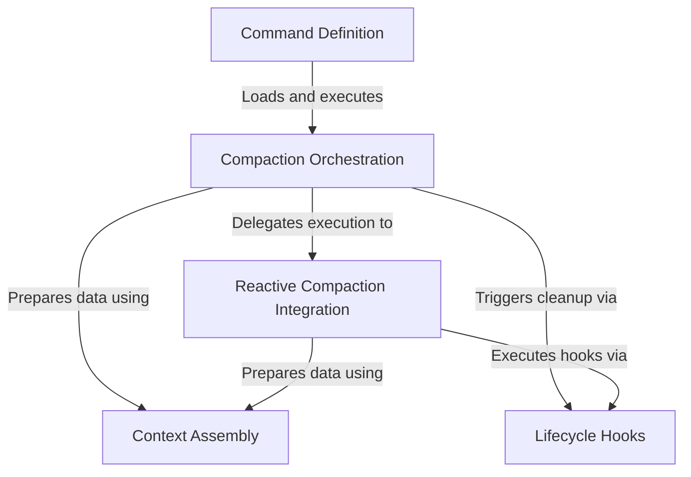

# Tutorial: compact

This project implements a smart **conversation summarization tool** for a CLI application, triggered via the `/compact` command. It manages the AI's context window by compressing message history using various strategies—like *Session Memory* or *Reactive Compaction*—ensuring the application maintains memory efficiency without losing critical information, supported by robust **lifecycle management** and data assembly.

## Chapters

1. [Command Definition](01_command_definition.md)
2. [Compaction Orchestration](02_compaction_orchestration.md)
3. [Reactive Compaction Integration](03_reactive_compaction_integration.md)
4. [Context Assembly](04_context_assembly.md)
5. [Lifecycle Hooks](05_lifecycle_hooks.md)

---

Generated by [Code IQ](https://github.com/adityasoni99/Code-IQ)