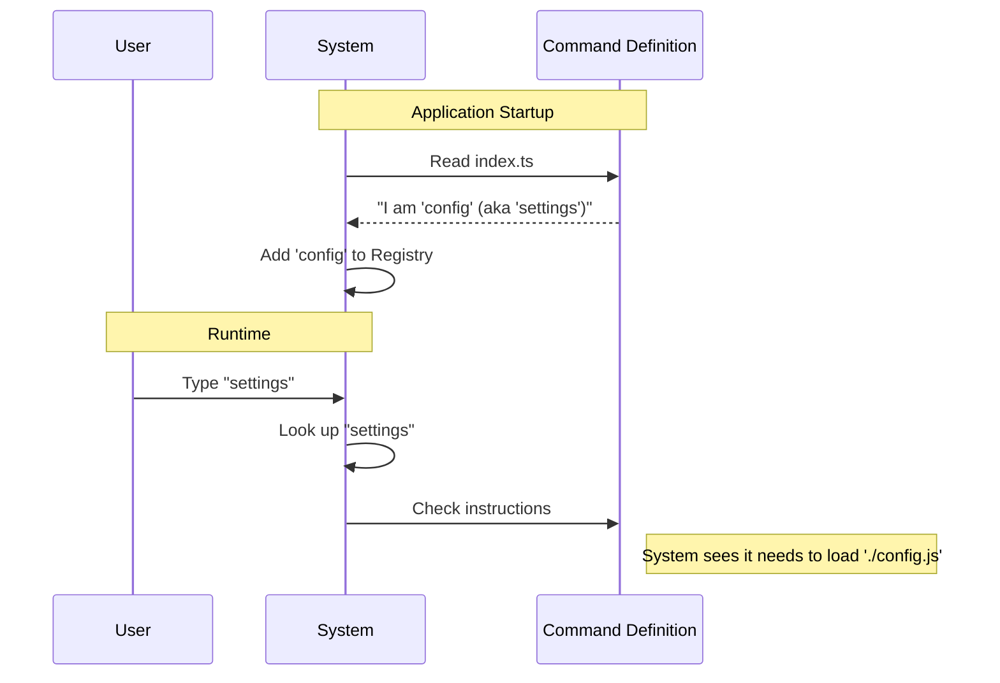

# Chapter 1: Command Definition

Welcome to the first chapter of our tutorial! Today, we are going to learn how to introduce a new feature to our system.

## The Motivation: The Restaurant Menu

Imagine walking into a restaurant. Before you can eat anything, you need to know what is available. You look at a **menu**.

The menu lists the name of the dish (e.g., "Cheeseburger") and a brief description (e.g., "Beef patty with cheddar"). However, the menu *is not the food itself*. You cannot eat the menu. It is simply a list that tells you what you can order and gives the kitchen instructions on what to prepare when you ask for it.

In our project, a **Command Definition** is exactly like that menu item. It tells the system:
1.  "I exist."
2.  "My name is `config`."
3.  "Here is a description of what I do."
4.  "Here is where you can find the actual code to run me."

Without this definition, the system wouldn't know your feature exists, even if you wrote thousands of lines of code for it.

## The Structure of a Command

Let's look at how we define this "menu item" in code. We use a simple JavaScript/TypeScript object to hold this information.

Here is the basic structure:

```typescript
// index.ts
import type { Command } from '../../commands.js'

const config = {
  name: 'config',            // The main command name
  aliases: ['settings'],     // Other names that work
  description: 'Open config panel',
  type: 'local-jsx',         // The category of command
  // ... more logic below
} satisfies Command
```

### Breakdown of the Definition

1.  **`name`**: This is what the user types to run the feature (e.g., typing `config` in the terminal).
2.  **`aliases`**: These are nicknames. If a user types `settings`, the system knows they actually mean `config`.
3.  **`description`**: A helpful hint shown in the help menu.
4.  **`type`**: This categorizes the command. Here, it is `'local-jsx'`, which tells the system how to treat the output. We will discuss the details of this execution style in [Local JSX Execution Strategy](04_local_jsx_execution_strategy.md).
5.  **`satisfies Command`**: This is a helper for the developer. It acts like a spell-checker to ensure we didn't forget any required fields.

## Connecting to the "Food" (Implementation)

Remember, the menu isn't the food. We need a way to tell the system, "When the user orders `config`, go get the code from this specific file."

We do this using the `load` property:

```typescript
// index.ts continued...
const config = {
  // ... previous properties ...
  
  // The instruction to find the actual code
  load: () => import('./config.js'),
} satisfies Command

export default config
```

**What is happening here?**
*   We provide a function `() => ...`.
*   Inside, we use `import('./config.js')`.
*   This points to the file where the actual logic lives.

This technique helps the system start up very fast. It reads the menu (the definition) instantly, but it doesn't cook the food (load the code) until someone actually orders it. We will explore this specific mechanism in depth in [Lazy Module Loading](02_lazy_module_loading.md).

## Internal Implementation: What Happens Under the Hood?

Let's visualize how the system uses this definition when the application starts.

1.  The **System** starts up.
2.  It looks for **Definitions** (like our `index.ts` file).
3.  It reads the `name` and `aliases` and registers them.
4.  It waits for the **User**.

Here is a simplified flow:



### Deep Dive: The Registration Process

When the system reads your file, it doesn't run your main feature code yet. It only cares about the **metadata** (data about data).

The code block below shows what the system sees when it imports your definition:

```typescript
// The system imports your default export
import myCommand from './index.ts'

// It accesses the metadata immediately
console.log(myCommand.name) // Output: "config"
console.log(myCommand.description) // Output: "Open config panel"
```

Because the `load` property is a function, the system can choose *when* to call it.

```typescript
// The system stores the load function for later
const instruction = myCommand.load

// It does NOT run the code inside './config.js' yet!
// It waits until the user presses Enter.
```

This separation allows us to have hundreds of commands without slowing down the application startup.

## Conclusion

In this chapter, we learned that a **Command Definition** is the entry point for any feature. It acts as a registration card, telling the system the command's name, aliases, and description. Most importantly, it provides a `load` function that points to the actual implementation file.

But wait—how exactly does that `load` function work, and why did we wrap it in an arrow function `() => import(...)`?

To answer that, we need to move to the next concept.

[Next Chapter: Lazy Module Loading](02_lazy_module_loading.md)

---

Generated by [Code IQ](https://github.com/adityasoni99/Code-IQ)