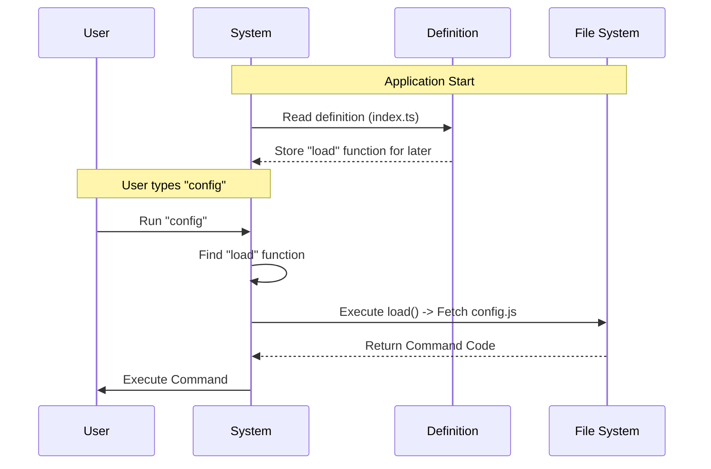

# Chapter 2: Lazy Module Loading

In the previous chapter, [Command Definition](01_command_definition.md), we created the "menu item" for our command. We defined its name (`config`) and its description. However, we stopped short of explaining exactly *how* the system retrieves the code for that command.

We briefly introduced this line of code:

```typescript
load: () => import('./config.js'),
```

In this chapter, we will explore why we write it this way and the powerful performance concept behind it: **Lazy Module Loading**.

## The Motivation: The Heavy Backpack

Imagine you are going to school. You have textbooks for Math, History, Science, Art, and Music.

**The "Eager" Approach (The Old Way):**
You put *every single book* for every subject into your backpack before you leave the house. Your bag is incredibly heavy. It takes you a long time to walk to school because you are carrying weight you don't need right now. If your first class is just Math, why are you carrying the heavy Art supplies?

**The "Lazy" Approach (Our Way):**
You walk to school carrying only an empty bag (or a list of classes). When you walk into Math class, someone hands you the Math book. When you leave and go to Art, you swap it for the Art supplies. You only carry exactly what you need, exactly when you need it.

In programming, "books" are **code files**.
*   **Eager Loading:** Loading every possible command when the program starts. This makes the program start slowly and use too much memory.
*   **Lazy Loading:** Loading the code for a command *only* when the user actually types that command.

## Key Concept: Dynamic Imports

To achieve this "Lazy" behavior in JavaScript/TypeScript, we use a feature called **Dynamic Imports**.

### Static Import (Eager)
Normally, you see imports at the top of a file. This is a **Static Import**.

```typescript
// The computer reads this and loads 'config.js' IMMEDIATELY.
import myCode from './config.js'

const command = {
  // ... properties ...
  run: myCode 
}
```

If we did this for 100 commands, the application would have to read 100 files before it could even start!

### Dynamic Import (Lazy)
A **Dynamic Import** looks like a function. It returns a "Promise" (a guarantee that the code will arrive soon).

```typescript
// The computer reads this but DOES NOT load the file yet.
const getCode = () => import('./config.js')

// Later, when we actually need it:
// getCode().then(...)
```

## Solving the Use Case

Let's apply this to our `config` command. We want the definitions file (index.ts) to remain lightweight. It acts as a pointer, not the heavy implementation.

Here is how we implement the `load` property within our definition:

```typescript
// index.ts
import type { Command } from '../../commands.js'

const config = {
  name: 'config',
  type: 'local-jsx',
  // The Magic Line:
  load: () => import('./config.js'),
} satisfies Command

export default config
```

### Breakdown of the Code

1.  **`() => ...`**: This is an **Arrow Function**. Think of it as a wrapper. It prevents the code inside from running immediately. It wraps the instruction up so it can be saved for later.
2.  **`import('./config.js')`**: This is the instruction to the runtime environment to go find the file `./config.js`, read it, and bring back its contents.

Because we wrapped the import inside a function, the import doesn't happen when the file is defined. It happens only when the function is **called**.

## Internal Implementation: Under the Hood

How does the system use this? It treats your command like a "Just-In-Time" manufacturing process.

### The Workflow

1.  **Startup**: The system reads your `index.ts`. It sees the `load` function, but it **does not** execute it.
2.  **Waiting**: The system waits for the user.
3.  **Action**: The user types `config` and presses Enter.
4.  **Trigger**: The system finds the definition for `config` and finally executes the `load()` function.
5.  **Delivery**: The code from `./config.js` is loaded into memory and executed.

### Visualizing the Sequence



### Deep Dive: System Code

Let's look at a simplified version of the system code that handles this process. This logic lives deep in the application's core, but understanding it helps you write better commands.

The system uses the keywords `async` and `await` to handle the dynamic import.

```typescript
// core/executor.ts

async function executeCommand(commandDef: Command) {
  console.log("User requested:", commandDef.name)

  // 1. Call the wrapper function we defined
  // The 'await' keyword pauses here until the file arrives
  const module = await commandDef.load()

  // 2. The file is now loaded! 
  // We can access the default export from that file.
  const actualCode = module.default

  return actualCode
}
```

**Why is this efficient?**
If the user never types `config`, the system **never** executes `commandDef.load()`. The `./config.js` file is never read, and the computer's memory stays clean.

## Conclusion

In this chapter, we learned about **Lazy Module Loading**. By wrapping our import statement in an arrow function (`() => import(...)`), we tell the system to wait. We only "pay" the cost of loading the code when the user explicitly asks for it. This keeps our application fast and responsive.

Now that the system has successfully loaded our file, what exactly is inside `./config.js`? It's not just a standard function; it's a special component designed to interact with the system.

[Next Chapter: Component Integration Adapter](03_component_integration_adapter.md)

---

Generated by [Code IQ](https://github.com/adityasoni99/Code-IQ)