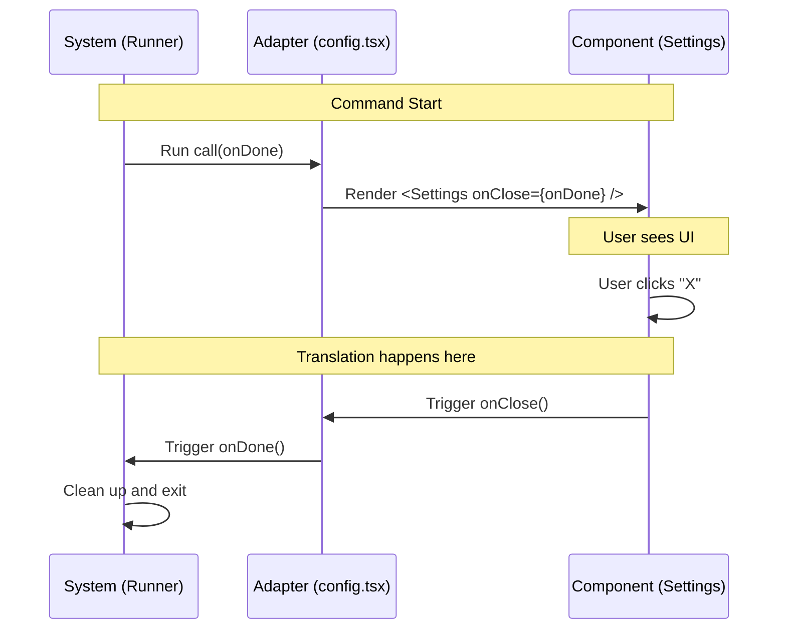

# Chapter 3: Component Integration Adapter

In the previous chapter, [Lazy Module Loading](02_lazy_module_loading.md), we learned how the system efficiently loads the code for a command only when it is needed. We ended with the system successfully fetching the file `./config.js`.

But now that the system has the file, what does it do with it? The system is a generic engine, but your specific feature (`config`) is a unique React component. They don't speak the same language naturally.

In this chapter, we will learn how to bridge that gap using a **Component Integration Adapter**.

## The Motivation: The Wall Socket and the Appliance

Imagine the electrical outlets in your house. They are "Universal." They provide electricity, but they don't know (or care) what you plug into them.
*   **The Wall Socket (System):** Provides raw power. It knows how to start the flow of electricity and how to stop it (via a fuse or switch).
*   **The Appliance (Your Component):** A toaster, a TV, or a lamp. Each has its own specific buttons and needs.

You cannot just shove the wires of a toaster directly into the wall; you need a **Plug**.

In our project:
*   The **System** is the Wall Socket. It knows generic signals like `onDone` (when a task is finished).
*   The **Settings Component** is the Appliance. It has specific properties like `onClose` (when the user clicks the "X" button).

The logic inside `config.tsx` is the **Plug** (or Adapter). It connects the generic system to your specific component.

## The Solution: The `call` Function

The "Plug" in our code is a specific function named `call`. The system looks for this function specifically.

Let's look at the implementation in `config.tsx`.

### Step 1: Importing the Appliance
First, we need to import the actual UI component we want to show.

```typescript
// config.tsx
import * as React from 'react';
// We import the specific UI component "Settings"
import { Settings } from '../../components/Settings/Settings.js';
import type { LocalJSXCommandCall } from '../../types/command.js';
```

This is like grabbing the toaster from the box. We haven't plugged it in yet, but we have it ready.

### Step 2: Creating the Adapter
Now we define the `call` function. This is where the translation happens.

```typescript
// config.tsx continued...

// The system calls this function and gives us 'onDone'
export const call: LocalJSXCommandCall = async (onDone, context) => {
  
  // We translate the system's 'onDone' to the component's 'onClose'
  return <Settings onClose={onDone} context={context} defaultTab="Config" />;
};
```

**What is happening here?**
1.  **Input (`onDone`)**: The system passes in a function called `onDone`. This is the system saying, "Call this function when you are finished so I can clean up."
2.  **Translation**: Our `Settings` component doesn't have a prop named `onDone`. It has one named `onClose`.
3.  **Output**: We return the React component, passing `onDone` into the `onClose` slot.

This effectively wires the specific "Close Button" of the Settings panel to the generic "Stop Command" signal of the System.

## Internal Implementation: What Happens Under the Hood?

To understand why this adapter is necessary, let's visualize the flow of control when a user runs this command.

### The Sequence

1.  **System**: Calls the adapter (`config.tsx`). It says, "Here is a way to signal you are done."
2.  **Adapter**: Starts the `Settings` component and hands it the signal.
3.  **User**: Interacts with the Settings UI and clicks "Close."
4.  **Component**: Triggers `onClose`.
5.  **Adapter**: Because of our wiring, this triggers `onDone`.
6.  **System**: Receives the signal and shuts down the command.



### Deep Dive: The System Runner

The code inside the system that executes this is actually quite simple because it relies on this standard adapter pattern. It doesn't need to know *what* `Settings` is; it only needs to trust the `call` function.

Here is a simplified version of the system code:

```typescript
// core/runner.ts

async function runCommand(adapter, context) {
  // 1. Create a generic function to handle completion
  const handleDone = () => {
    console.log("Command finished. Cleaning up...");
    process.exit(0);
  };

  // 2. Execute the adapter, passing the generic handler
  const output = await adapter.call(handleDone, context);
  
  return output;
}
```

The system is blind to the details. It hands off the `handleDone` grenade to the adapter, and the adapter decides when to pull the pin.

## Solving the Use Case

Let's look at our complete file one last time to see how it solves the problem of integrating the Settings UI.

```typescript
// config.tsx
import * as React from 'react';
import { Settings } from '../../components/Settings/Settings.js';
import type { LocalJSXCommandCall } from '../../types/command.js';

export const call: LocalJSXCommandCall = async (onDone, context) => {
  // The 'context' passes generic app info (like screen size or config path)
  // The 'defaultTab' is a prop specific to the Settings component
  return <Settings onClose={onDone} context={context} defaultTab="Config" />;
};
```

**Inputs and Outputs:**
*   **Input:** The System provides `onDone` (Function) and `context` (Object).
*   **Output:** A React Element (`<Settings ... />`).

Because we used this adapter pattern, we can reuse the `Settings` component elsewhere if we wanted to (e.g., inside a different command), or swap out the `Settings` component for a `Preferences` component without changing the main System code.

## Conclusion

In this chapter, we learned that the **Component Integration Adapter** (the `config.tsx` file) acts as a translator. It takes generic signals from the system (`onDone`) and converts them into specific props for our UI components (`onClose`). This keeps our system clean and our components flexible.

We have successfully defined the command, loaded the code, and adapted the component. But wait—our `call` function returned a React Element (`<Settings />`). How does a command-line tool understand React?

We will answer that in the next chapter.

[Next Chapter: Local JSX Execution Strategy](04_local_jsx_execution_strategy.md)

---

Generated by [Code IQ](https://github.com/adityasoni99/Code-IQ)