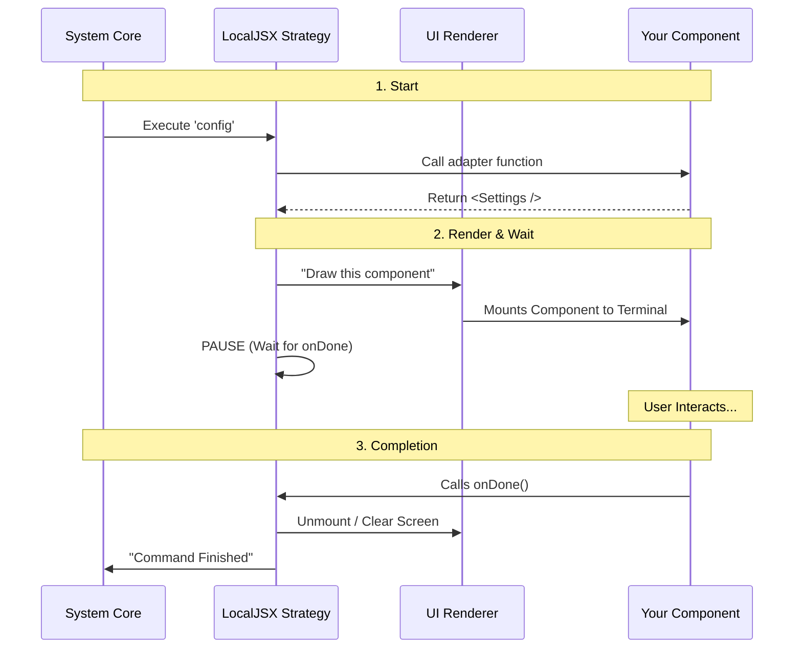

# Chapter 4: Local JSX Execution Strategy

Welcome to the fourth chapter! In the previous chapter, [Component Integration Adapter](03_component_integration_adapter.md), we built a "plug" that connects our `Settings` component to the system. We ended with a function that returns a React element: `<Settings />`.

But here is a puzzle: **Terminals understand text, not React components.**

If you try to `console.log(<Settings />)`, you will just see a confusing object full of data. You won't see an interactive user interface.

In this chapter, we will learn about the **Local JSX Execution Strategy**. This is the specific "engine" that knows how to take that React element, render it as a visual interface in your terminal, and handle the user's interaction.

## The Motivation: The Pop-Up Store

Imagine walking down a busy street (the Command Line). Usually, you just walk past buildings (background tasks).

But sometimes, you see a **Pop-Up Store**.
1.  It appears instantly in front of you.
2.  It blocks your path temporarily (takes focus).
3.  You go inside, look at items, and maybe buy something (interact with UI).
4.  When you leave, the store vanishes, and you are back on the street.

In our project:
*   **Background Commands:** Run silently (like deleting a file).
*   **Local JSX Commands:** Are like the Pop-Up Store. They need to **render** a visual interface, **wait** for you to finish, and then **clean up**.

The **Local JSX Execution Strategy** is the construction crew that builds the store, waits for you to leave, and then takes it down.

## Defining the Strategy

How does the system know to build a Pop-Up Store instead of just running a background script?

We told it to do so back in Chapter 1, inside our `index.ts`.

```typescript
// index.ts
const config = {
  name: 'config',
  // THIS LINE defines the strategy:
  type: 'local-jsx', 
  load: () => import('./config.js'),
} satisfies Command
```

By setting `type: 'local-jsx'`, you triggered a specific chain of events in the system's core.

### Key Concept: The `LocalJSXCommandCall`

In the previous chapter, we used a type called `LocalJSXCommandCall`. This type enforces a specific contract (or agreement) between your code and the system.

**The Agreement:**
1.  **You promise** to return a React Element (JSX).
2.  **The System promises** to render it visually.
3.  **The System promises** to give you an `onDone` callback.
4.  **You promise** to call `onDone` when the user wants to leave.

## Solving the Use Case

Let's look at how this strategy handles the inputs and outputs to make the `config` command work.

### 1. The Rendering Phase
When the strategy starts, it takes the React element returned by your adapter and uses a library (like `ink`) to draw it using text characters.

```typescript
// Your adapter (config.tsx) returns this:
<Settings onClose={onDone} ... />
```

**System Output:**
Instead of raw data, the user sees:
```text
┌── Config Panel ────────┐
│  [x] Dark Mode         │
│  [ ] Notifications     │
│                        │
│  [ Save ]   [ Cancel ] │
└────────────────────────┘
```

### 2. The Waiting Phase
This is the most important part of the strategy. Unlike a normal script that runs from top to bottom and exits immediately, a Local JSX command **pauses**.

It keeps the application running so the user can use the arrow keys to select "Dark Mode" or press Enter on "Save".

### 3. The Completion Phase
The system will wait forever unless we tell it to stop. This is why passing the `onDone` function was critical in Chapter 3.

```typescript
// Inside your Component (simplified):
<Button onPress={() => {
    // 1. User clicks button
    // 2. Component calls prop
    props.onClose(); 
}}>
  Close
</Button>
```

When `props.onClose()` runs, it triggers the system's `onDone`, which tells the strategy: "The user has left the Pop-Up Store. Tear it down."

## Internal Implementation: What Happens Under the Hood?

Let's visualize the lifecycle of this strategy using a diagram.

### The Lifecycle Flow



### Deep Dive: The Strategy Code

The code inside the system that manages this is complex, but we can look at a simplified version to understand the logic. It uses a JavaScript `Promise` to handle the waiting.

```typescript
// core/strategies/local-jsx.ts (Simplified)

import { render } from 'ink'; // The library that draws React in terminal

export async function executeLocalJSX(commandFn, context) {
  // 1. Create a Promise that waits for a signal
  return new Promise((resolve) => {
    
    // 2. Define the signal function
    const onDone = () => {
      resolve(); // This unlocks the Promise
    };

    // 3. Get your component, passing the signal
    const uiComponent = commandFn(onDone, context);

    // 4. Render it to the screen
    const { unmount } = render(uiComponent);
    
    // The code STOPS here until 'resolve()' is called above
  }).then(() => {
    // 5. Cleanup after resolve() happens
    console.log("Exiting...");
  });
}
```

**Breakdown:**
1.  **`new Promise`**: This tells JavaScript, "Don't finish this function yet. Wait until `resolve` is called."
2.  **`render(uiComponent)`**: This paints your UI to the terminal.
3.  **The Gap**: The code sits in limbo between step 4 and step 5 while the user interacts with your UI.
4.  **`onDone` -> `resolve`**: When your component calls `onDone`, it triggers `resolve`.
5.  **`.then(...)`**: The promise completes, the function finishes, and the command exits.

## Why This Matters

Without the **Local JSX Execution Strategy**, your command would either:
1.  Print the UI once and immediately exit (making it impossible to click anything).
2.  Or run forever and never exit.

This strategy abstracts away all the complexity of managing terminal raw mode, input streams, and rendering loops. It lets you focus purely on writing standard React code in your `Settings` component.

## Conclusion

In this chapter, we explored the **Local JSX Execution Strategy**.

*   We learned that `type: 'local-jsx'` tells the system to treat the command as an interactive UI.
*   We saw how the system uses a **Promise** to pause execution while the user interacts with the interface.
*   We understood that `onDone` is the key that unlocks that Promise and allows the application to exit cleanly.

You have now completed the journey for the `config` command!

1.  **[Command Definition](01_command_definition.md)**: You registered the "menu item".
2.  **[Lazy Module Loading](02_lazy_module_loading.md)**: You optimized the code delivery.
3.  **[Component Integration Adapter](03_component_integration_adapter.md)**: You plugged your component into the system.
4.  **Local JSX Execution Strategy**: You learned how the system renders and manages the lifecycle of your UI.

You are now ready to build your own interactive CLI commands!

---

Generated by [Code IQ](https://github.com/adityasoni99/Code-IQ)