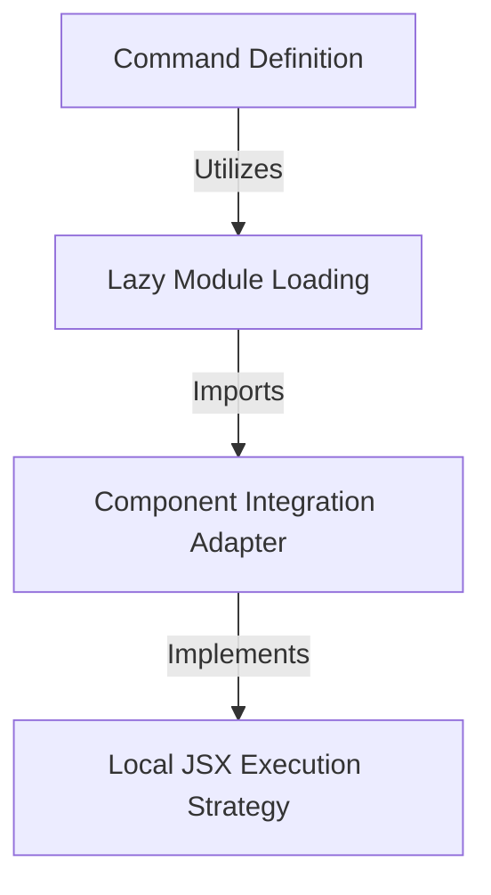

# Tutorial: config

This project defines a **configuration command** that allows users to access the application's *Settings panel*. It utilizes a performance-saving **lazy loading** technique to only fetch the implementation code when the user specifically requests it, at which point it adapts the request to render the visual interface.

## Chapters

1. [Command Definition](01_command_definition.md)
2. [Lazy Module Loading](02_lazy_module_loading.md)
3. [Component Integration Adapter](03_component_integration_adapter.md)
4. [Local JSX Execution Strategy](04_local_jsx_execution_strategy.md)

---

Generated by [Code IQ](https://github.com/adityasoni99/Code-IQ)