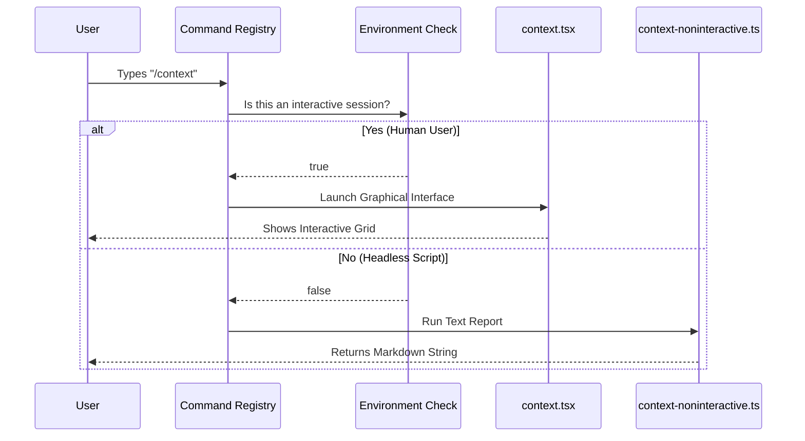

# Chapter 1: Dual-Mode Command Strategy

Welcome to the **Context Project**! In this first chapter, we are going to look at the "Front Door" of our application.

Imagine you have a **video game console**.
1. When you hook it up to a TV, it shows beautiful graphics and menus.
2. When you hook it up to a diagnostic computer for repairs, it just sends simple text logs.

The hardware is the same, but the **output changes based on the environment**.

The `context` command works exactly like this. It uses a **Dual-Mode Command Strategy** to decide whether to show you a pretty interactive table or a raw text report.

## The Problem: One Command, Two Environments

We want a command called `/context` that analyzes how many tokens (AI memory units) we are using.

*   **Human User:** When *you* type `/context`, you want a colorful, interactive grid to explore.
*   **Script/Bot:** When an automated script runs `/context`, it can't "see" colors or interact. It needs plain text.

How do we create one command that handles both perfectly?

## The Solution: The Smart Switch

We define the command **twice** in our entry file (`index.ts`), but we add a logic gate so only one version is active at a time.

### 1. The Interactive Definition
This definition handles the "Human User" scenario.

```typescript
// From index.ts
export const context: Command = {
  name: 'context',
  description: 'Visualize current context usage',
  // Active ONLY if a human is using the terminal
  isEnabled: () => !getIsNonInteractiveSession(),
  type: 'local-jsx', // Use React/Graphics
  load: () => import('./context.js'),
}
```
**Explanation:**
*   `name: 'context'`: The command the user types.
*   `isEnabled`: Checks `!getIsNonInteractiveSession()`. If this is **not** a headless session (meaning it is interactive), this version turns on.
*   `type: 'local-jsx'`: Tells the system to prepare a graphical interface. We will cover this in [Interactive Visualization (TUI)](02_interactive_visualization__tui_.md).

### 2. The Headless Definition
This definition handles the "Script/Bot" scenario.

```typescript
// From index.ts
export const contextNonInteractive: Command = {
  name: 'context', // Same name!
  // Active ONLY if this is a script/headless session
  isEnabled: () => getIsNonInteractiveSession(),
  type: 'local', // Simple text output
  load: () => import('./context-noninteractive.js'),
}
```
**Explanation:**
*   `name: 'context'`: It shares the same name! To the user, it feels like the same command.
*   `isEnabled`: This is the inverse of the previous one. It only turns on if we *are* in a non-interactive session.
*   `type: 'local'`: This tells the system to expect a simple text return value, which we will explore in [Headless Reporting (Markdown)](03_headless_reporting__markdown_.md).

## Internal Implementation: How the Switch Works

Let's visualize what happens when the application starts up and registers these commands.



### Lazy Loading for Performance

You might have noticed the `load` property in the code snippets above:

```typescript
load: () => import('./context.js'),
```

This is a specific design choice called **Lazy Loading**.

*   If we are in **Text Mode**, we never load the heavy graphics code (`context.js`).
*   If we are in **Graphics Mode**, we load the graphics code on demand.

This keeps the application fast and lightweight. It ensures that a script running in the background doesn't waste memory loading React components it will never use.

## Summary

In this chapter, we learned:

1.  **Dual-Mode Strategy:** We can have two commands with the same name, as long as they never activate at the same time.
2.  **Environment Detection:** We use `getIsNonInteractiveSession()` to determine if a human or a computer is running the command.
3.  **Efficiency:** We separate the code into two files (`context.tsx` and `context-noninteractive.ts`) and only load the one we need.

Now that we understand how the system chooses which file to run, let's dive into the "Human Mode" to see how the graphical interface is built.

[Next Chapter: Interactive Visualization (TUI)](02_interactive_visualization__tui_.md)

---

Generated by [Code IQ](https://github.com/adityasoni99/Code-IQ)