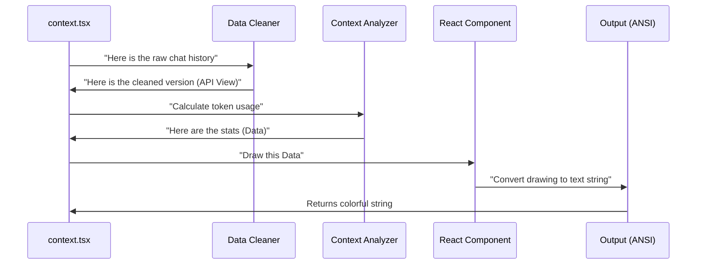

# Chapter 2: Interactive Visualization (TUI)

In the previous chapter, [Dual-Mode Command Strategy](01_dual_mode_command_strategy.md), we set up a "Smart Switch" that detects if a human is using the terminal.

Now, we are going to walk through the "Human Mode" door.

When you are driving a car, you don't want to see a spreadsheet of fuel injection rates. You want to see a **dashboard gauge**. It's visual, colorful, and easy to understand at a glance.

That is exactly what this chapter is about: **converting raw data into a beautiful Terminal User Interface (TUI).**

## The Concept: React in the Terminal

You might know **React** as a tool for building websites. But here, we use a special library called **Ink**. It allows us to build React components (like `<Box>` and `<Text>`) that render as text in your terminal instead of HTML in a browser.

However, there is a twist.

Usually, interactive terminal apps (like `vim` or `nano`) take over your whole screen. Our `/context` command is different. It acts like a **stamp**. It calculates the data, draws a picture using text characters, prints it to your history, and then finishes.

## High-Level Workflow

Before we look at the code, let's visualize the assembly line.



## Step-by-Step Implementation

Let's look at `context.tsx`. This file is the conductor of the orchestra. It doesn't draw the pixels itself; it coordinates the data and the artist.

### Step 1: Preparing the Data

First, we need to know what the AI actually "sees." The chat history in your terminal might contain things (like collapsed sections) that the AI ignores. We need to filter those out.

```typescript
// Inside context.tsx
function toApiView(messages: Message[]): Message[] {
  // 1. Get messages that haven't been "forgotten" (compacted)
  let view = getMessagesAfterCompactBoundary(messages);
  
  // 2. Apply logic to handle collapsed sections (optional features)
  // ... (Feature flag logic omitted for simplicity) ...
  
  return view;
}
```
**Explanation:**
We act as a filter. We take the raw `messages` from the application state and return an `apiView`. This ensures our visualization matches reality.

### Step 2: Compressing Messages

Before we analyze, we do one last pass to "micro-compact" messages. This is a specific optimization to save space.

```typescript
export async function call(onDone, context) {
  const { messages } = context;
  const apiView = toApiView(messages);

  // Shrink the messages to match exactly what is sent to the LLM
  const { messages: compactedMessages } = 
    await microcompactMessages(apiView);
    
  // ... continued below
```
**Explanation:**
`microcompactMessages` ensures that if our system automatically squashed some text to save money/tokens, our visualization accounts for that.

### Step 3: The Analysis

Now we have clean data. We need to do the math. How many tokens are used? How much budget is left?

```typescript
  // ... continued
  const terminalWidth = process.stdout.columns || 80;
  const appState = context.getAppState();

  // Send everything to the Analyzer
  const data = await analyzeContextUsage(
    compactedMessages, 
    context.options.mainLoopModel, 
    // ... other necessary permissions and tools ...
    terminalWidth
  );
```
**Explanation:**
We call `analyzeContextUsage`. This is a pure calculation function (we will cover similar logic in [Context Analysis Integration](04_context_analysis_integration.md)). It returns a `data` object containing percentages, limits, and file sizes.

### Step 4: Rendering to ANSI

This is the most unique part of this file.

If this were a website, we would just mount the component. But here, we want to generate a **string** that contains the colors.

```typescript
  // ... continued
  
  // 1. Create the React Element with our data
  const element = <ContextVisualization data={data} />;

  // 2. "Freeze" the component into a string of text + colors
  const output = await renderToAnsiString(element);

  // 3. Send the string to the user
  onDone(output);
  return null;
}
```
**Explanation:**
1.  `<ContextVisualization />`: This is our custom React component. It defines the grid, the bars, and the colors.
2.  `renderToAnsiString`: This function renders the React component virtually, grabs the output (which includes special "ANSI" codes like `\x1b[31m` for red), and returns it as a string.
3.  `onDone(output)`: This prints the final result to your terminal.

## Why "Static Render"?

You might be wondering: *"Why do we convert it to a string? Why not keep it running?"*

If we kept it running, you couldn't type your next command! We render a **snapshot** of the current state. This allows the visualization to stay in your scrollback history, so you can scroll up later and see: *"Ah, that's how much memory I was using 10 minutes ago."*

## Summary

In this chapter, we learned how to build the "Human Mode" of our command:

1.  **Data Prep:** We clean the message history to match what the AI sees.
2.  **Analysis:** We calculate the math (token usage) before drawing.
3.  **Visualization:** We use a React component (`<ContextVisualization>`) to design the UI.
4.  **Freezing:** We use `renderToAnsiString` to turn that React component into a static text string that prints to the console.

But what happens if a robot runs this command? Robots can't read colorful dashboards. They need raw text.

[Next Chapter: Headless Reporting (Markdown)](03_headless_reporting__markdown_.md)

---

Generated by [Code IQ](https://github.com/adityasoni99/Code-IQ)