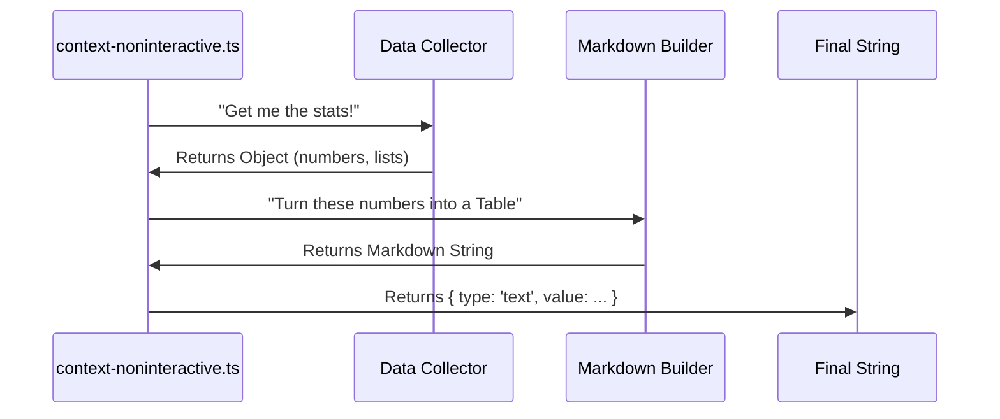

# Chapter 3: Headless Reporting (Markdown)

In the previous chapter, [Interactive Visualization (TUI)](02_interactive_visualization__tui_.md), we learned how to paint a beautiful, colorful dashboard for human users.

But remember the **Dual-Mode Command Strategy** from Chapter 1? Sometimes, there is no human looking at the screen.

Imagine you are at a grocery store.
1.  **Interactive Mode:** The self-checkout screen shows you photos of your items, colorful buttons, and animations.
2.  **Headless Mode:** The **printed receipt**. It contains the exact same information (what you bought, how much it cost), but it is just a strip of plain text.

This chapter is about building that "Printed Receipt." We call it **Headless Reporting**.

## The Motivation: Why Plain Text?

Why would we want a boring text report instead of a cool dashboard?

1.  **Automation:** If a script runs your AI overnight, it can't "look" at a dashboard. It needs text to save to a log file.
2.  **Copy/Paste:** Sometimes you want to copy your token usage and paste it into a GitHub issue or an email. You can't copy a TUI dashboard easily, but you can copy text.
3.  **Portability:** Text works everywhere. It works in old terminals, inside code editors, and on web pages.

## The Format: Markdown Tables

We don't just dump random numbers. We format the text using **Markdown**.

Markdown is great because it is readable as plain text, but if you paste it into a viewer (like GitHub or Discord), it renders into a nice table.

**Raw Text Output:**
```text
| Category | Tokens | Percentage |
|----------|--------|------------|
| Files    | 1024   | 10%        |
| Chat     | 500    | 5%         |
```

**Rendered View:**
| Category | Tokens | Percentage |
|----------|--------|------------|
| Files | 1024 | 10% |
| Chat | 500 | 5% |

## High-Level Workflow

The process for Headless Reporting is actually simpler than the Interactive TUI. We don't need to manage screen refreshes or keyboard inputs. We just run once and exit.



## Step-by-Step Implementation

Let's look at `context-noninteractive.ts`. This file handles the logic when the "Smart Switch" detects a script or bot.

### Step 1: The Entry Point

Unlike the TUI, which used a React component, this is a standard function call.

```typescript
// context-noninteractive.ts
export async function call(_args, context): Promise<TextResult> {
  // 1. Gather the data (Reuse the same logic as TUI!)
  const data = await collectContextData(context);
  
  // 2. Format it into a string
  const markdown = formatContextAsMarkdownTable(data);

  // 3. Return the text packet
  return {
    type: 'text',
    value: markdown,
  }
}
```
**Explanation:**
*   `collectContextData`: This gathers the token counts. We'll look at the math behind this in [Context Analysis Integration](04_context_analysis_integration.md).
*   `formatContextAsMarkdownTable`: This is our "Receipt Printer."
*   `return { type: 'text' ... }`: This tells the system, "I am done. Here is the result to print."

### Step 2: printing the Header

Now let's look inside the `formatContextAsMarkdownTable` function. It builds a long string, line by line.

```typescript
function formatContextAsMarkdownTable(data: ContextData): string {
  // Start with a Title
  let output = `## Context Usage\n\n`;
  
  // Add Summary Stats
  output += `**Model:** ${data.model}  \n`;
  output += `**Tokens:** ${data.totalTokens} / ${data.rawMaxTokens}\n\n`;
  
  // ... continued below
```
**Explanation:**
We are manually constructing a string. The `\n` characters create new lines. The `**` syntax makes text bold in Markdown.

### Step 3: Building the Main Table

This is where we loop through our data to create the "Itemized" part of the receipt.

```typescript
  // ... continued
  
  // 1. Create Table Headers
  output += `### Estimated usage by category\n\n`;
  output += `| Category | Tokens | Percentage |\n`;
  output += `|----------|--------|------------|\n`;

  // 2. Loop through categories (Files, Chat, Tools, etc.)
  for (const cat of data.categories) {
    const percent = ((cat.tokens / data.rawMaxTokens) * 100).toFixed(1);
    
    // 3. Add a row for this item
    output += `| ${cat.name} | ${cat.tokens} | ${percent}% |\n`;
  }
  
  output += `\n`;
```
**Explanation:**
*   We draw the table headers manually using pipes (`|`) and dashes (`-`).
*   We loop through `data.categories`.
*   For every category, we append a new line to `output` with the calculated numbers.

### Step 4: Conditional Sections (Advanced Logic)

Sometimes, we want to show extra info, but only if it exists. For example, if you didn't use any special "Agents," we shouldn't print an empty Agents table.

```typescript
  // Check if we have any custom agents
  if (data.agents.length > 0) {
    
    output += `### Custom Agents\n\n`;
    output += `| Agent Type | Source | Tokens |\n`;
    output += `|------------|--------|--------|\n`;
    
    for (const agent of data.agents) {
      output += `| ${agent.agentType} | ${agent.source} | ${agent.tokens} |\n`;
    }
  }
```
**Explanation:**
This `if` statement ensures our receipt stays clean. We only print sections that have data. This keeps the logs readable and concise.

## Internal Implementation: Data Consistency

A critical design detail is that **Headless Mode** and **Interactive Mode** must show the *exact same numbers*.

If the TUI says you used 500 tokens, but the text report says 600, users will lose trust.

To solve this, both `context.tsx` (from Chapter 2) and `context-noninteractive.ts` (this chapter) call the **exact same helper function**:

```typescript
// Shared logic used by both modes
export async function collectContextData(context) {
  // ... logic to clean messages ...
  // ... logic to count tokens ...
  return analyzeContextUsage(...);
}
```

By isolating the "Math" from the "Display," we ensure consistency. We will explore this shared math engine in the next chapter.

## Summary

In this chapter, we learned:

1.  **Headless Reporting:** How to support automated environments using simple text.
2.  **Markdown Tables:** Using Markdown to create text that is readable by machines but looks good to humans.
3.  **String Construction:** Building a report by concatenating strings line-by-line.
4.  **Consistency:** The importance of using the same data source for both Graphics and Text modes.

Now that we have seen the **Front Door** (Chapter 1), the **Living Room** (Chapter 2), and the **Mail Room** (Chapter 3), it is time to visit the **Engine Room**.

How do we actually count the tokens? How do we know how big a file is?

[Next Chapter: Context Analysis Integration](04_context_analysis_integration.md)

---

Generated by [Code IQ](https://github.com/adityasoni99/Code-IQ)