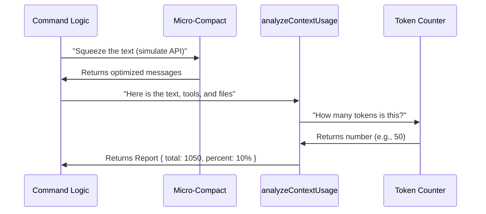

# Chapter 4: Context Analysis Integration

In the previous chapters, we built the "Front End" of our command.
1. We built a graphical dashboard in [Interactive Visualization (TUI)](02_interactive_visualization__tui_.md).
2. We built a text report in [Headless Reporting (Markdown)](03_headless_reporting__markdown_.md).

Both of these chapters had one thing in common: they displayed numbers (Token Counts). But where did those numbers come from?

If the TUI calculates `500 tokens` and the Headless report calculates `550 tokens`, our users will be confused. To solve this, we move the math into a central "Accountant."

This chapter covers **Context Analysis Integration**: the bridge between our command and the core math engine.

## The Motivation: The "Packing a Suitcase" Analogy

Imagine the AI's Context Window (memory) is a **suitcase**.
*   It has a hard limit (e.g., 50 lbs).
*   You are packing different things: Clothes (Chat History), Shoes (Files), and Toiletries (System Instructions).

If you just throw everything in a pile, you don't know if the suitcase will zip shut.

**Context Analysis Integration** is like creating an itemized packing list. It takes all the items, weighs them individually, groups them by category, and tells you: *"You have used 40 lbs (80%), and Shoes are taking up the most space."*

## The Workflow

Before we look at code, let's see how data flows from the command to the analysis engine.



## Step 1: Preparing the Data (The "Squeeze")

Before we count tokens, we must simulate exactly what happens when we send data to the AI. The system often "micro-compacts" messages (removing extra spaces or empty lines) to save money.

If we count the raw messages, our estimate will be too high. We must count the **compacted** version.

```typescript
// Inside context.tsx (and context-noninteractive.ts)

// 1. Get the raw messages
const apiView = toApiView(messages);

// 2. Squeeze them!
const {
  messages: compactedMessages
} = await microcompactMessages(apiView);
```
**Explanation:**
*   `toApiView`: Filters out hidden internal logs.
*   `microcompactMessages`: Removes whitespace/redundancy.
*   **Result:** `compactedMessages` is now an accurate reflection of what the AI will actually receive.

## Step 2: Gathering the Ingredients

Counting tokens isn't just about chat messages. The AI also "loads" tools, file definitions, and system prompts into its memory. We need to gather all of these.

```typescript
// From the context object passed to the command
const {
  options: {
    mainLoopModel, // e.g., "claude-3-5-sonnet"
    tools          // e.g., "readFile", "runScript"
  },
  getAppState      // Access to global state
} = context;

const appState = getAppState();
```
**Explanation:**
*   `mainLoopModel`: Different models count tokens differently. We need to know which one we are using.
*   `tools`: Every tool available to the AI takes up a small amount of memory (the definition of the tool).
*   `appState`: Contains permissions and other global settings.

## Step 3: Calling the Accountant

Now we call the core utility: `analyzeContextUsage`. This is the shared function used by both the TUI and Headless modes.

```typescript
// The Integration Point
const data = await analyzeContextUsage(
  compactedMessages,     // The chat history
  mainLoopModel,         // The specific AI model
  async () => appState.toolPermissionContext, 
  tools,                 // Available tools
  appState.agentDefinitions,
  terminalWidth,         // For formatting width
  context,               // Full context access
  undefined,
  apiView                // Original messages (for reference)
);
```
**Explanation:**
This function does the heavy lifting. It:
1.  Iterates through every message.
2.  Iterates through every file loaded in memory.
3.  Iterates through every tool definition.
4.  Sums up the tokens based on the Model's specific rules.

## Step 4: The Result Structure

The `analyzeContextUsage` function returns a `ContextData` object. This is our "Itemized Receipt."

It looks roughly like this (simplified):

```javascript
{
  totalTokens: 15420,
  rawMaxTokens: 200000,
  percentage: 7.7,
  categories: [
    { name: "System Prompts", tokens: 1000 },
    { name: "Chat History", tokens: 5000 },
    { name: "Memory Files", tokens: 9420 }
  ],
  // ... extra details
}
```

This object is purely data. It contains no UI logic.
*   **Chapter 2** takes this object and draws colored bars.
*   **Chapter 3** takes this object and prints a Markdown table.

## Why This Architecture Matters

By separating the **Analysis** (this chapter) from the **Presentation** (previous chapters), we achieve consistency.

Imagine if we wrote the math logic inside `context.tsx` (the visual command). Later, when we built the headless command, we would have to copy-paste that math. Eventually, we would change one and forget the other.

**Integration Pattern:**
1.  **Command Layer:** Collects data (inputs).
2.  **Service Layer (`analyzeContextUsage`):** Processes data (logic).
3.  **View Layer:** Displays data (UI).

## Summary

In this chapter, we learned:

1.  **Data Preparation:** We must "micro-compact" messages to get an accurate token count.
2.  **Centralized Logic:** We use `analyzeContextUsage` as the single source of truth for token math.
3.  **Integration:** The command acts as a coordinator, gathering inputs (Model, Tools, Messages) and handing them to the analyzer.

Now we have our data! But simply having numbers isn't enough. In the TUI mode, we need to transform this raw data into visual components (Bars, Lists, Colors).

[Next Chapter: Model-View Transformation](05_model_view_transformation.md)

---

Generated by [Code IQ](https://github.com/adityasoni99/Code-IQ)