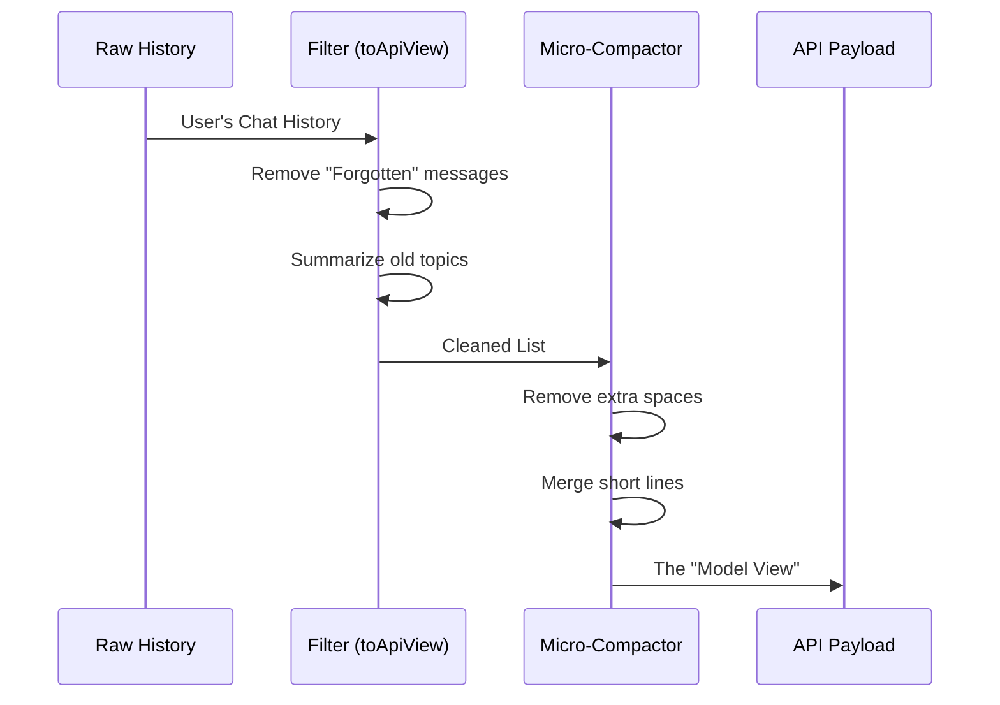

# Chapter 5: Model-View Transformation

In the previous chapter, [Context Analysis Integration](04_context_analysis_integration.md), we learned how to send data to our "Accountant" to get token counts.

But there is a catch.

If you hand the Accountant your raw chat history, they might give you the wrong number. Why? Because **what you see in your terminal is not exactly what the AI sees.**

To save money and memory, our system acts like a "Prep Chef." It chops, cleans, and squeezes your messages before sending them to the AI.

This chapter is about **Model-View Transformation**: the pipeline that turns the **Human View** (your screen) into the **Model View** (the API payload).

## The Motivation: The "Space Bag" Analogy

Imagine packing for a vacation.
1.  **Human View:** You lay out 10 puffy winter coats on your bed. It looks like it takes up 10 suitcases.
2.  **Transformation:** You use a vacuum-seal "Space Bag" to suck all the air out.
3.  **Model View:** The coats now fit into 1 small suitcase.

If we calculated shipping costs based on the **Human View** (10 suitcases), we would think it's expensive. But the airline actually sees the **Model View** (1 suitcase).

To show the user accurate stats, we must replicate this "Space Bag" process exactly.

## The Transformation Pipeline

The transformation happens in a specific sequence. Let's visualize the assembly line.



## Step 1: The Filter (`toApiView`)

The first step is filtering out things that simply don't exist for the AI anymore.

If you have a chat history of 10,000 messages, the system might have "forgotten" the first 5,000 to save space (this is called the Compact Boundary). Even though you can scroll up and see them, the AI cannot.

We use a helper function called `toApiView` to simulate this.

```typescript
// Inside context.tsx
function toApiView(messages: Message[]): Message[] {
  // 1. Cut off messages that are behind the "Compact Boundary"
  let view = getMessagesAfterCompactBoundary(messages);
  
  // 2. (Optional) Apply Context Collapse
  if (feature('CONTEXT_COLLAPSE')) {
     view = projectView(view);
  }
  
  return view;
}
```
**Explanation:**
*   `getMessagesAfterCompactBoundary`: This acts like a pair of scissors. It cuts off the "forgotten" history so we don't count it.
*   `projectView`: If "Context Collapse" is active, this turns 100 old messages into 1 summary message.

## Step 2: The Squeezer (`microcompactMessages`)

Now that we have the correct list of messages, we need to squeeze the text itself.

The system uses a technique called **Micro-Compaction**. It removes unnecessary newlines and whitespace. A message that looks "airy" to a human might be a dense block of text to the machine.

```typescript
// Inside context.tsx
export async function call(onDone, context) {
  const { messages } = context;

  // 1. Get the filtered view
  const apiView = toApiView(messages);

  // 2. Squeeze it!
  const { messages: compactedMessages } = 
    await microcompactMessages(apiView);
    
  // Now we are ready to analyze compactedMessages...
}
```
**Explanation:**
*   `microcompactMessages`: This is our "Vacuum Seal." It takes the `apiView` and returns `compactedMessages`.
*   **Result:** `compactedMessages` contains the exact characters (byte-for-byte) that will be sent to the AI.

## Deep Dive: Context Collapse

You noticed `projectView` in Step 1. This is a powerful feature for long conversations.

Imagine a conversation with 500 lines.
*   **Without Collapse:** The AI reads lines 1–500.
*   **With Collapse:** The AI reads a **Summary** of lines 1–400, and then reads lines 401–500 verbatim.

The **Model-View Transformation** ensures that when you run `/context`, you see the token count for the *Summary*, not the original 400 lines. This ensures your dashboard matches reality.

## Internal Implementation

Let's look at how this fits into the files we studied in previous chapters.

Whether we are in the TUI ([Interactive Visualization (TUI)](02_interactive_visualization__tui_.md)) or the Text Report ([Headless Reporting (Markdown)](03_headless_reporting__markdown_.md)), we perform this transformation *before* calling the analyzer.

### The Sequence

1.  **User** types `/context`.
2.  **Command** grabs `context.messages` (The User View).
3.  **Command** calls `toApiView` (Removes hidden/forgotten items).
4.  **Command** calls `microcompactMessages` (Squeezes whitespace).
5.  **Command** passes the result to `analyzeContextUsage` (Chapter 4).

### Code Comparison

Notice how the code is identical in both `context.tsx` and `context-noninteractive.ts`. This duplication is intentional to keep the "View" logic separate, but they share the same transformation logic.

**In `context.tsx` (Visual Mode):**
```typescript
const apiView = toApiView(messages);
const { messages: compactedMessages } = await microcompactMessages(apiView);

const data = await analyzeContextUsage(compactedMessages, ...);
// -> Draw Graphics
```

**In `context-noninteractive.ts` (Text Mode):**
```typescript
let apiView = getMessagesAfterCompactBoundary(messages);
// ... logic for collapse ...
const { messages: compactedMessages } = await microcompactMessages(apiView);

const data = await analyzeContextUsage(compactedMessages, ...);
// -> Print Markdown
```

## Summary

In this final chapter, we closed the loop on how the `/context` command works.

1.  **The Problem:** The chat history on your screen is not what the AI sees.
2.  **The Solution:** We create a transformation pipeline (Filter -> Squeeze).
3.  **The Tools:** We use `toApiView` to handle history boundaries and `microcompactMessages` to handle whitespace optimization.
4.  **The Result:** Our token counts are accurate to the single digit, because we are measuring the *exact* payload the AI will receive.

### Project Wrap-Up

Congratulations! You have explored the entire architecture of the `context` command.

*   **Chapter 1:** We learned how the **Dual-Mode Command Strategy** chooses between graphics and text.
*   **Chapter 2:** We built a **TUI** using React for terminal graphics.
*   **Chapter 3:** We built a **Headless Report** using Markdown for automation.
*   **Chapter 4:** We centralized our math in the **Context Analysis Integration**.
*   **Chapter 5:** We ensured accuracy with **Model-View Transformation**.

You now understand how to build a production-grade terminal tool that is beautiful for humans, friendly for robots, and accurate for everyone.

---

Generated by [Code IQ](https://github.com/adityasoni99/Code-IQ)