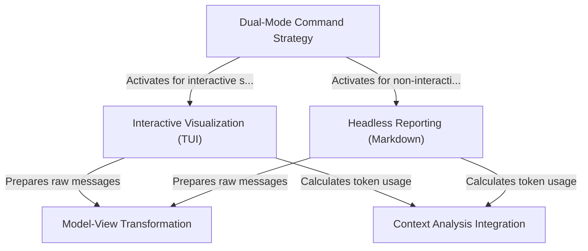

# Tutorial: context

The project implements a **context inspection tool** that allows users to visualize how much of the AI's memory (token window) is currently occupied. It employs a **Dual-Mode Command Strategy** to automatically switch between a rich, graphical *Interactive TUI* for active sessions and a static *Markdown report* for headless or script-based usage. To ensure accuracy, it passes chat history through a **Model-View Transformation** pipeline so the reported statistics match exactly what the AI model sees.

## Chapters

1. [Dual-Mode Command Strategy](01_dual_mode_command_strategy.md)
2. [Interactive Visualization (TUI)](02_interactive_visualization__tui_.md)
3. [Headless Reporting (Markdown)](03_headless_reporting__markdown_.md)
4. [Context Analysis Integration](04_context_analysis_integration.md)
5. [Model-View Transformation](05_model_view_transformation.md)

---

Generated by [Code IQ](https://github.com/adityasoni99/Code-IQ)