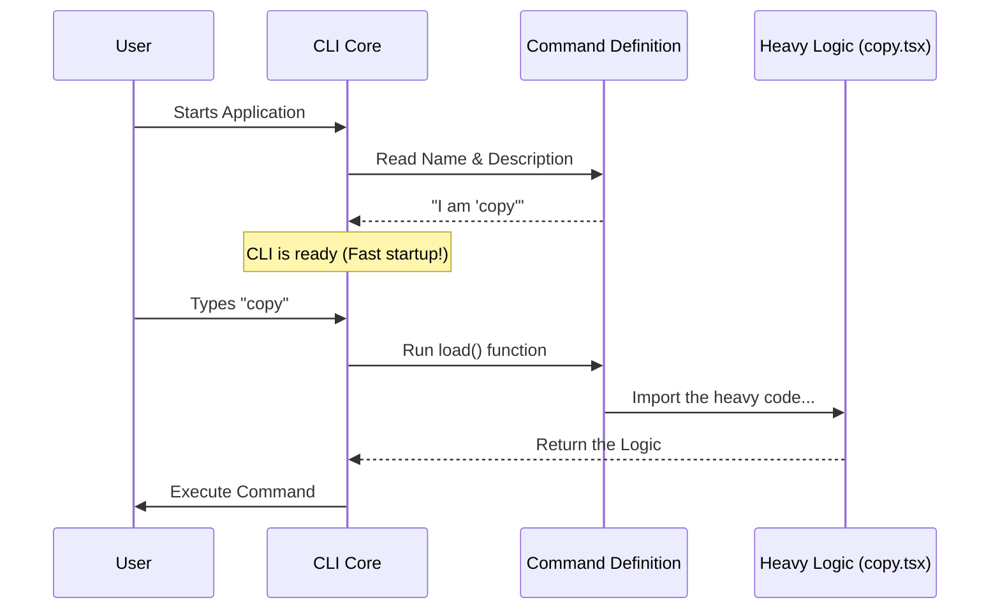

# Chapter 1: Command Definition Strategy

Welcome to the first chapter of our journey building the `copy` command!

## Why do we need a "Strategy"?

Imagine you walk into a restaurant and sit down. You pick up the menu. You see the names of dishes: "Burger", "Salad", "Pasta".

Now, imagine if the kitchen started cooking **every single dish on the menu** the moment you sat down, just in case you ordered one. That would be chaotic, slow, and wasteful!

Instead, the restaurant uses a strategy:
1.  ** The Menu (Metadata):** Light, easy to read, just names and descriptions.
2.  ** The Kitchen (Implementation):** Heavy work, starts cooking only *after* you place an order.

The **Command Definition Strategy** does exactly this for our software.

### The Use Case

Our CLI tool might have dozens of commands. When a user starts the tool, we want it to feel **instant**.
*   **Goal:** The user types `help` to see what commands are available.
*   **Problem:** We don't want to load complex code (like React or heavy text processing) just to show a list of names.
*   **Solution:** We create a lightweight "definition" that points to the heavy code, but doesn't load it yet.

---

## How it Works

Let's look at how we define the `copy` command. We create a small object that acts as the "Menu Item."

### 1. Setting up the Definition

First, we define the basic identity of our command. This file is lightweight and loads instantly.

```typescript
// index.ts
import type { Command } from '../../commands.js'

// This is our lightweight "Menu Item"
const copy = {
  type: 'local-jsx', // Tells the CLI this uses UI components
  name: 'copy',      // The command the user types
  description: "Copy Claude's last response to clipboard",
  // ... logic comes next
}
```

**Explanation:**
*   `name`: This is what you type in the terminal (e.g., `> copy`).
*   `description`: This shows up when you type `help`.
*   We haven't imported any heavy logic yet!

### 2. The "Lazy" Load

This is the magic part. We use a function to load the heavy code **only** when the command is actually triggered.

```typescript
// index.ts (continued)

const copy = {
  // ... previous properties (name, type)
  
  // The kitchen starts cooking ONLY when this function is called
  load: () => import('./copy.js'),
} satisfies Command

export default copy
```

**Explanation:**
*   `load`: This is a function. It is not run immediately.
*   `import('./copy.js')`: This is a **dynamic import**. It tells the computer, "Go find this file and read it now." This file contains the heavy React and logic code we will build in later chapters.
*   `satisfies Command`: This is a safety check to ensure our definition follows the rules (has a name, has a description, etc.).

---

## Under the Hood: The Sequence

What happens when the application starts?

1.  The CLI loads our **Command Definition** (the menu).
2.  It reads the `name` and `description`.
3.  It waits.
4.  Only when the user types `copy` does it run the `load()` function.

Here is a diagram showing this flow:



## Deep Dive: The Implementation

The code we looked at earlier is located in `index.ts`. It acts as the "Gatekeeper."

It separates the **Interface** (what the command looks like) from the **Implementation** (what the command does).

```typescript
/**
 * Copy command - minimal metadata only.
 * Implementation is lazy-loaded from copy.tsx to reduce startup time.
 */
import type { Command } from '../../commands.js'

const copy = {
  type: 'local-jsx',
  name: 'copy',
  description:
    "Copy Claude's last response to clipboard (or /copy N for the Nth-latest)",
  load: () => import('./copy.js'),
} satisfies Command

export default copy
```

By using `export default copy`, we make this definition available to the main application. The main app collects these lightweight objects from all commands to build its help menu.

Now that the CLI knows *how* to load our command, it needs to know *what* to load. The `load` function points to `./copy.js`. This is where the real work happens.

In that file, the first thing we need to do is go back in time and find what Claude said previously so we can copy it.

## Conclusion

In this chapter, we learned the **Command Definition Strategy**.
*   We treated our command like a menu item in a restaurant.
*   We separated the lightweight **Metadata** (name, description) from the heavy **Logic**.
*   We used a `load` function to import code only when requested, keeping our application fast.

Now that the command is defined and the application knows how to load it, we need to build the actual logic. The first step of the `copy` logic is finding the text we want to copy.

[Next: Message History Retrieval](02_message_history_retrieval.md)

---

Generated by [Code IQ](https://github.com/adityasoni99/Code-IQ)