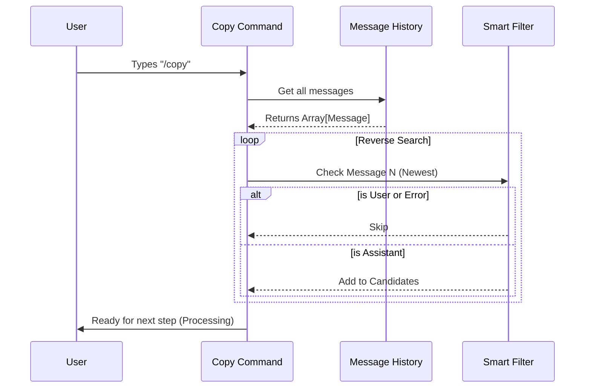

# Chapter 2: Message History Retrieval

In the previous chapter, [Command Definition Strategy](01_command_definition_strategy.md), we created the "menu item" for our command. Now that the user has actually ordered the "Copy" dish, the kitchen is open, and we need to start cooking.

But before we can copy anything, we have to find **what** to copy.

## The Motivation: Why is this hard?

You might think, "Just grab the last message!" But in a complex chat application, the "last message" isn't always what the user wants.

Imagine this conversation history:
1.  **You:** "Write me a Python script."
2.  **Claude:** "Here is the code..." (Valid response)
3.  **You:** "Wait, add comments."
4.  **System:** *[Network Error: API timed out]* (Invalid noise)
5.  **Claude:** "Sure, here is the commented code..." (Valid response)

If you type `/copy`, you expect the tool to be smart.
*   It shouldn't copy the **System Error**.
*   It shouldn't copy **Your** prompt ("Wait, add comments").
*   It should find the **last valid thing Claude said**.

This chapter explains how we build that "Smart Filter."

---

## Concept: The Reverse Time Machine

To find the right content, we don't start at the beginning of the conversation. We start at the **end** (the most recent message) and walk backwards.

### The Strategy
1.  **Start** at the newest message.
2.  **Check** who sent it.
    *   If it's the User? Skip it.
    *   If it's a System Error? Skip it.
    *   If it's the Assistant (Claude)? **Keep it.**
3.  **Repeat** backwards until we have a list of valid candidates.

### Analogy: The Receipt Spike
Imagine a restaurant spike where waiters stick receipts. The newest receipt is on top. When you want to find the last *valid* order (ignoring cancelled ones), you take the top one off, look at it, and if it's garbage, you toss it and look at the next one down.

---

## The Code: Finding the Messages

The logic for this lives in `copy.tsx`. We use a helper function called `collectRecentAssistantTexts`.

Let's break down how it works in small pieces.

### 1. The Setup

We take the raw list of messages from the application context and prepare an empty list to hold our results.

```typescript
// copy.tsx

export function collectRecentAssistantTexts(messages: Message[]): string[] {
  const texts: string[] = []; 
  // We will fill this with valid text strings
  
  // ... loop logic follows
}
```

### 2. The Reverse Loop

We use a standard `for` loop, but notice the direction. We start at `messages.length - 1` (the end) and subtract `i--` (go backwards).

```typescript
  // Start at the end, go to the beginning (0)
  // Stop if we found enough (MAX_LOOKBACK)
  for (
    let i = messages.length - 1; 
    i >= 0 && texts.length < MAX_LOOKBACK; 
    i--
  ) {
    const msg = messages[i];
    // ... validation logic follows
  }
```

### 3. The Smart Filter

Inside the loop, we check every message. We immediately `continue` (skip) if the message isn't useful.

```typescript
    // If it's not from the AI, or if it's an error... SKIP IT.
    if (msg?.type !== 'assistant' || msg.isApiErrorMessage) {
        continue;
    }

    // If it is valid, get the content
    const content = (msg as AssistantMessage).message.content;
```

### 4. Extracting the Text

Finally, if the message passes the tests, we extract the raw text and add it to our list.

```typescript
    // Helper function to turn complex message objects into a string
    const text = extractTextContent(content, '\n\n');
    
    // Add to our list of candidates
    if (text) {
        texts.push(text);
    }
```

---

## Under the Hood: The Retrieval Flow

When the user runs the command, here is the sequence of events that happens to retrieve the history.



## Handling User Arguments (The "Nth" Message)

Sometimes, you don't want the *very* last response. Maybe you want the one *before* that.

Our command supports typing `/copy 2` to get the 2nd most recent response.

Here is how we handle that logic in the main `call` function:

```typescript
// copy.tsx inside the call() function

// texts[0] is the latest, texts[1] is the one before that
const texts = collectRecentAssistantTexts(context.messages);

// Default to 0 (latest)
let age = 0; 

if (args) {
    // If user typed "/copy 2", n becomes 2
    const n = Number(args.trim());
    
    // Convert human number (1-based) to array index (0-based)
    age = n - 1; 
}
```

**Example:**
*   **Input:** User types `/copy` -> `age` is 0. We grab `texts[0]`.
*   **Input:** User types `/copy 2` -> `age` is 1. We grab `texts[1]`.

---

## Summary

In this chapter, we built the **Message History Retrieval** system.

1.  **The Problem:** Chat history is noisy (errors, user prompts).
2.  **The Solution:** A reverse-order traversal function (`collectRecentAssistantTexts`).
3.  **The Result:** A clean list of just the Assistant's valid text responses.

We now have the raw text string the user wants. However, this text might contain Markdown, code blocks, or explanations. We need to parse this text to understand what parts are code and what parts are just talking.

[Next: Markdown Content Parsing](03_markdown_content_parsing.md)

---

Generated by [Code IQ](https://github.com/adityasoni99/Code-IQ)