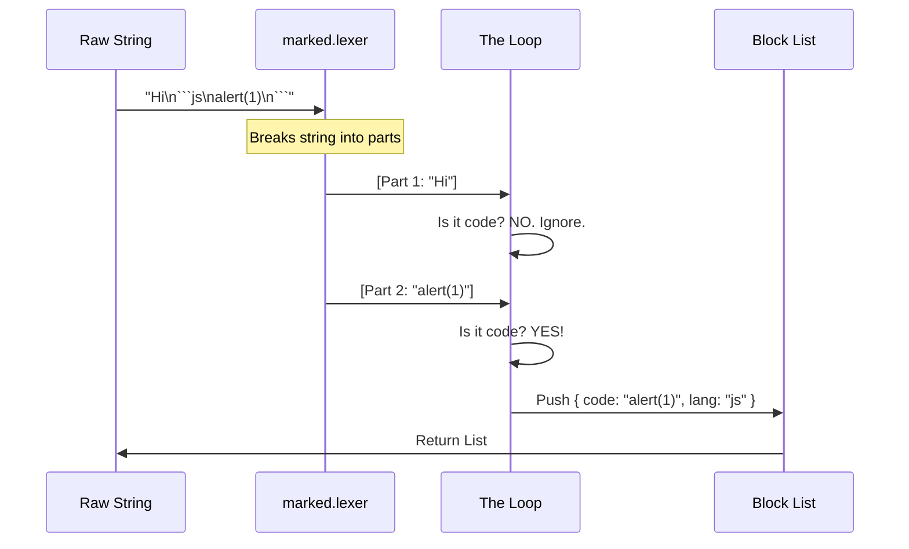

# Chapter 3: Markdown Content Parsing

Welcome to Chapter 3!

In the previous chapter, [Message History Retrieval](02_message_history_retrieval.md), we successfully built a time machine. We can now reach back into the chat history and grab the raw text of the AI's last response.

However, we have a new problem. The text we retrieved is often a "sandwich."

## The Problem: The "Sandwich" Response

AI models like Claude rarely just output code. They usually wrap it in conversational text.

**The Raw Text:**
```text
Here is the Python script you asked for:

```python
print("Hello World")
```

I hope this helps! Let me know if you need changes.
```

If we copy this **entire** message and paste it into a file named `script.py`, the Python interpreter will crash. Why? Because "Here is the Python script..." is not valid Python code.

**The Goal:** We need a way to surgically extract *only* the code block (the "meat") and separate it from the conversational text (the "bread").

---

## The Concept: The Digital Highlighter

Think of this process like studying a textbook with a neon highlighter.

1.  **Reading:** You read the whole page (the raw text).
2.  **Identifying:** You spot the important definition (the code block).
3.  **Highlighting:** You mark just that specific section.

In programming terms, this process is called **Parsing** or **Lexing**. We need to analyze the structure of the text to understand which parts are prose and which parts are code.

---

## The Strategy: Using a "Lexer"

We don't want to write complex logic to find where a code block starts (```` ``` ````) and ends using basic string searches. That is error-prone.

Instead, we use a library called **`marked`**. It has a tool called a **Lexer**.

A Lexer takes a long string of text and breaks it down into a list of "Tokens" (meaningful chunks).

### Example of Lexing

**Input String:**
`"Hi! \n ```code```"`

**Lexer Output (Simplified):**
1.  **Token A:** Type: `paragraph`, Text: "Hi!"
2.  **Token B:** Type: `space`
3.  **Token C:** Type: `code`, Text: "code"

Our job is simply to look at this list and grab every token where the type is `code`.

---

## Implementation: The Code Extraction

We implement this logic in a function called `extractCodeBlocks` inside `copy.tsx`.

### 1. Defining the Structure

First, we define what a "Block" looks like in our application. We care about two things: the code itself, and the language (e.g., 'python', 'javascript').

```typescript
// copy.tsx

type CodeBlock = {
  code: string;           // The actual code content
  lang: string | undefined; // e.g. 'python', 'typescript'
};
```

### 2. breaking the Text

We pass the raw text into `marked.lexer`. Note: We run a small cleanup function (`stripPromptXMLTags`) first to remove any invisible system tags, but the core work is done by the lexer.

```typescript
import { marked } from 'marked';

function extractCodeBlocks(markdown: string): CodeBlock[] {
  // 1. Turn the big string into a list of tokens
  const tokens = marked.lexer(stripPromptXMLTags(markdown));
  
  const blocks: CodeBlock[] = [];

  // ... loop logic follows
}
```

### 3. The Filter Loop

Now we loop through the tokens. We act like a gold panner, sifting through dirt (text) to find gold nuggets (code).

```typescript
  // 2. Loop through every token found
  for (const token of tokens) {
    
    // 3. Is this token a code block?
    if (token.type === 'code') {
      const codeToken = token as Tokens.Code;
      
      // Yes! Save it.
      blocks.push({
        code: codeToken.text,
        lang: codeToken.lang
      });
    }
  }
  return blocks;
```

---

## Under the Hood: The Parsing Flow

Here is what happens to the data when we run this function.



## Determining the File Extension

We also include a small helper utility. If we extract Python code, we want to suggest saving it as `.py`. If it's TypeScript, `.tsx` or `.ts`.

The `marked` lexer gives us the language string (like `python`) directly from the markdown fence (the text after the backticks: \`\`\`python).

```typescript
export function fileExtension(lang: string | undefined): string {
  if (lang) {
    // Remove special characters to be safe
    const sanitized = lang.replace(/[^a-zA-Z0-9]/g, '');
    
    // If we have a valid name, return it as an extension
    if (sanitized && sanitized !== 'plaintext') {
      return `.${sanitized}`;
    }
  }
  // Default fallback
  return '.txt';
}
```

---

## Putting it Together

At this point in the `copy` command execution, we have two pieces of data:

1.  **The Full Text:** The complete, original response (useful if the user *wants* the explanations).
2.  **The Code Blocks:** A clean list of just the technical snippets.

### The Decision Logic

In the main `call` function of our command, we check if we actually found any blocks.

```typescript
// copy.tsx - inside call()

const codeBlocks = extractCodeBlocks(text);

// Case A: No code blocks found?
if (codeBlocks.length === 0) {
    // Just copy the whole text immediately.
    // (We don't need to ask the user to choose anything)
    const result = await copyOrWriteToFile(text, 'response.md');
    onDone(result);
    return null;
}

// Case B: We found blocks! 
// We need to ask the user what to do next...
```

## Conclusion

In this chapter, we learned **Markdown Content Parsing**.

*   **The Problem:** Raw AI responses mix code and conversation.
*   **The Solution:** We used a **Lexer** to parse the structure of the text.
*   **The Result:** We extracted a list of `CodeBlock` objects containing clean code and language identifiers.

We now have the extracted code, but we have a user interface problem. If there are **three** code blocks in one message, how does the user choose which one to copy?

We need a UI that allows the user to select specific blocks using their keyboard.

[Next: Interactive Picker UI](04_interactive_picker_ui.md)

---

Generated by [Code IQ](https://github.com/adityasoni99/Code-IQ)